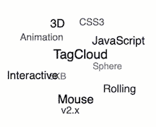

<!--
 * @Date: 2021-06-16 17:22:48
 * @LastEditors: wenfujie
 * @LastEditTime: 2021-09-05 09:28:10
 * @FilePath: /document-library/README.解决方案.md
-->
- [技术解决方案](#技术解决方案)
  - [多package管理及代码重用](#多package管理及代码重用)
  - [仿soul实现3D标签云](#仿soul实现3d标签云)
  - [服务端渲染 Nuxt.js](#服务端渲染-nuxtjs)

# 技术解决方案
## 多package管理及代码重用 

[lerna：多package管理及代码重用](articles/解决方案/lerna-多package管理及代码重用.md)

## 仿soul实现3D标签云

[github仓库](https://github.com/mcc108/TagCloud/blob/master/README.CN.md)

## 服务端渲染 Nuxt.js

[Nuxt.js入门](articles/解决方案/nuxt.js服务端渲染.md)