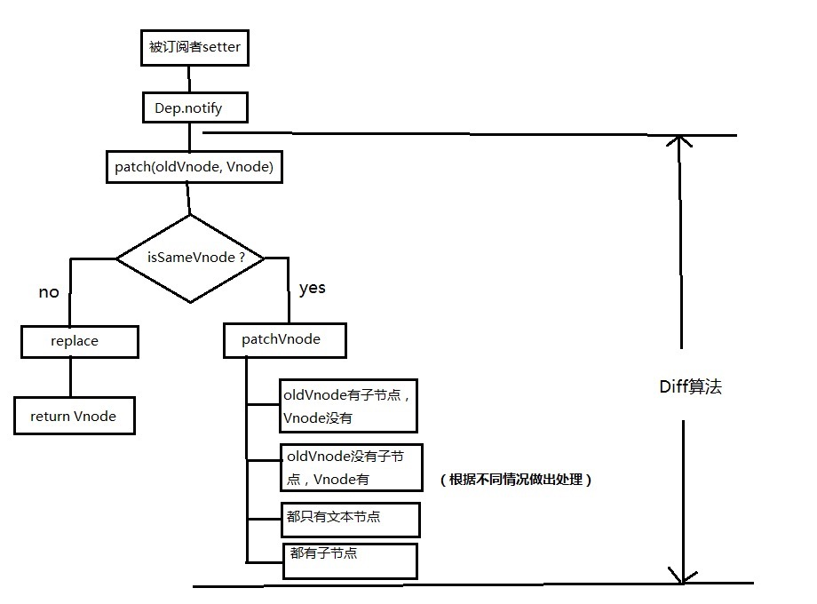
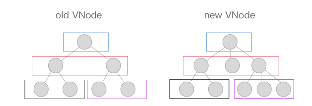

- [vue内部机制流程图](#vue内部机制流程图)
- [双向绑定实现](#双向绑定实现)
- [依赖收集](#依赖收集)
  - [为什么要依赖收集？](#为什么要依赖收集)
  - [Dep类](#dep类)
  - [Watcher](#watcher)
  - [开始依赖收集](#开始依赖收集)
- [虚拟节点VNode](#虚拟节点vnode)
- [diff算法](#diff算法)
  - [sameVnode实现](#samevnode实现)
  - [patch VNode](#patch-vnode)
  - [updateChildren方法](#updatechildren方法)
## vue内部机制流程图


## 双向绑定实现

首先通过一次渲染操作触发Data的getter（这里保证只有视图中需要被用到的data才会触发getter）进行依赖收集，这时候其实Watcher与data可以看成一种被绑定的状态（实际上是data的闭包中有一个 `Deps` 订阅者，在修改的时候会通知所有的Watcher观察者），在data发生变化的时候会触发它的setter，setter通知 `Watcher` ，Watcher进行回调通知组件重新渲染的函数，之后根据 `diff算法` 来决定是否发生视图的更新。

```javascript
  <script>
      // 给对象每个key都增加数据劫持
      function observe(obj, cb) {
          for (key in obj) {
              reactive(obj, key, cb)
          }
      }

      // 给对象的单个key增加数据劫持
      function reactive(obj, key, cb) {
          Object.defineProperty(obj, key, {
              enumerable: true, // 可枚举
              configurable: true, // 可配置
              get: () => {
                  /*....依赖收集等逻辑....*/
                  return obj[key];
              },
              set: (newVal) => {
                  obj[key] = newVal;
                  cb(); // 执行订阅者收到消息的回调 更新节点
              }
          })
      }

      class Vue {
          constructor(option) {
              this._data = option.data;
              observe(this._data, option.render);
          }
      }
      
      new Vue({
          el: '#app',
          data: {
              name: 'wfj',
              gender: 'boy'
          },
          render() {
              console.log('执行渲染逻辑');
          }
      });
  </script>
```

## 依赖收集
### 为什么要依赖收集？

如下代码，test2属性并无关联视图，但从上文“双向绑定”原理可知：当修改值this.test2 = 'hello'时会触发setter从而更新视图

```javascript
  // html
  <div>
      <span>{{test1}}</span>
  </div>

  // js
  data(){
      return {
          test1: '',
          test2: ''
      };
  }
```

### Dep类
在最开始初始化vue的render函数时，将此时触发getter的对应Watcher收集到Dep的subs中去。在对data中的数据进行修改的时候setter只要触发Dep的subs的函数即可。


```javascript
class Dep {
    constructor () {
        this.subs = [];
    }

    addSub (sub: Watcher) {
        this.subs.push(sub)
    }

    removeSub (sub: Watcher) {
        remove(this.subs, sub)
    }
    /*Github:https://github.com/answershuto*/
    notify () {
        // stabilize the subscriber list first
        const subs = this.subs.slice()
        for (let i = 0, l = subs.length; i < l; i++) {
            subs[i].update()
        }
    }
}
function remove (arr, item) {
    if (arr.length) {
        const index = arr.indexOf(item)
        if (index > -1) {
            return arr.splice(index, 1)
        }
    }
}
```

### Watcher
订阅者，当依赖收集的时候会addSub到sub中，在修改data中数据的时候会触发dep对象的notify，通知所有Watcher对象去修改对应视图。

```javascript
class Watcher {
    constructor (vm, expOrFn, cb, options) {
        this.cb = cb;
        this.vm = vm;

        /*在这里将观察者本身赋值给全局的target，只有被target标记过的才会进行依赖收集*/
        Dep.target = this;
        /*Github:https://github.com/answershuto*/
        /*触发渲染操作进行依赖收集*/
        this.cb.call(this.vm);
    }

    update () {
        this.cb.call(this.vm);
    }
}
```

### 开始依赖收集

```javascript
class Vue {
    constructor(options) {
        this._data = options.data;
        observer(this._data, options.render);
        let watcher = new Watcher(this, );
    }
}

function defineReactive (obj, key, val, cb) {
    /*在闭包内存储一个Dep对象*/
    const dep = new Dep();

    Object.defineProperty(obj, key, {
        enumerable: true,
        configurable: true,
        get: ()=>{
            if (Dep.target) {
                /*Watcher对象存在全局的Dep.target中*/
                dep.addSub(Dep.target);
            }
        },
        set:newVal=> {
            /*只有之前addSub中的函数才会触发*/
            dep.notify();
        }
    })
}

Dep.target = null;
```
将观察者Watcher实例赋值给全局的Dep.target，然后触发render操作只有被Dep.target标记过的才会进行依赖收集。有Dep.target的对象会将Watcher的实例push到subs中，在对象被修改触发setter操作的时候dep会调用subs中的Watcher实例的update方法进行渲染。


## 虚拟节点VNode
**什么是 `VNode`？**

vue中将Dom树抽象为js对象构成的抽象 `VNode` （virtual dom），用属性来表示Dom的特性，当 `VNode` 改变时就去修改视图。

**为什么使用 `VNode`？**

如果不使用 `VNode` 当修改某条数据的时候，这时候js会将整个DOM Tree进行替换，这种操作是相当消耗性能的。

VNode是对真实DOM节点的模拟，可以对VNode Tree进行增加节点、删除节点和修改节点操作。这些过程都只需要操作VNode Tree，不需要操作真实的DOM，大大的提升了性能。修改之后使用diff算法计算出修改的最小单位，在将这些小单位的视图进行更新。

```javascript
// Vue.js源码中对VNode类的定义

export default class VNode {
  tag: string | void;
  data: VNodeData | void;
  children: ?Array<VNode>;
  text: string | void;
  elm: Node | void;
  ns: string | void;
  context: Component | void; // rendered in this component's scope
  functionalContext: Component | void; // only for functional component root nodes
  key: string | number | void;
  componentOptions: VNodeComponentOptions | void;
  componentInstance: Component | void; // component instance
  parent: VNode | void; // component placeholder node
  raw: boolean; // contains raw HTML? (server only)
  isStatic: boolean; // hoisted static node
  isRootInsert: boolean; // necessary for enter transition check
  isComment: boolean; // empty comment placeholder?
  isCloned: boolean; // is a cloned node?
  isOnce: boolean; // is a v-once node?

  constructor (
    tag?: string,
    data?: VNodeData,
    children?: ?Array<VNode>,
    text?: string,
    elm?: Node,
    context?: Component,
    componentOptions?: VNodeComponentOptions
  ) {
    /*当前节点的标签名*/
    this.tag = tag
    /*当前节点对应的对象，包含了具体的一些数据信息，是一个VNodeData类型，可以参考VNodeData类型中的数据信息*/
    this.data = data
    /*当前节点的子节点，是一个数组*/
    this.children = children
    /*当前节点的文本*/
    this.text = text
    /*当前虚拟节点对应的真实dom节点*/
    this.elm = elm
    /*当前节点的名字空间*/
    this.ns = undefined
    /*编译作用域*/
    this.context = context
    /*函数化组件作用域*/
    this.functionalContext = undefined
    /*节点的key属性，被当作节点的标志，用以优化*/
    this.key = data && data.key
    /*组件的option选项*/
    this.componentOptions = componentOptions
    /*当前节点对应的组件的实例*/
    this.componentInstance = undefined
    /*当前节点的父节点*/
    this.parent = undefined
    /*简而言之就是是否为原生HTML或只是普通文本，innerHTML的时候为true，textContent的时候为false*/
    this.raw = false
    /*静态节点标志*/
    this.isStatic = false
    /*是否作为根节点插入*/
    this.isRootInsert = true
    /*是否为注释节点*/
    this.isComment = false
    /*是否为克隆节点*/
    this.isCloned = false
    /*是否有v-once指令*/
    this.isOnce = false
  }

  // DEPRECATED: alias for componentInstance for backwards compat.
  /* istanbul ignore next */
  get child (): Component | void {
    return this.componentInstance
  }
}
```
举例说明，以下VNode

```javascript
{
    tag: 'div'
    data: {
        class: 'test'
    },
    children: [
        {
            tag: 'span',
            data: {
                class: 'demo'
            }
            text: 'hello,VNode'
        }
    ]
}
```
渲染结果

```html
<div class="test">
    <span class="demo">hello,VNode</span>
</div>
```

## diff算法

**diff算法用于比对新、旧VNode**

以下是diff算法的整个过程



**`patch函数`主要实现将虚拟节点转化为真实DOM渲染的过程**

patch中比对新、旧VNode差异过程：
1. 从最深层从左往右比较新旧VNode节点
2. 比对节点前，先判断oldVNode和VNode是否是sameVNode，如果不是则创建新dom移除旧dom，如果是则使用diff算法计算差异
3. 得到差异后，以打补丁形式更新视图



### sameVnode实现

```javascript
/*
  判断两个VNode节点是否是同一个节点，需要满足以下条件
  key相同
  tag（当前节点的标签名）相同
  isComment（是否为注释节点）相同
  是否data（当前节点对应的对象，包含了具体的一些数据信息，是一个VNodeData类型，可以参考VNodeData类型中的数据信息）都有定义
  当标签是<input>的时候，type必须相同
*/
function sameVnode (a, b) {
  return (
    a.key === b.key &&
    a.tag === b.tag &&
    a.isComment === b.isComment &&
    isDef(a.data) === isDef(b.data) &&
    sameInputType(a, b)
  )
}

// Some browsers do not support dynamically changing type for <input>
// so they need to be treated as different nodes
/*
  判断当标签是<input>的时候，type是否相同
  某些浏览器不支持动态修改<input>类型，所以他们被视为不同节点
*/
function sameInputType (a, b) {
  if (a.tag !== 'input') return true
  let i
  const typeA = isDef(i = a.data) && isDef(i = i.attrs) && i.type
  const typeB = isDef(i = b.data) && isDef(i = i.attrs) && i.type
  return typeA === typeB
}
```

当两个VNode的tag、key、isComment都相同，并且同时定义或未定义data的时候，且如果标签为input则type必须相同。这时候这两个VNode则算sameVnode，可以直接进行patchVnode操作。

### patch VNode
**patchVnode规则**

1. 如果新旧VNode都是静态的，同时它们的key相同（代表同一节点），并且新的VNode是clone或者是标记了once（标记v-once属性，只渲染一次），那么只需要替换elm以及componentInstance即可。

2. 新老节点均有children子节点，则对子节点进行diff操作，调用updateChildren，这个updateChildren也是diff的核心。

3. 如果老节点没有子节点而新节点存在子节点，先清空老节点DOM的文本内容，然后为当前DOM节点加入子节点。

4. 当新节点没有子节点而老节点有子节点的时候，则移除该DOM节点的所有子节点。

5. 当新老节点都无子节点的时候，只是文本的替换。

**实现代码**

```javascript
/*patch VNode节点*/
  function patchVnode (oldVnode, vnode, insertedVnodeQueue, removeOnly) {
    /*两个VNode节点相同则直接返回*/
    if (oldVnode === vnode) {
      return
    }
    // reuse element for static trees.
    // note we only do this if the vnode is cloned -
    // if the new node is not cloned it means the render functions have been
    // reset by the hot-reload-api and we need to do a proper re-render.
    /*
      如果新旧VNode都是静态的，同时它们的key相同（代表同一节点），
      并且新的VNode是clone或者是标记了once（标记v-once属性，只渲染一次），
      那么只需要替换elm以及componentInstance即可。
    */
    if (isTrue(vnode.isStatic) &&
        isTrue(oldVnode.isStatic) &&
        vnode.key === oldVnode.key &&
        (isTrue(vnode.isCloned) || isTrue(vnode.isOnce))) {
      vnode.elm = oldVnode.elm
      vnode.componentInstance = oldVnode.componentInstance
      return
    }
    let i
    const data = vnode.data
    if (isDef(data) && isDef(i = data.hook) && isDef(i = i.prepatch)) {
      /*i = data.hook.prepatch，如果存在的话，见"./create-component componentVNodeHooks"。*/
      i(oldVnode, vnode)
    }
    const elm = vnode.elm = oldVnode.elm
    const oldCh = oldVnode.children
    const ch = vnode.children
    if (isDef(data) && isPatchable(vnode)) {
      /*调用update回调以及update钩子*/
      for (i = 0; i < cbs.update.length; ++i) cbs.update[i](oldVnode, vnode)
      if (isDef(i = data.hook) && isDef(i = i.update)) i(oldVnode, vnode)
    }
    /*如果这个VNode节点没有text文本时*/
    if (isUndef(vnode.text)) {
      if (isDef(oldCh) && isDef(ch)) {
        /*新老节点均有children子节点，则对子节点进行diff操作，调用updateChildren*/
        if (oldCh !== ch) updateChildren(elm, oldCh, ch, insertedVnodeQueue, removeOnly)
      } else if (isDef(ch)) {
        /*如果老节点没有子节点而新节点存在子节点，先清空elm的文本内容，然后为当前节点加入子节点*/
        if (isDef(oldVnode.text)) nodeOps.setTextContent(elm, '')
        addVnodes(elm, null, ch, 0, ch.length - 1, insertedVnodeQueue)
      } else if (isDef(oldCh)) {
        /*当新节点没有子节点而老节点有子节点的时候，则移除所有ele的子节点*/
        removeVnodes(elm, oldCh, 0, oldCh.length - 1)
      } else if (isDef(oldVnode.text)) {
        /*当新老节点都无子节点的时候，只是文本的替换，因为这个逻辑中新节点text不存在，所以直接去除ele的文本*/
        nodeOps.setTextContent(elm, '')
      }
    } else if (oldVnode.text !== vnode.text) {
      /*当新老节点text不一样时，直接替换这段文本*/
      nodeOps.setTextContent(elm, vnode.text)
    }
    /*调用postpatch钩子*/
    if (isDef(data)) {
      if (isDef(i = data.hook) && isDef(i = i.postpatch)) i(oldVnode, vnode)
    }
  }
```

### updateChildren方法
前面有提到，当新旧Vnode都存在子节点时，就会调用updateChildren方法进行比较。

**updateChildren做了什么**

- 将新、旧Vnode的子节newChild、oldChild提取出来
- 定义startIdx、endIdx表示newChild、oldChild的头尾元素，将他们互相比较，共有4种比较方式。如果4种比较方式都不匹配则使用key比较。
- 比较过程中，变量会往中间靠，一旦startIdx > endIdx 表明新Vnode或旧Vnode已遍历完成，结束比较。

**结合图片来理解**

如下图，粉红色球表示oldVnode的children，黄色球表示新Vnode的children。


将子节点都取出来，用oldS和oldE表示oldVnode子节点的起始和结束，用S和E表示新Vnode子节点的起始和结束。


分别对oldS、oldE、S、E两两进行比较，有四种比较方式：

- oldS 和 S
- oldS 和 E
- oldE 和 S
- oldE 和 E

如果其中两个配对成功，那真实dom中的相应节点会移到新Vnode对应的位置，打个比方

- 如果是oldS和E匹配上，真实dom的第一个节点会移到最后
- 如果是oldE和s匹配上，真实dom的最后一个节点会移到最前
- 匹配上的两个指针往中间移动，准备下一次匹配
- 如果四种匹配都没配对成功，那就遍历oldChild逐个与S匹配，匹配成功就将对应的真实dom移动到最前面，如果还是没配对，就将S对应的节点插入到oldS对应的真实dom的位置上，oldS和S指针向中间移动。


**步骤分解**

1. oldS和S匹配，则将dom中的a节点放到第一个，已经是第一个了就不管了，此时dom的位置为：a b d
    ```javascript
    oldS = a, oldE = d；
    S = a, E = b;
    ```
2. oldS和E匹配，就将原本的b节点移动到最后，此时dom的位置为：a d b
    ```javascript
    oldS = b, oldE = d；
    S = c, E = b;
    ```
3. oldE和E匹配，位置不变此时dom的位置为：a d b
    ```javascript
    oldS = d, oldE = d；
    S = c, E = d;
    ```
4. 由于oldS 大于 oldE，说明是oldChild先遍历完，结束遍历，将剩余的newChild根据自己的index插入到真实dom中去，最后dom结果：a c b d

一次diff算法计算完成。

匹配过程的结束条件有两个：
1. oldS > oldE 表示oldChild先遍历完，需将剩余的newChild根据index插入到真实dom中
2. S > E 表示newChild先遍历完，需将[oldS, oldE]范围的多余节点删除

**参考文档**

1. https://github.com/answershuto/learnVue/blob/master/docs/VirtualDOM%E4%B8%8Ediff(Vue%E5%AE%9E%E7%8E%B0).MarkDown

2. https://www.cnblogs.com/wind-lanyan/p/9061684.html