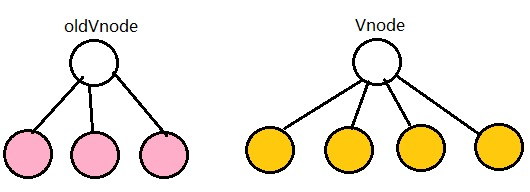
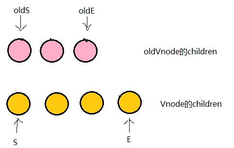
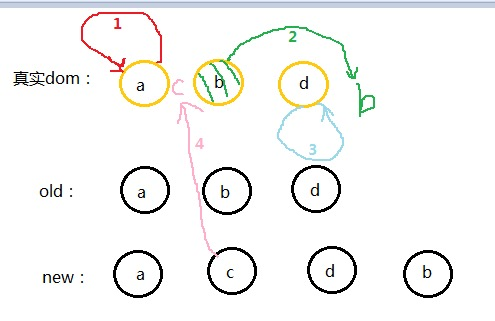

- [vue 内部机制流程图](#vue-内部机制流程图)
- [生命周期](#生命周期)
  - [vue2 生命周期](#vue2-生命周期)
  - [vue3 生命周期](#vue3-生命周期)
- [双向绑定实现](#双向绑定实现)
  - [Vue2 和 Vue3 双向绑定对比](#vue2-和-vue3-双向绑定对比)
- [依赖收集](#依赖收集)
  - [为什么要依赖收集？](#为什么要依赖收集)
  - [Dep 类](#dep-类)
  - [Watcher](#watcher)
  - [开始依赖收集](#开始依赖收集)
- [虚拟节点 VNode](#虚拟节点-vnode)
- [diff 算法](#diff-算法)
  - [sameVnode 实现](#samevnode-实现)
  - [patch VNode](#patch-vnode)
  - [updateChildren 方法](#updatechildren-方法)
- [为何能在 this 上直接使用 data、methods](#为何能在-this-上直接使用-datamethods)

## vue 内部机制流程图


## 生命周期

### vue2 生命周期

vue 生命周期先后执行顺序分为

- beforeCreate
- created
- beforeMount
- mounted
- beforeUpdate
- updated
- beforeDestroy
- destroyed

由于 initState 在 beforeCreate 钩子之后，所以在 beforeCreate 时无法获取 props 和 data 数据。

created 钩子在 initState 之后，所以可以获取 data、props 数据

```javascript
Vue.prototype._init = function(options) {
  ...
  callHook(vm, 'beforeCreate') // 拿不到 props data
  ...
  initState(vm)
  callHook(vm, 'created')
}
```

接下来执行挂载函数，beforeMount 钩子在挂载前执行，然后创建 Vnode 并替换成真实 dom，最后执行 mounted 钩子

```javascript
export function mountComponent {
    callHook(vm, 'beforeMount')
    // 创建Vnode，渲染真实dom...
    callHook(vm, 'mounted')
}
```

再接下来是数据更新时会触发的钩子，beforeUpdate 钩子在数据更新前触发，然后比对视图差异打补丁更新视图，视图更新完成触发 updated 钩子

最后是销毁组件会触发的钩子，比如 v-if 或切换路由就会触发组件销毁。销毁前会触发 beforeDestroy 钩子，然后进行一系列销毁操作，子组件一并递归销毁，所有组件销毁完毕才会执行根组件的 destroyed 钩子

### vue3 生命周期

Vue3 Composition API 附带了一个 setup() 方法。此方法封装了我们的大多数组件代码，并处理了响应式，生命周期钩子函数等。

setup 方法会在 beforeCreate 钩子之后，created 钩子之前调用，因此不再需要这两个钩子，将这两个钩子的代码写到 setup 方法即可。

除去 beforeCreate 和 created 钩子，在 setup 方法中有 9 个旧的生命周期钩子可以使用

- onBeforeMount
- onMounted
- onBeforeUpdate
- onUpdated
- onBeforeUnmount
- onUnmounted
- onActivated
- onDeactivated
- onErrorCaptured

**vue3 生命周期使用方法**

将需要用的钩子函数引入组件，并在 setup 方法中调用，钩子函数都接收一个回调函数作为参数

```javascript
import {
  onBeforeMount,
  onMounted,
  onBeforeUpdate,
  onUpdated,
  onBeforeUnmount,
  onUnmounted,
  onActivated,
  onDeactivated,
  onErrorCaptured
} from "vue";

export default {
  setup() {
    onBeforeMount(() => {
      // ...
    });
    onMounted(() => {
      // ...
    });
    onBeforeUpdate(() => {
      // ...
    });
    onUpdated(() => {
      // ...
    });
    onBeforeUnmount(() => {
      // ...
    });
    onUnmounted(() => {
      // ...
    });
    onActivated(() => {
      // ...
    });
    onDeactivated(() => {
      // ...
    });
    onErrorCaptured(() => {
      // ...
    });
  }
};
```

**从 vue2 转换到 vue3**

- beforeCreate -> use setup()
- created -> use setup()
- beforeMount -> onBeforeMount
- mounted -> onMounted
- beforeUpdate -> onBeforeUpdate
- updated -> onUpdated
- beforeDestroy -> onBeforeUnmount
- destroyed -> onUnmounted
- errorCaptured -> onErrorCaptured

**vue3 添加新的钩子函数**

vue3 添加了两个新的钩子函数用于调试

- onRenderTracked
- onRenderTriggered

两个钩子都带有一个 DebuggerEvent，能让我们知道是什么导致 Vue 实例的重新渲染

```javascript
export default {
  onRenderTriggered(e) {
    debugger;
    // 检查哪个依赖项导致组件重新呈现
  }
};
```

## 双向绑定实现

首先通过一次渲染操作触发 Data 的 getter（这里保证只有视图中需要被用到的 data 才会触发 getter）进行依赖收集，这时候其实 Watcher 与 data 可以看成一种被绑定的状态（实际上是 data 的闭包中有一个 `Deps` 订阅者，在修改的时候会通知所有的 Watcher 观察者），在 data 发生变化的时候会触发它的 setter，setter 通知 `Watcher` ，Watcher 进行回调通知组件重新渲染的函数，之后根据 `diff算法` 来决定是否发生视图的更新。

```javascript
  <script>
      // 给对象每个key都增加数据劫持
      function observe(obj, cb) {
          for (key in obj) {
              reactive(obj, key, cb)
          }
      }

      // 给对象的单个key增加数据劫持
      function reactive(obj, key, cb) {
          Object.defineProperty(obj, key, {
              enumerable: true, // 可枚举
              configurable: true, // 可配置
              get: () => {
                  /*....依赖收集等逻辑....*/
                  return obj[key];
              },
              set: (newVal) => {
                  obj[key] = newVal;
                  cb(); // 执行订阅者收到消息的回调 更新节点
              }
          })
      }

      class Vue {
          constructor(option) {
              this._data = option.data;
              observe(this._data, option.render);
          }
      }

      new Vue({
        ...
      });
  </script>
```

### Vue2 和 Vue3 双向绑定对比

Vue2 的双向绑定基于 Object.defineProperty ，实现上存在缺陷

- 只能对属性进行数据劫持，所以要深度遍历整个对象
- 无法监听到数组的变化

虽然 Vue2 对数组的部分操作方法进行改写，使得在调这些方法操作数组时能更新视图，但还是不够灵活。

而 Vue3 是基于 es6 的 Proxy ，它原生支持监听数组变化，并可对整个对象进行拦截

看一下简单用法

```javascript
let obj = [
  {
    a: "aaa"
  }
];
let proxy = new Proxy(obj, {
  get(target, key) {
    if (key === "0") {
      return "bbb";
    }
    return target[key];
  },
  set(target, key, value) {
    if (key === "1") {
      target[key] = { b: "bbb" };
    }
  }
});

console.log(proxy[0]); // bbb
proxy[1] = "aaa";
console.log(proxy[1]); // {b: 'bbb'}
```

所以相对 Vue2 来说，Vue3 的双向绑定性能更好，也更灵活。

## 依赖收集

### 为什么要依赖收集？

如下代码，test2 属性并无关联视图，但从上文“双向绑定”原理可知：当修改值 this.test2 = 'hello'时会触发 setter 从而更新视图

```javascript
  // html
  <div>
      <span>{{test1}}</span>
  </div>

  // js
  data(){
      return {
          test1: '',
          test2: ''
      };
  }
```

### Dep 类

在最开始初始化 vue 的 render 函数时，将此时触发 getter 的对应 Watcher 收集到 Dep 的 subs 中去。在对 data 中的数据进行修改的时候 setter 只要触发 Dep 的 subs 的函数即可。

```javascript
class Dep {
  constructor() {
    this.subs = [];
  }

  addSub(sub: Watcher) {
    this.subs.push(sub);
  }

  removeSub(sub: Watcher) {
    remove(this.subs, sub);
  }
  /*Github:https://github.com/answershuto*/
  notify() {
    // stabilize the subscriber list first
    const subs = this.subs.slice();
    for (let i = 0, l = subs.length; i < l; i++) {
      subs[i].update();
    }
  }
}
function remove(arr, item) {
  if (arr.length) {
    const index = arr.indexOf(item);
    if (index > -1) {
      return arr.splice(index, 1);
    }
  }
}
```

### Watcher

订阅者，当依赖收集的时候会 addSub 到 sub 中，在修改 data 中数据的时候会触发 dep 对象的 notify，通知所有 Watcher 对象去修改对应视图。

```javascript
class Watcher {
  constructor(vm, expOrFn, cb, options) {
    this.cb = cb;
    this.vm = vm;

    /*在这里将观察者本身赋值给全局的target，只有被target标记过的才会进行依赖收集*/
    Dep.target = this;
    /*Github:https://github.com/answershuto*/
    /*触发渲染操作进行依赖收集*/
    this.cb.call(this.vm);
  }

  update() {
    this.cb.call(this.vm);
  }
}
```

### 开始依赖收集

```javascript
class Vue {
  constructor(options) {
    this._data = options.data;
    observer(this._data, options.render);
    let watcher = new Watcher(this);
  }
}

function defineReactive(obj, key, val, cb) {
  /*在闭包内存储一个Dep对象*/
  const dep = new Dep();

  Object.defineProperty(obj, key, {
    enumerable: true,
    configurable: true,
    get: () => {
      if (Dep.target) {
        /*Watcher对象存在全局的Dep.target中*/
        dep.addSub(Dep.target);
      }
    },
    set: (newVal) => {
      /*只有之前addSub中的函数才会触发*/
      dep.notify();
    }
  });
}

Dep.target = null;
```

将观察者 Watcher 实例赋值给全局的 Dep.target，然后触发 render 操作只有被 Dep.target 标记过的才会进行依赖收集。有 Dep.target 的对象会将 Watcher 的实例 push 到 subs 中，在对象被修改触发 setter 操作的时候 dep 会调用 subs 中的 Watcher 实例的 update 方法进行渲染。

## 虚拟节点 VNode

**什么是 `VNode`？**

vue 中将 Dom 树抽象为 js 对象构成的抽象 `VNode` （virtual dom），用属性来表示 Dom 的特性，当 `VNode` 改变时就去修改视图。

**为什么使用 `VNode`？**

如果不使用 `VNode` 当修改某条数据的时候，这时候 js 会将整个 DOM Tree 进行替换，这种操作是相当消耗性能的。

VNode 是对真实 DOM 节点的模拟，可以对 VNode Tree 进行增加节点、删除节点和修改节点操作。这些过程都只需要操作 VNode Tree，不需要操作真实的 DOM，大大的提升了性能。修改之后使用 diff 算法计算出修改的最小单位，在将这些小单位的视图进行更新。

```javascript
// Vue.js源码中对VNode类的定义

export default class VNode {
  tag: string | void;
  data: VNodeData | void;
  children: ?Array<VNode>;
  text: string | void;
  elm: Node | void;
  ns: string | void;
  context: Component | void; // rendered in this component's scope
  functionalContext: Component | void; // only for functional component root nodes
  key: string | number | void;
  componentOptions: VNodeComponentOptions | void;
  componentInstance: Component | void; // component instance
  parent: VNode | void; // component placeholder node
  raw: boolean; // contains raw HTML? (server only)
  isStatic: boolean; // hoisted static node
  isRootInsert: boolean; // necessary for enter transition check
  isComment: boolean; // empty comment placeholder?
  isCloned: boolean; // is a cloned node?
  isOnce: boolean; // is a v-once node?

  constructor(
    tag?: string,
    data?: VNodeData,
    children?: ?Array<VNode>,
    text?: string,
    elm?: Node,
    context?: Component,
    componentOptions?: VNodeComponentOptions
  ) {
    /*当前节点的标签名*/
    this.tag = tag;
    /*当前节点对应的对象，包含了具体的一些数据信息，是一个VNodeData类型，可以参考VNodeData类型中的数据信息*/
    this.data = data;
    /*当前节点的子节点，是一个数组*/
    this.children = children;
    /*当前节点的文本*/
    this.text = text;
    /*当前虚拟节点对应的真实dom节点*/
    this.elm = elm;
    /*当前节点的名字空间*/
    this.ns = undefined;
    /*编译作用域*/
    this.context = context;
    /*函数化组件作用域*/
    this.functionalContext = undefined;
    /*节点的key属性，被当作节点的标志，用以优化*/
    this.key = data && data.key;
    /*组件的option选项*/
    this.componentOptions = componentOptions;
    /*当前节点对应的组件的实例*/
    this.componentInstance = undefined;
    /*当前节点的父节点*/
    this.parent = undefined;
    /*简而言之就是是否为原生HTML或只是普通文本，innerHTML的时候为true，textContent的时候为false*/
    this.raw = false;
    /*静态节点标志*/
    this.isStatic = false;
    /*是否作为根节点插入*/
    this.isRootInsert = true;
    /*是否为注释节点*/
    this.isComment = false;
    /*是否为克隆节点*/
    this.isCloned = false;
    /*是否有v-once指令*/
    this.isOnce = false;
  }

  // DEPRECATED: alias for componentInstance for backwards compat.
  /* istanbul ignore next */
  get child(): Component | void {
    return this.componentInstance;
  }
}
```

举例说明，以下 VNode

```javascript
{
    tag: 'div'
    data: {
        class: 'test'
    },
    children: [
        {
            tag: 'span',
            data: {
                class: 'demo'
            }
            text: 'hello,VNode'
        }
    ]
}
```

渲染结果

```html
<div class="test">
  <span class="demo">hello,VNode</span>
</div>
```

## diff 算法

**diff 算法用于比对新、旧 VNode**

以下是 diff 算法的整个过程


**`patch函数`主要实现将虚拟节点转化为真实 DOM 渲染的过程**

patch 中比对新、旧 VNode 差异过程：

1. 从最深层从左往右比较新旧 VNode 节点
2. 比对节点前，先判断 oldVNode 和 VNode 是否是 sameVNode，如果不是则创建新 dom 移除旧 dom，如果是则使用 diff 算法计算差异
3. 得到差异后，以打补丁形式更新视图


### sameVnode 实现

```javascript
/*
  判断两个VNode节点是否是同一个节点，需要满足以下条件
  key相同
  tag（当前节点的标签名）相同
  isComment（是否为注释节点）相同
  是否data（当前节点对应的对象，包含了具体的一些数据信息，是一个VNodeData类型，可以参考VNodeData类型中的数据信息）都有定义
  当标签是<input>的时候，type必须相同
*/
function sameVnode(a, b) {
  return (
    a.key === b.key &&
    a.tag === b.tag &&
    a.isComment === b.isComment &&
    isDef(a.data) === isDef(b.data) &&
    sameInputType(a, b)
  );
}

// Some browsers do not support dynamically changing type for <input>
// so they need to be treated as different nodes
/*
  判断当标签是<input>的时候，type是否相同
  某些浏览器不支持动态修改<input>类型，所以他们被视为不同节点
*/
function sameInputType(a, b) {
  if (a.tag !== "input") return true;
  let i;
  const typeA = isDef((i = a.data)) && isDef((i = i.attrs)) && i.type;
  const typeB = isDef((i = b.data)) && isDef((i = i.attrs)) && i.type;
  return typeA === typeB;
}
```

当两个 VNode 的 tag、key、isComment 都相同，并且同时定义或未定义 data 的时候，且如果标签为 input 则 type 必须相同。这时候这两个 VNode 则算 sameVnode，可以直接进行 patchVnode 操作。

### patch VNode

**patchVnode 规则**

1. 如果新旧 VNode 都是静态的，同时它们的 key 相同（代表同一节点），并且新的 VNode 是 clone 或者是标记了 once（标记 v-once 属性，只渲染一次），那么只需要替换 elm 以及 componentInstance 即可。

2. 新老节点均有 children 子节点，则对子节点进行 diff 操作，调用 updateChildren，这个 updateChildren 也是 diff 的核心。

3. 如果老节点没有子节点而新节点存在子节点，先清空老节点 DOM 的文本内容，然后为当前 DOM 节点加入子节点。

4. 当新节点没有子节点而老节点有子节点的时候，则移除该 DOM 节点的所有子节点。

5. 当新老节点都无子节点的时候，只是文本的替换。

**实现代码**

```javascript
/*patch VNode节点*/
function patchVnode(oldVnode, vnode, insertedVnodeQueue, removeOnly) {
  /*两个VNode节点相同则直接返回*/
  if (oldVnode === vnode) {
    return;
  }
  // reuse element for static trees.
  // note we only do this if the vnode is cloned -
  // if the new node is not cloned it means the render functions have been
  // reset by the hot-reload-api and we need to do a proper re-render.
  /*
      如果新旧VNode都是静态的，同时它们的key相同（代表同一节点），
      并且新的VNode是clone或者是标记了once（标记v-once属性，只渲染一次），
      那么只需要替换elm以及componentInstance即可。
    */
  if (
    isTrue(vnode.isStatic) &&
    isTrue(oldVnode.isStatic) &&
    vnode.key === oldVnode.key &&
    (isTrue(vnode.isCloned) || isTrue(vnode.isOnce))
  ) {
    vnode.elm = oldVnode.elm;
    vnode.componentInstance = oldVnode.componentInstance;
    return;
  }
  let i;
  const data = vnode.data;
  if (isDef(data) && isDef((i = data.hook)) && isDef((i = i.prepatch))) {
    /*i = data.hook.prepatch，如果存在的话，见"./create-component componentVNodeHooks"。*/
    i(oldVnode, vnode);
  }
  const elm = (vnode.elm = oldVnode.elm);
  const oldCh = oldVnode.children;
  const ch = vnode.children;
  if (isDef(data) && isPatchable(vnode)) {
    /*调用update回调以及update钩子*/
    for (i = 0; i < cbs.update.length; ++i) cbs.update[i](oldVnode, vnode);
    if (isDef((i = data.hook)) && isDef((i = i.update))) i(oldVnode, vnode);
  }
  /*如果这个VNode节点没有text文本时*/
  if (isUndef(vnode.text)) {
    if (isDef(oldCh) && isDef(ch)) {
      /*新老节点均有children子节点，则对子节点进行diff操作，调用updateChildren*/
      if (oldCh !== ch)
        updateChildren(elm, oldCh, ch, insertedVnodeQueue, removeOnly);
    } else if (isDef(ch)) {
      /*如果老节点没有子节点而新节点存在子节点，先清空elm的文本内容，然后为当前节点加入子节点*/
      if (isDef(oldVnode.text)) nodeOps.setTextContent(elm, "");
      addVnodes(elm, null, ch, 0, ch.length - 1, insertedVnodeQueue);
    } else if (isDef(oldCh)) {
      /*当新节点没有子节点而老节点有子节点的时候，则移除所有ele的子节点*/
      removeVnodes(elm, oldCh, 0, oldCh.length - 1);
    } else if (isDef(oldVnode.text)) {
      /*当新老节点都无子节点的时候，只是文本的替换，因为这个逻辑中新节点text不存在，所以直接去除ele的文本*/
      nodeOps.setTextContent(elm, "");
    }
  } else if (oldVnode.text !== vnode.text) {
    /*当新老节点text不一样时，直接替换这段文本*/
    nodeOps.setTextContent(elm, vnode.text);
  }
  /*调用postpatch钩子*/
  if (isDef(data)) {
    if (isDef((i = data.hook)) && isDef((i = i.postpatch))) i(oldVnode, vnode);
  }
}
```

### updateChildren 方法

前面有提到，当新旧 Vnode 都存在子节点时，就会调用 updateChildren 方法进行比较。

**updateChildren 做了什么**

- 将新、旧 Vnode 的子节 newChild、oldChild 提取出来
- 定义 startIdx、endIdx 表示 newChild、oldChild 的头尾元素，将他们互相比较，共有 4 种比较方式。如果 4 种比较方式都不匹配则使用 key 比较。
- 比较过程中，变量会往中间靠，一旦 startIdx > endIdx 表明新 Vnode 或旧 Vnode 已遍历完成，结束比较。

**结合图片来理解**

如下图，粉红色球表示 oldVnode 的 children，黄色球表示新 Vnode 的 children。



将子节点都取出来，用 oldS 和 oldE 表示 oldVnode 子节点的起始和结束，用 S 和 E 表示新 Vnode 子节点的起始和结束。



分别对 oldS、oldE、S、E 两两进行比较，有四种比较方式：

- oldS 和 S
- oldS 和 E
- oldE 和 S
- oldE 和 E

如果其中两个配对成功，那真实 dom 中的相应节点会移到新 Vnode 对应的位置，打个比方

- 如果是 oldS 和 E 匹配上，真实 dom 的第一个节点会移到最后
- 如果是 oldE 和 s 匹配上，真实 dom 的最后一个节点会移到最前
- 匹配上的两个指针往中间移动，准备下一次匹配
- 如果四种匹配都没配对成功，那就遍历 oldChild 逐个与 S 匹配，匹配成功就将对应的真实 dom 移动到最前面，如果还是没配对，就将 S 对应的节点插入到 oldS 对应的真实 dom 的位置上，oldS 和 S 指针向中间移动。



**步骤分解**

1. oldS 和 S 匹配，则将 dom 中的 a 节点放到第一个，已经是第一个了就不管了，此时 dom 的位置为：a b d
   ```javascript
   oldS = a, oldE = d；
   S = a, E = b;
   ```
2. oldS 和 E 匹配，就将原本的 b 节点移动到最后，此时 dom 的位置为：a d b
   ```javascript
   oldS = b, oldE = d；
   S = c, E = b;
   ```
3. oldE 和 E 匹配，位置不变此时 dom 的位置为：a d b
   ```javascript
   oldS = d, oldE = d；
   S = c, E = d;
   ```
4. 由于 oldS 大于 oldE，说明是 oldChild 先遍历完，结束遍历，将剩余的 newChild 根据自己的 index 插入到真实 dom 中去，最后 dom 结果：a c b d

一次 diff 算法计算完成。

匹配过程的结束条件有两个：

1. oldS > oldE 表示 oldChild 先遍历完，需将剩余的 newChild 根据 index 插入到真实 dom 中
2. S > E 表示 newChild 先遍历完，需将[oldS, oldE]范围的多余节点删除

**参考文档**

1. [VirtualDOM 与 diff(Vue 实现)](<https://github.com/answershuto/learnVue/blob/master/docs/VirtualDOM%E4%B8%8Ediff(Vue%E5%AE%9E%E7%8E%B0).MarkDown>)

2. [详解 vue 的 diff 算法](https://www.cnblogs.com/wind-lanyan/p/9061684.html)

## 为何能在 this 上直接使用 data、methods

**对 methods 的处理：**
遍历 methods 并用 call 方法绑定调用者为 vue 实例，最后添加到 this 的属性上。

**对 data 的处理：**
data 属性会被挂载到 `this._data` 上，vue 对 this 做了代理，当我们 通过 `this.a` 访问属性时，会被代理到 this.\_data.a 。

**为何模板上使用 data 的属性不需要加 this？**

这是因为 vue 在对模板解析时 使用 with 将顶层作用域改为 this
