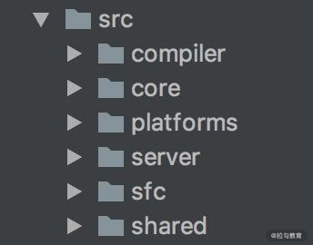
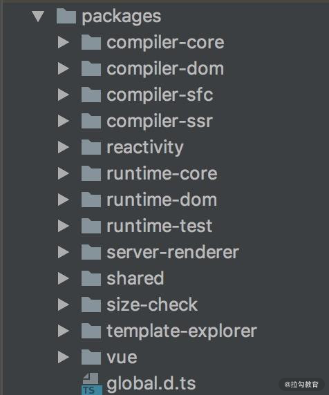

## 1. 源码优化

### 1.1 monorepo 管理的优势

vue2 源码放在 src 目录下，依据功能拆分如图所示模块

vue3 源码通过 monorepo 管理，依据功能拆分如图所示模块

Monorepo 相对 vue2 的管理

1. 各个模块变得相互独立，各自有各自的类型定义、测试模块、Api，职责划分明确，代码可读性、可维护性更高
1. 可单独引入某个包（例如 reactivity），减小引用包体积大小

### 1.2 源码使用 ts 开发的优势

1. 提供了类型检查
1. 源码更易阅读
1. 不用再单独维护 d.ts 声明文件

## 2.性能

### 2.1 减小源码体积

1. 移除冷门 feture（比如 filter、inline-template 等）；
2. 使用 tree-shaking ，减小打包体积

### 2.2 数据劫持优化

Vue2 中使用 Object.defineProperty 进行数据劫持，由于它只能对具体的key进行劫持，vue2深度遍历了data中的所有属性并对他们进行劫持，存在性能浪费。

Vue3 用 proxy 代替 Object.defineProperty 来实现数据劫持，proxy 支持对整个对象进行劫持，提升了性能。

### 2.3 编译优化

1. Vue2 的更新效率与模板整体大小相关，而 vue3 缩小至与模板中动态内容的数量相关
2. Slot 的编译优化、事件侦听函数的缓存优化，并且在运行时重写了 diff 算法

## 3. 语法 api

### 3.1 Composition Api

1. 逻辑代码更集中，更易阅读和维护：相比 vue2 中在大型组件中上下切换来查询 options，vue3 单个业务的状态及方法包裹在一个函数中，逻辑更聚合
2. 代码复用性高：vue2 通过 Mixins 实现复用而产生的命名冲突、状态无法追踪等问题一并得以解决
