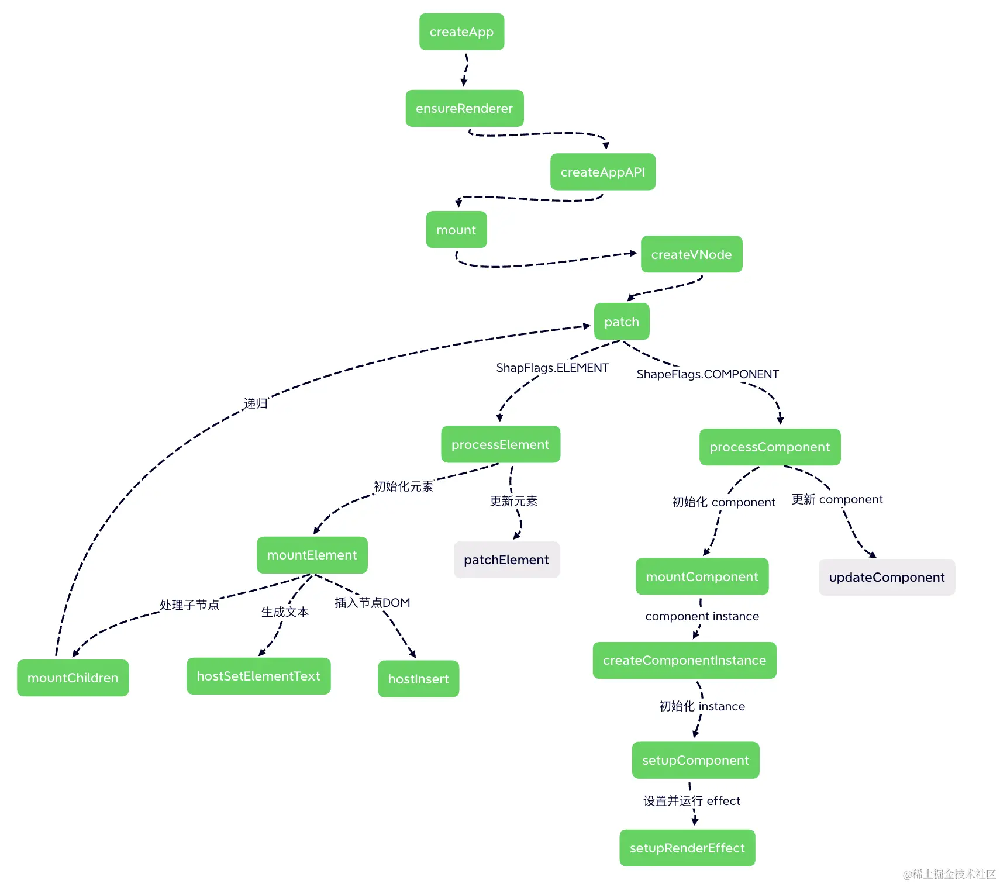

[TOC]

## 组件如何渲染成DOM？

组件的样子

```vue
<template>
  <div class="helloWorld">
    hello world
  </div>
</template>
<script>
export default {
  setup() {
    // ...
  }
}
</script>

```


>  `.vue` 文件无法在浏览器直接加载，所以要使用 `webpack` 通过 `vue-loader` 编译，其中 `template` 部分会被编译成 `render函数` 存储到组件对象中，`script` 会编译成js并导出组件对象，`style` 部分编译成css文件。


`template` 编译后结果

```js
import { openBlock as _openBlock, createElementBlock as _createElementBlock } from "vue"

const _hoisted_1 = { class: "helloWorld" }

export function render(_ctx, _cache, $props, $setup, $data, $options) {
  return (_openBlock(), _createElementBlock("div", _hoisted_1, " hello world "))
}
```


`template` 和 `script` 编译的结果

```js
{

  render(_ctx, _cache, $props, $setup, $data, $options) { 
    // ... 
  },
  setup() {
    // ...
  }
}
```


>  HTML 通过 http请求加载js和css文件，完成DOM渲染。

### 组件对象如何被加载？

js被加载后，会执行 `main.js` 入口文件代码

```js
import { createApp } from 'vue';
import App from './App.vue';

createApp(App).mount('#app')
```


`createApp` 函数

```js
// packages/runtime-core/src/apiCreateApp.ts
function createAppAPI(render, hydrate) {
  // createApp createApp 方法接收的两个参数：根组件的对象和 prop
  return function createApp(rootComponent, rootProps = null) {
    const app = {
      // ... 省略很多不需要在这里介绍的属性
      _component: rootComponent,
      _props: rootProps,
      mount(rootContainer, isHydrate, isSVG) {
        // ...
      }
    }
    return app
  }
}
```


`mount` 函数

```js
// packages/runtime-core/src/apiCreateApp.ts
mount(rootContainer, isHydrate, isSVG) {
  if (!isMounted) {
    // ... 省略部分不重要的代码
    // 1. 创建根组件的 vnode
    const vnode = createVNode(
      rootComponent,
      rootProps
    )
    
    // 2. 渲染根组件
    render(vnode, rootContainer, isSVG)
    isMounted = true
  }
}
```


> `mount` 函数执行，先调用 `createVNode` 方法将根组件转换为虚拟节点 `VNode` ，接着调用 `render` 方法把 `VNode` 渲染为 DOM。


### createVNode 如何创建 VNode？

> `VNode` 是对 DOM 进行描述的一个对象。


`VNode` 的样子

```js
const vnode = {
  type: 'div',
  props: { 
    'class': 'helloWorld'
  },
  children: 'helloWorld',
  // ...
}
```


`createVNode` 函数

```js
// packages/runtime-core/src/vnode.ts
function createBaseVNode(...) {
  const vnode = {
    type,
    props,
    key: props && normalizeKey(props),
    children,
    component: null,
    shapeFlag,
    patchFlag,
    dynamicProps,
    dynamicChildren: null,
    // ... 一些其他属性
  }
  // ...
  return vnode
}
function createVNode(type, props = null, children = null) {
  if (props) {
    // 如果存在 props 则需要对 props 进行一些处理，这里先省略
  }
  // ...
  // 处理 shapeFlag 类型
  const shapeFlag = isString(type)
    ? ShapeFlags.ELEMENT
    : __FEATURE_SUSPENSE__ && isSuspense(type)
    ? ShapeFlags.SUSPENSE
    : isTeleport(type)
    ? ShapeFlags.TELEPORT
    : isObject(type)
    ? ShapeFlags.STATEFUL_COMPONENT
    : isFunction(type)
    ? ShapeFlags.FUNCTIONAL_COMPONENT
    : 0
  
  // ...
  return createBaseVNode(
    type,
    props,
    children,
    patchFlag,
    dynamicProps,
    shapeFlag,
    isBlockNode,
    true
  )
}
```


> `createBaseVNode` 调用了 `createBaseVNode` 创建 `VNode` ，其中包含 `shapeFlag` 属性用于描述组件类型。


### render 如何将 VNode 渲染为 DOM？


`render` 函数

```js
// packages/runtime-core/src/renderer.ts
const render = (vnode, container) => {
  if (vnode == null) {
    // 如果 vnode 不存在，表示需要卸载组件
    if (container._vnode) {
      unmount(container._vnode, null, null, true)
    }
  } else {
    // 否则进入更新流程（初始化创建也是特殊的一种更新）
    patch(container._vnode || null, vnode, container)
  }
  // 缓存 vnode
  container._vnode = vnode
}
```


> 初始化DOM或更新DOM 都调用了 `patch` 函数。


`patch` 函数

```js
// packages/runtime-core/src/renderer.ts
function patch(n1,n2,container = null,anchor = null,parentComponent = null) {
  // 对于类型不同的新老节点，直接进行卸载
  if (n1 && !isSameVNodeType(n1, n2)) {
    anchor = getNextHostNode(n1)
    unmount(n1, parentComponent, parentSuspense, true)
    n1 = null
  }
  // 基于 n2 的类型来判断
  // 因为 n2 是新的 vnode
  const { type, shapeFlag } = n2;
  switch (type) {
    case Text:
       // 处理文本节点
      break;
    // 其中还有几个类型比如： static fragment comment
    default:
      // 这里就基于 shapeFlag 来处理
      if (shapeFlag & ShapeFlags.ELEMENT) {
        // 处理普通 DOM 元素
        processElement(n1, n2, container, anchor, parentComponent);
      } else if (shapeFlag & ShapeFlags.COMPONENT) {
        // 处理 component
        processComponent(n1, n2, container, parentComponent);
      } else if {
        // ... 处理其他元素
      }
  }
}
```


> 基于 `isSameVNodeType` 方法判断是否是同种类型的 `VNode` ，不同类型调用 `unmount` 方法删除节点，若是相同类型则调用各种类型的处理函数进行处理如：`processElement` 、`processComponent` ...


`processComponent` 函数

```js
// packages/runtime-core/src/renderer.ts
function processComponent(n1, n2, container, parentComponent) {
  // 如果 n1 没有值的话，那么就是 mount
  if (!n1) {
    // 初始化 component
    mountComponent(n2, container, parentComponent);
  } else {
    updateComponent(n1, n2, container);
  }
}
```


`mountComponent` 函数

```js
// packages/runtime-core/src/renderer.ts
function mountComponent(initialVNode, container, parentComponent) {
  // 1. 先创建一个 component instance
  const instance = (initialVNode.component = createComponentInstance(
    initialVNode,
    parentComponent
  ));
  
  // 2. 初始化 instance 上的 props, slots, 执行组件的 setup 函数...
  setupComponent(instance);

  // 3. 设置并运行带副作用的渲染函数
  setupRenderEffect(instance, initialVNode, container);
}
```


`createComponentInstance` 方法返回值

```js
// packages/runtime-core/src/component.ts
const instance = {
  // 这里是组件对象
  type: vnode.type, 
  // 组件 vnode
  vnode,
  // 新的组件 vnode
  next: null, 
  // props 相关
  props: {}, 
  // 指向父组件
  parent,
  // 依赖注入相关
  provides: parent ? parent.provides : {},
  // 渲染上下文代理
  proxy: null,
  // 标记是否被挂载
  isMounted: false,
  // attrs 相关
  attrs: {}, 
  // slots 相关
  slots: {}, 
  // context 相关
  ctx: {},
  // setup return 的状态数据
  setupState: {}, 
  // ...
};
```


`setupComponent` 函数

```js
// packages/runtime-core/src/component.ts
export function setupComponent(instance) {
  // 1. 处理 props
  // 取出存在 vnode 里面的 props
  const { props, children } = instance.vnode;
  initProps(instance, props);
  // 2. 处理 slots
  initSlots(instance, children);

  // 3. 调用 setup 并处理 setupResult
  setupStatefulComponent(instance);
}
```


`setupRenderEffect` 函数

```js
// packages/runtime-core/src/renderer.ts
const setupRenderEffect = (instance, initialVNode, container, anchor, parentSuspense, isSVG, optimized) => {
  function componentUpdateFn() {
    if (!instance.isMounted) {
      // 渲染子树的 vnode
      const subTree = (instance.subTree = renderComponentRoot(instance))
      // 挂载子树 vnode 到 container 中
      patch(null, subTree, container, anchor, instance, parentSuspense, isSVG)
      // 把渲染生成的子树根 DOM 节点存储到 el 属性上
      initialVNode.el = subTree.el
      instance.isMounted = true
    }
    else {
      // 更新相关，后面介绍
    }
  }
  // 创建副作用渲染函数
  instance.update = effect(componentUpdateFn, prodEffectOptions)
}
```


>  `setupRenderEffect` 中会调用 `renderComponentRoot` 函数，该函数中会触发组件的 `render` 函数并在最后返回 DOM树。


`render` 函数上文有提到

```js
import { openBlock, createElementBlock } from "vue"

const _hoisted_1 = { class: "helloWorld" }

export function render(...) {
  return (openBlock(), createElementBlock("div", _hoisted_1, " hello world "))
}
```


`createElementBlock` 函数

```js
// packages/runtime-core/src/vnode.ts
export const createElementBlock = (...) => {
  return setupBlock(
    createBaseVNode(
      type,
      props,
      children,
      patchFlag,
      dynamicProps,
      shapeFlag,
      true /* isBlock */
    )
  )
};
```

> `createElementBlock` 函数调用了 `createBaseVNode ` 创建和返回 `VNode` ，此时 `VNode` 的 `shapeFlags`

 值为 `ELEMENT` 。


> `setupRenderEffect` 方法中，在拿到 `VNode` 后会调用 `patch` 方法， `patch` 方法中判断  `shapeFlags`  值为 `ELEMENT` 会执行 `processElement` 方法
>

`processElement` 方法

```js
// packages/runtime-core/src/renderer.ts
function processElement(n1, n2, container, anchor, parentComponent) {
  if (!n1) {
    // 挂载元素节点
    mountElement(n2, container, anchor);
  } else {
    // 更新元素节点
    updateElement(n1, n2, container, anchor, parentComponent);
  }
}
```


`mountElement` 方法

```js
// packages/runtime-core/src/renderer.ts
const mountElement = (vnode, container, anchor, parentComponent, parentSuspense, isSVG, optimized) => {
  let el
  const { type, props, shapeFlag, transition, patchFlag, dirs } = vnode
  // ...
  // 根据 vnode 创建 DOM 节点
  el = vnode.el = hostCreateElement(vnode.type, isSVG, props && props.is)
  if (props) {
    // 处理 props 属性
    for (const key in props) {
      if (!isReservedProp(key)) {
        hostPatchProp(el, key, null, props[key], isSVG)
      }
    }
  }
  // 文本节点处理
  if (shapeFlag & ShapeFlags.TEXT_CHILDREN) {
    hostSetElementText(el, vnode.children)
  } else if (shapeFlag & ShapeFlags.ARRAY_CHILDREN) {
    // 如果节点是个数据类型，则递归子节点
    mountChildren(vnode.children, el)
  }
  // 把创建好的 el 元素挂载到容器中
  hostInsert(el, container, anchor)
}
```

> `mountElemet` 首先是通过 `hostCreateElement` 创建了一个 `DOM` 节点，然后处理一下 `props` 属性，接着根据 `shapeFlag` 判断子节点的类型，如果节点是个文本节点，则直接创建文本节点。


如果子节点是个数组，比如这种情况：

```js
return (openBlock(), createElementBlock("div", _hoisted_1, [
  hoisted_2,
  createVNode(_component_Hello)
]))
```

> `VNode` 的 `shapeFlag` 将是一个数组类型 `ARRAY_CHILDREN`，针对该类型 `VNode` 会调用 `mountChildren` 方法递归触发 `patch` 进行渲染。


最后通过 `hostInsert` 方法挂载节点

```js
// packages/runtime-dom/src/nodeOps.ts
insert: (child, parent, anchor) {
  parent.insertBefore(child, anchor || null)
}
```

## 总结

