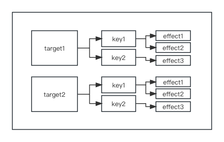

- [基本概念](#基本概念)
- [响应式数据的实现](#响应式数据的实现)
- [避免无限循环](#避免无限循环)
- [调度执行](#调度执行)
- [lazy 懒执行](#lazy-懒执行)
- [computed 的实现](#computed-的实现)

## 基本概念

> 副作用函数：函数的执行会影响到函数外部

> 响应式数据：响应式数据改变后，副作用函数会自动执行

## 响应式数据的实现

**收集和触发的时机？**

通过 `proxy` 监听到 `响应式数据` 取值和设值的钩子，在取值时存储 `effect`，设值时触发 `effect`。

**如何建立响应数据和 effect 的关系？**

`桶` 里存放多个 `响应式数据` ，并连接 `响应式数据` 与其多个 `key` 的关系，每个 `key` 也要连接多个 `effect` 。可以看出这是一个树形结构数据。



**实现代码**

```js
// 桶
const bucket = new WeakMap();
const obj = new Proxy(data, {
  // 建立响应数据和 key 和 effect 的关系
  get(target, key) {
    if (!activeEffect) return target[key];
    let depsMap = bucket.get(target);
    if (!depsMap) {
      bucket.set(target, (depsMap = new Map()));
    }
    let deps = depsMap.get(key);
    if (!deps) {
      depsMap.set(key, (deps = new Set()));
    }
    deps.add(activeEffect);
    return target[key];
  },
  // 执行副作用函数
  set(target, key, newVal) {
    target[key] = newVal;
    const effects = bucket.get(target)?.get(key);
    if (!effects) return;
    effects.forEach((f) => f());
  },
});
```

将收集和触发副作用的逻辑封装到 `track` 、`trigger` 中，使得代码更灵活。

```js
function track(target, key) {
  if (!activeEffect) return target[key];
  let depsMap = bucket.get(target);
  if (!depsMap) {
    bucket.set(target, (depsMap = new Map()));
  }
  let deps = depsMap.get(key);
  if (!deps) {
    depsMap.set(key, (deps = new Set()));
  }
  deps.add(activeEffect);
}

function trigger(target, key) {
  const effects = bucket.get(target)?.get(key);
  if (!effects) return;
  effects.forEach((f) => f());
}

const obj = new Proxy(data, {
  get(target, key) {
    track(target, key);
    return target[key];
  },
  set(target, key, newVal) {
    target[key] = newVal;
    trigger(target, key);
  },
});
```

## 避免无限循环

```js
const data = { foo: 1 };
const obj = new Proxy(data, {
  /*...*/
});
effect(() => data.foo++);
```

> 该段代码执行后会报堆栈溢出异常，因为副作用中同时触发了 `data.foo` 的 `get` 和 `set` ，导致了无限递归调用自己

解决

```js
function trigger(target, key) {
  // ...
  const effects = depsMap.get(key);
  const effectsToRun = new Set();
  // 剔除当前的副作用函数
  effects &&
    effects.forEach((fn) => {
      if (fn !== activeEffect) {
        effectsToRun.add(fn);
      }
    });
  effectsToRun.forEach((fn) => fn());
}
```

> 修改响应数据时，触发 `trigger` 时不执行当前副作用函数 `activeEffect` 即可。

## 调度执行

> 可调度执行：可以控制副作用函数执行的时机、次数、方式。

为 `effect` 函数设计一个选项参数，允许用户指定 `调度器`

```js
effect(fn, {
  // 调度器 scheduler 为函数
  scheduler(fn) {},
});
```

`effect`

```js
function effect(fn, options) {
  const effectFn = () => {
    activeEffect = effectFn;
    effectStack.push(effectFn);
    fn();
    effectStack.pop();
    activeEffect = effectStack[effectStack.length - 1];
  };
  effectFn.options = options;
  effectFn.deps = [];
  effectFn();
}
```

`trigger`

```js
function trigger(target, key) {
  // ...
  const effectsToRun = new Set();
  // ... 给 effectsToRun 赋值

  effectsToRun.forEach((fn) => {
    if (fn.options.scheduler) {
      fn.options.scheduler(fn);
    } else {
      fn();
    }
  });
}
```

执行 `trigger` 时，增加 `options.scheduler` 的判断，若存在优先执行 `options.scheduler` 。

这样一来，就支持了在 `options.scheduler` 中自定义副作用的触发逻辑。

## lazy 懒执行

> 懒执行：`effect(fn)` 中不立即执行 fn 。

通过 `options.lazy` 配置

```js
effect(fn, { lazy: true });
```

`effect`

```js
function effect(fn, options) {
  const effectFn = () => {
    /*...*/
  };
  effectFn.options = options;
  effectFn.deps = [];
  if (!options.lazy) {
    effectFn();
  }
  return effectFn;
}
```

外部手动执行副作用

```js
const fn = effect(() => console.log("hello"), {
  lazy: true,
});

// 手动执行
fn();
```

## computed 的实现

`computed` 的特性

> 1. 延时计算，只有当我们访问计算属性的时候，它才会真正运行 computed getter 函数计算；
> 2. 缓存，计算结果会被缓存起来，下次访问时，如果响应数据无变化会返回缓存的结果，如果响应数据有变化则会重新计算。

其中，`延时计算` 使用到 `effect` 的 `lazy` 。

```js
// computed 为函数，接收一个 getter 函数，最终返回一个计算结果
const result = function computed(getter) {};
```

看个例子

```js
const fn = effect(() => obj.foo + obj.bar, {
  lazy: true,
});
const value = fn();
```

> 如果接着上文的实现，此时 `value` 为 `undefined` ，因为 `effectFn` 未返回值，我们期待 `value` 应该是函数计算后的结果，所以需对 `effect` 改造。

effect

```js
function effect(fn, options) {
  const effectFn = () => {
    // ...
    const res = fn();
    // ...
    return res;
  };
  // ...
  if (!options.lazy) {
    effectFn();
  }
  return effectFn;
}
```

> 改造后，外部手动执行副作用时可以正常拿到函数结果。

实现 `计算属性`

```js
function computed(getter) {
  const fn = effect(getter, { lazy: true });
  const obj = {
    value() {
      // 读取 value 时才执行 effectFn
      return fn();
    },
  };
  return obj;
}
```

使用示例

```js
const data = { foo: 1, bar: 2 };
const obj = new Proxy(data, {
  /*...*/
});
const sumRes = computed(() => obj.foo + obj.bar);
console.log(sumRes.value); // 3
```

此时 `计算属性` 做到了懒执行，但不支持缓存。当执行 `sumRes.value` n次，`effectFn` 也会执行 n 次。

