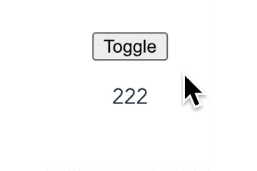
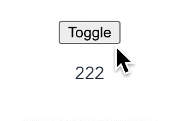
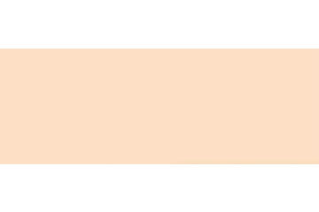

# 介绍动画相关

## 1. Vue的transition组件
### 1.1 transition组件介绍
transition组件通常用于元素的过渡动画，比如以下场景：
- 条件渲染 (使用 v-if)
- 条件展示 (使用 v-show)
- 动态组件
- 组件根节点

在transition下的组件进入/离开，会经历6个class的切换：
- v-enter：定义进入过渡的开始状态。在元素被插入之前生效，在元素被插入之后的下一帧移除。

- v-enter-active：定义进入过渡生效时的状态。在整个进入过渡的阶段中应用，在元素被插入之前生效，在过渡/动画完成之后移除。这个类可以被用来定义进入过渡的过程时间，延迟和曲线函数。

- v-enter-to：2.1.8 版及以上定义进入过渡的结束状态。在元素被插入之后下一帧生效 (与此同时 v-enter 被移除)，在过渡/动画完成之后移除。

- v-leave：定义离开过渡的开始状态。在离开过渡被触发时立刻生效，下一帧被移除。

- v-leave-active：定义离开过渡生效时的状态。在整个离开过渡的阶段中应用，在离开过渡被触发时立刻生效，在过渡/动画完成之后移除。这个类可以被用来定义离开过渡的过程时间，延迟和曲线函数。

- v-leave-to：2.1.8 版及以上定义离开过渡的结束状态。在离开过渡被触发之后下一帧生效 (与此同时 v-leave 被删除)，在过渡/动画完成之后移除。

下图描述了各指令对应的类出发时机：


**举例：**
```html
  <transition>
    <p v-if="show">hello</p>
  </transition>
```

```css
.v-enter{
  opacity: 0;
}
.v-leave-to{
  transform: translateX(10px);
  opacity: 0;
}
.v-enter-active,
.v-leave-active{
  transition: all 1s;
}
```
p标签随着show状态切换会有淡入淡出的效果。

### 1.2 使用name属性修改类名
v- 是这些类名的默认前缀。如果你使用了\<transition name="my-transition">，那么 v-enter 会替换为 my-transition-enter。

### 1.3 结合css动画
使用和css过渡类似：
```html
  <transition name="bounce">
    <p v-if="show">hello</p>
  </transition>
```
```css
.bounce-enter-active {
  animation: bounce-in .5s;
}
.bounce-leave-active {
  animation: bounce-in .5s reverse;
}
@keyframes bounce-in {
  0% {
    transform: scale(0);
  }
  50% {
    transform: scale(1.5);
  }
  100% {
    transform: scale(1);
  }
}
```

### 1.4 自定义过渡类名
我们可以通过以下 attribute 来自定义过渡类名：

- enter-class
- enter-active-class
- enter-to-class (2.1.8+)
- leave-class
- leave-active-class
- leave-to-class (2.1.8+)

这对于 Vue 的过渡系统和其他第三方 CSS 动画库，如 Animate.css 结合使用十分有用。
```html
  <transition
    name="custom-classes-transition"
    enter-active-class="animated tada"
    leave-active-class="animated bounceOutRight"
  >
    <p v-if="show">hello</p>
  </transition>
```

### 1.5 多个元素的过渡 - 过渡模式
当使用v-if配合v-else控制元素显隐时，如果元素标签相同，需要为元素添加key标识为不同元素，否则Vue会最大限度去复用节点，从而不能达到过渡效果。

```html
  <transition>
    <p v-if="show" key="first">111</p>
    <p v-else key="second">222</p>
  </transition>
```

结合上文的动画，我们看下效果：


会发现，两个p标签的过渡动画同时进行了。这是 \<transition> 的默认行为 - 进入和离开同时发生。

transition提供了不同的过渡模式mode：
- in-out：新元素先进行过渡，完成之后当前元素过渡离开。
- out-in：当前元素先进行过渡，完成之后新元素过渡进入。

修改代码
```html
  <transition name="bounce" mode="out-in">
    <p v-if="show" key="first">111</p>
    <p v-else key="second">222</p>
  </transition>
```


### 1.6 多个组件过渡
多个组件的过渡不需要使用 **key** attribute。相反，我们只需要使用动态组件：

```html
<transition name="component-fade" mode="out-in">
  <component v-bind:is="view"></component>
</transition>
```

```js
new Vue({
  el: '#transition-components-demo',
  data: {
    view: 'v-a'
  },
  components: {
    'v-a': {
      template: '<div>Component A</div>'
    },
    'v-b': {
      template: '<div>Component B</div>'
    }
  }
})
```

### 1.7 列表过渡
列表过渡这边不多做介绍，详细可看 [官网](https://cn.vuejs.org/v2/guide/transitions.html#%E5%88%97%E8%A1%A8%E8%BF%87%E6%B8%A1)

## 2. Css3常用动画

参考动画库：[animate.css](https://animate.style/)

### 2.1 css3动画相关方法
transform中常用的动画方法：

```css
/* 放大元素至1.5倍 */
transform: scale(1.5)

/* 放大元素至1.5倍(3D) */
transform: scale3d(1.5, 1.5, 1.5)

/* 元素相对当前位置移动 */
transform: translate(10px, 10px)
transform: translateX(10px)
transform: translateY(10px)

/* 元素旋转 */
transform: rotate(45deg) // 顺时针旋转45°
transform: rotate3d(0, 1, 0, 180deg); // 绕Y轴旋转180°

/* 元素倾斜 */
transform: skew(0 30deg)
```

### 2.2 放大

```css
@keyframes pulse {
  from {
    transform: scale3d(1, 1, 1);
  }

  50% {
    transform: scale3d(1.05, 1.05, 1.05);
  }

  to {
    transform: scale3d(1, 1, 1);
  }
}
.animate__pulse {
  animation-name: pulse;
  animation-timing-function: ease-in-out;
}
```

### 2.3 从上降落

```css
@keyframes backInDown {
  0% {
    transform: translateY(-1200px) scale(0.7);
    opacity: 0.7;
  }

  80% {
    transform: translateY(0px) scale(0.7);
    opacity: 0.7;
  }

  100% {
    transform: scale(1);
    opacity: 1;
  }
}
.animate__backInDown {
  animation-name: backInDown;
}
```

### 2.4 淡入

```css
@keyframes fadeIn {
  from {
    opacity: 0;
  }

  to {
    opacity: 1;
  }
}
.animate__fadeIn {
  animation-name: fadeIn;
}
```

### 2.5 绕Y轴旋转

```css
.animate{
  animation: animateName 1s;
}

@keyframes animateName {
  0% {
    transform: rotate3d(0,1,0,0deg);
  }

  100% {
    transform: rotate3d(0,1,0,360deg);
  }
}
```

### 2.6 转圈

```css
.animate{
  animation: animateName 1s;
}

@keyframes animateName {
  0% {
    transform: rotate(0);
  }

  100% {
    transform: rotate(360deg);
  }
}
```

### 2.7 倾斜
```css
.animate{
  animation: animateName 1s;
}

@keyframes animateName {
  0% {
    transform: skew(0);
  }

  50%{
    transform: skew(30deg);
  }

  100% {
    transform: skew(0deg);
  }
}
```