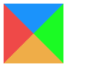

- [1.BFC机制](#1bfc机制)
- [2.CSS3中新增的选择器以及属性](#2css3中新增的选择器以及属性)
- [3.居中布局](#3居中布局)
- [4.清除浮动有哪些方法,各有什么优缺点](#4清除浮动有哪些方法各有什么优缺点)
- [5.用纯CSS创建一个三角形的原理是什么](#5用纯css创建一个三角形的原理是什么)
- [6.实现三栏布局有哪些方法, 分别描述一下](#6实现三栏布局有哪些方法-分别描述一下)
- [7.css3实现0.5px的细线](#7css3实现05px的细线)
- [8.link 与 @import 的区别](#8link-与-import-的区别)
- [9.开发中为什么要初始化css样式](#9开发中为什么要初始化css样式)
- [10.CSS优化、提高性能的方法有哪些](#10css优化提高性能的方法有哪些)
- [11.flex有哪些属性](#11flex有哪些属性)
- [12.display:none和visibility:hidden区别](#12displaynone和visibilityhidden区别)
- [13.常用伪类、伪元素](#13常用伪类伪元素)
- [14.选择器的优先级](#14选择器的优先级)
- [15.移动端单位rem、vw、vh、em](#15移动端单位remvwvhem)

## 1.BFC机制

BFC(Block Formatting Context)， **块级格式化上下文** ，是一个独立的渲染区域，让处于 BFC
内部的元素与外部的元素相互隔离，使内外元素的定位不会相互影响。

  * 触发条件 (以下任意一条) 
    * float的值不为none
    * overflow的值不为visible
    * display的值为table-cell、tabble-caption和inline-block之一
    * position的值不为static或则releative中的任何一个

> 在IE下, Layout,可通过`zoom:1` 触发

  * .BFC布局与普通文档流布局区别 普通文档流布局:

    1. 浮动的元素是不会被父级计算高度
    2. 非浮动元素会覆盖浮动元素的位置
    3. margin会传递给父级元素
    4. 两个相邻元素上下的margin会重叠

BFC布局规则:

    1. 浮动的元素会被父级计算高度(父级元素触发了BFC)
    2. 非浮动元素不会覆盖浮动元素的位置(非浮动元素触发了BFC)
    3. margin不会传递给父级(父级触发BFC)
    4. 属于同一个BFC的两个相邻元素上下margin会重叠
  * 开发中的应用

    * 阻止margin重叠
    * 可以包含浮动元素 —— 清除内部浮动(清除浮动的原理是两个 div都位于同一个 BFC 区域之中)
    * 自适应两栏布局
    * 可以阻止元素被浮动元素覆盖

## 2.CSS3中新增的选择器以及属性

  * 属性选择器

属性选择器 | 含义描述  
---|---  
E[att^="val"] | 属性att的值以"val" **开头** 的元素  
E[att$="val"] | 属性att的值以"val" **结尾** 的元素  
E[att*="val"] | 属性att的值 **包含** "val"字符串的元素  
  
  * 结构伪类选择器

选择器 | 含义描述  
---|---  
E:root | 匹配文档的 **根元素** ，对于HTML文档，就是HTML元素  
E:nth-child(n) | 匹配其 **父元素的第n个子元素** ，第一个编号为1  
E:nth-last-child(n) | 匹配其父元素的 **倒数第n个子元素** ，第一个编号为1  
E:nth-of-type(n) | 与:nth-child()作用类似，但是仅匹配使用同种标签的元素  
E:nth-last-of-type(n) | 与:nth-last-child() 作用类似，但是仅匹配使用同种标签的元素  
E:last-child | 匹配父元素的最后一个子元素，等同于:nth-last-child(1)  
E:first-of-type | 匹配父元素下使用同种标签的第一个子元素，等同于:nth-of-type(1)  
E:last-of-type | 匹配父元素下使用同种标签的最后一个子元素，等同于:nth-last-of-type(1)  
E:only-child | 匹配父元素下仅有的一个子元素，等同于:first-child:last-child或 :nth-child(1):nth-
last-child(1)  
E:only-of-type | 匹配父元素下使用同种标签的唯一一个子元素，等同于:first-of-type:last-of-type或 :nth-of-
type(1):nth-last-of-type(1)  
E:empty | 匹配一个不包含任何子元素的元素，注意，文本节点也被看作子元素  
  
  * css3新增属性

属性 | 含义描述 | 兼容  
---|---|---  
transition | 设置过渡效果 |  
transform | 变换效果(移动、缩放、转动、拉长或拉伸) |  
animation | 动画效果 |  
box-shadow | 阴影效果 | FF3.5, Safari 4, Chrome 3  
text-shadow | 文本阴影 | FF 3.5, Opera 10, Safari 4, Chrome 3  
border-colors | 为边框设置多种颜色 | FF3+  
boder-image | 图片边框 | FF 3.5, Safari 4, Chrome 3  
text-overflow | 文本截断 | IE6+, Safari4, Chrome3, Opera10  
word-wrap | 自动换行 | IE6+, FF 3.5, Safari 4, Chrome 3  
border-radius | 圆角边框 | FF 3+, Safari 4 , Chrome 3  
opacity | 不透明度 | all  
box-sizing | 控制盒模型的组成模式 | FF3+, Opera 10, Safari 4, Chrome 3  
outline | 外边框 | FF3+, safari 4, chrome 3, opera 10  
background-size | 不指定背景图片的尺寸 | safari 4, chrome 3, opera 10  
background-origin | 指定背景图片从哪里开始显示 | safari 4, chrome 3, FF 3+  
background-clip | 指定背景图片从什么位置开始裁切 | safari 4, chrome 3  
rgba | 基于r,g,b三个颜色通道来设置颜色值, 通过a来设置透明度 | safari 4, chrome 3, FF3, opera 10  
  
## 3.居中布局

  * 水平居中

    1. 行内元素: `text-align:center`
    2. 块级元素: `margin:0 auto`
    3. 绝对定位和移动: `absolute + transform`
    4. 绝对定位和负边距: `absolute + margin`
    5. flex布局: `flex + justify-content:center`
  * 垂直居中

    1. 子元素为单行文本: `line-height:height`
    2. `absolute + transform`
    3. `flex + align-items:center`
    4. table: `display:table-cell; vertical-align: middle`
    5. 利用position和top和负margin
  * 水平垂直居中

1. 已知元素宽高:`绝对定位+margin:auto`:
```css
  div{
    width: 200px;
    height: 200px;
    background: green;
    
    position:absolute;
    left:0;
    top: 0;
    bottom: 0;
    right: 0;
    margin: auto;
  }
 ```

2. 已知元素宽高: 绝对定位+负margin    
```css
  div{
    width: 200px;
    height: 200px;
    background: green;
    
    position:absolute;
    left:50%;
    top: 50%;
    margin-left: -100px;
    margin-top: -100px;
  }
 ```

3. `absolute+transform` 无需知道宽高

```css
div{
  background: green;		        
  position:absolute;
  left:50%;    /* 定位父级的50% */
  top:50%;
  transform: translate(-50%,-50%); /*自己的50% */
}
```

4. `flex布局` 无需知道宽高
假设box下有一个content元素，如下设置box即可让content居中显示
```css
.box{
  display:flex;
  justify-content:center;  //子元素水平居中
  align-items:center;      //子元素垂直居中
}
```

## 4.清除浮动有哪些方法,各有什么优缺点

  1. **使用clear属性的空元素** 在浮动元素后使用一个空元素如`<div class="clear"></div>`，并在CSS中赋予`.clear{clear:both;}`属性即可清理浮动。

> 优点: 简单, 写少量代码, 兼容性也好 缺点: 添加无语义html元素, 不利于代码语义化, 后期维护成本大

  2. **使用css的overflow属性** 给浮动元素的容器添加`overflow:hidden;`或`overflow:auto;`可以清除浮动。

> 优点: 简单, 代码少, 浏览器支持好 缺点: 不能和position配合使用, 因为超出的尺寸会被隐藏`overflow:hidden`

  3. **使用CSS的:after伪元素** 结合 :after 伪元素（注意这不是伪类，而是伪元素，代表一个元素之后最近的元素）和 IEhack ，可以完美兼容当前主流的各大浏览器，这里的 IEhack 指的是触发 hasLayout。 给浮动元素的容器添加一个 `clearfix` 的class，然后给这个class添加一个:after伪元素实现元素末尾添加一个看不见的块元素（Block element）清理浮动。 通过CSS伪元素在容器的内部元素最后添加了一个看不见的空格"020"或点"."，并且赋予clear属性来清除浮动。需要注意的是为了IE6和IE7浏览器，要给clearfix这个class添加一条zoom:1;触发haslayout。

> 优点: 浏览器支持好，不容易出现怪问题（目前：大型网站都有使用，如：腾迅，网易，新浪等等） 缺点: 代码多，要两句代码结合使用，才能让主流浏览器都支持

  4. **给父级元素设置高度**

> 简单, 代码少,好掌握 缺点: 只适用于高度固定的布局

## 5.用纯CSS创建一个三角形的原理是什么
将元素的border值增大

```css
  .box{
    width:100px;
    height:100px;
    border: 50px solid;
    border-color:#1b93fb #1bfb24 #efad48 #ef4848;
  }
```

很容易发现, border渲染并不是正方形, 而是梯形的

在增大border的基础下, 此时我们将盒子宽高变成0,会产生什么效果呢!

```css
  .box{
    width:0px;
    height:0px;
    border: 50px solid;
    border-color:#1b93fb #1bfb24 #efad48 #ef4848;
  }
```



四个三角形拼合成的矩形呈现在我们眼前,那如如果我们只想要一个三角形, 我们是不是可以设想将其他三个设为不可见;

设置透明, 隐藏其中三个三角形

```css
  .box{
  width:0px;
  height:0px;
  border: 50px solid;
  border-color:transparent transparent transparent #ef4848;
}
```

三角形这样就出来, 有木有很简单, 当然我们也可以采用逆向思维来写这个效果, 就是先将所有边框设为透明, 然后需要哪边再对其设置颜色, 效果是一样的

```css
  .box{
    width:0px;
    height:0px;
    border: 50px solid transparent;
    border-left:50px solid #ef4848;
  }
```

## 6.实现三栏布局有哪些方法, 分别描述一下

三栏布局，顾名思义就是两边固定，中间自适应。三栏布局在开发十分常见，那么什么是三栏布局？
即左右模块固定宽度，中间模块随浏览器变化自适应，想要完成的最终效果如下图所示：

下面列出四种实现方式, 在开发中可以根据实际需求选择适合自己的方法进行编码:

  * Flex 布局

```html
  <style>
  .container{
    display:flex;
    justify-content: center;
    height: 200px;
    background: #eee;
  }
  .left {
      width: 200px;
      background-color: red;
      height: 100%;
    }
  .main {
      background-color: yellow;
      flex: 1;
  }
  .right {
      width: 200px;
      background-color: green;
  }
  </style>
  
  <div class="container">
    <div class="left">1</div>
    <div class="main">2</div>
    <div class="right">3</div>
  </div>
```

> 简单实用，现在比较流行的方案，但是需要考虑浏览器的兼容性。

  * 绝对定位布局

```html
<style>
.container {
  position: relative;
  background:#eee;
  height:200px;
  }
.main {
  height: 200px;
  margin: 0 120px;
  background-color: yellow;
  }
.left {
  position: absolute;
  width: 100px;
  height: 200px;
  left: 0;
  top: 0;
  background-color: red;
  }
.right {
  position: absolute;
  width: 100px;
  height: 200px;
  background-color: green;
  right: 0;
  top: 0;
}
</style>

<div class="container">
  <div class="left">1</div>
  <div class="main">2</div>
  <div class="right">3</div>
</div>
```

> 这种方案也简单实用, 并且可以将 `<div class="main"></div>`元素放到第一位,使得主要内容优先加载!

  * 双飞翼布局

```html
<style>
.content {
  float: left;
  width: 100%;
}
.main {
  height: 200px;
  margin-left: 110px;
  margin-right: 220px;
  background-color: yellow;
}
.left {
  float: left;
  height: 200px;
  width: 100px;
  margin-left: -100%;
  background-color: red;
}
.right {
  width: 200px;
  height: 200px;
  float: right;
  margin-left: -200px;
  background-color: green;
}	

</style>
<div class="content">
  <div class="main"></div>
</div>
<div class="left"></div>
<div class="right"></div>
```

  * 圣杯布局

```html
<style>
.container {
  margin-left: 120px;
  margin-right: 220px;
}
.main {
  float: left;
  width: 100%;
  height: 300px;
  background-color: yellow;
}
.left {
  float: left;
  width: 100px;
  height: 300px;
  margin-left: -100%;
  position: relative;
  left: -120px;
  background-color: blue;
}
.right {
  float: left;
  width: 200px;
  height: 300px;
  margin-left: -200px;
  position: relative;
  right: -220px;
  background-color: green;
}
</style>
<div class="container">
  <div class="main"></div>
  <div class="left"></div>
  <div class="right"></div>
</div>
```

> 圣杯布局和双飞翼布局解决问题的方案在前一半是相同的，也就是三栏全部float浮动，但左右两栏加上负margin让其跟中间栏div并排，以形成三栏布局。

## 7.css3实现0.5px的细线
使用css3的scaleY，纵向缩小元素
    
```html    
  <style>
  .line {
      border-bottom: 1px solid #000;
      transform: scaleY(0.5);
  }
  </style>
  
  <div class="line"></div>
```

## 8.link 与 @import 的区别

  1. 从属关系区别

> @import是 CSS 提供的语法规则，只有导入样式表的作用；link是HTML提供的标签，不仅可以加载 CSS 文件，还可以定义 RSS、rel
> 连接属性等

  2. 加载顺序区别

> 加载页面时，link标签引入的 CSS 被同时加载；@import引入的 CSS 将在页面加载完毕后被加载。

  3. 兼容性区别

> @import是 CSS2.1 才有的语法，故只可在 IE5+ 才能识别；link标签作为 HTML 元素，不存在兼容性问题。

  4. DOM可控性区别

> 可以通过 JS 操作 DOM ，插入link标签来改变样式；由于DOM方法是基于文档的，无法使用@import的方式插入样式。

## 9.开发中为什么要初始化css样式

因为浏览器的兼容问题，不同浏览器对有些标签的默认值是不同的，如果没对CSS初始化往往会出现浏览器之间的页面显示差异。

## 10.CSS优化、提高性能的方法有哪些

  * 尽量将样式写在单独的css文件里面，在head元素中引用 将代码写成单独的css文件有几点好处： 
    1. 内容和样式分离，易于管理和维护
    2. 减少页面体积
    3. css文件可以被缓存、重用，维护成本降低
  * 不使用@import
  * 避免使用复杂的选择器，层级越少越好 建议选择器的嵌套最好不要超过三层
  * 精简页面的样式文件，去掉不用的样式
  * 利用CSS继承减少代码量
  * 避免!important，可以选择其他选择器
  * 避免使用行内样式

## 11.flex有哪些属性
**容器上的属性**

| 属性 | 作用 | 可选值 | 默认值 |
| :----:| :---: | :----: | :----: |
| flex-direction | 决定子元素排列方向 | row、row-reverse、column、column-reverse | row |
| flex-wrap | 子元素换行方式 | nowrap、wrap、wrap-reverse（换行且第一行在下方） | nowrap |
| flex-flow | flex-direction和flex-wrap的简写 | 属性原有的值 | row nowrap |
| justify-content | 主轴对齐方式 | flex-start、flex-end、center、space-between、space-around | flex-start |
| align-items | 交叉轴对齐方式 | flex-start、flex-end、center、baseline、stretch（占满容器高度） | stretch |
| align-content | 定义了多根轴线的对齐方式。如果项目只有一根轴线，该属性不起作用 | flex-start、flex-end、center、space-between、space-around、stretch | stretch |

**子元素上的属性**

| 属性 | 作用 | 可选值 | 默认值 |
| :----:| :---: | :----: | :----: |
| order | 决定子元素排列顺序，数值越小越靠前 | \<number> | 0 |
| flex-grow | 定义子元素放大比例。如果子元素都是1，那么等分空间，如果有一个元素是2，那该元素的空间是其他元素的两倍 | \<number> | 0（存在剩余空间也不不放大） |
| flex-shrink | 定义子元素缩小比例 | \<number>，设置为0的元素空间不会缩小 | 1（空间不足时，元素缩小） |
| flex-basis | 定义子元素大小 | \<length>例如：350px | auto |
| flex | flex-grow、flex-shrink、flex-basis的简写 | 它们原先的值 | 0 1 auto |
| align-self | 设置单个子元素与其他子元素不同对齐方式，覆盖父元素align-items | auto、flex-start、flex-end、center、baseline、stretch | auto（继承父元素的align-items） |

**如何设置两个点在容器的对角？**

```html
<style>
  .flex {
    display: flex;
    flex-flow: column;
    justify-content: space-between;
  }

  .flex>div:nth-child(2) {
    align-self: flex-end;
  }
</style>

<div class="flex">
  <div>1</div>
  <div>2</div>
</div>
```

## 12.display:none和visibility:hidden区别
1. 前者不占空间，后者任占据空间
2. 前者会触发回流，后者仅触发重绘
3. 前者为非继承属性，子元素设置display:block后任然无法显示。后者为继承属性，子元素设置visibility:visible后，子元素会显示

## 13.常用伪类、伪元素
**伪类**

用于当元素处于某个状态时，为其添加对应的样式，这个状态是根据用户行为而动态变化的

状态相关伪类

- :active
- :visited
- :hover
- :focus

表单相关伪类

- :disabled
- :enabled
- :checked
- :read-only

结构化伪类

- :first-child
- :last-child
- :nth-child(n)

**伪元素**

创建不再文档树的元素，并为其添加样式。

- ::befroe
- ::after
- ::first-letter
- ::first-line

## 14.选择器的优先级

css有7种基础选择器

1. id选择器，如#id{}
2. 类选择器，如.class{}
3. 属性选择器，如a[href="baidu.com"]{}
4. 伪类选择器，如:hover{}
5. 标签选择器，如input{}
6. 伪元素选择器，如::after{}
7. 通配符选择器，*{}

css优先规则：行内样式 > id选择器 > 类选择器 = 伪类选择器 = 属性选择器 > 标签选择器 = 伪元素选择器 > 通配符选择器

## 15.移动端单位rem、vw、vh、em

**rem**

相对单位，相对根节点html的font-size大小，比如html的font-size:16px，那1rem = 16px

**vw、vh**

vw 表示视窗宽度，1vw = 1%视窗宽度

vh 表示视窗高度，1vh = 1%视窗高度

vw、vh 和 % 的区别？

1. % 相对的是父元素的宽高，而 vw、vh 是相对视窗的宽高
2. 父元素未设置宽高时，% 是无法获得正确的宽高的，而vw、vh任何时候都能获取到视窗的宽高

**em**

相对单位，参考父元素font-size，比如父元素font-size:16px，那么1em = 16px。具有继承特性。
