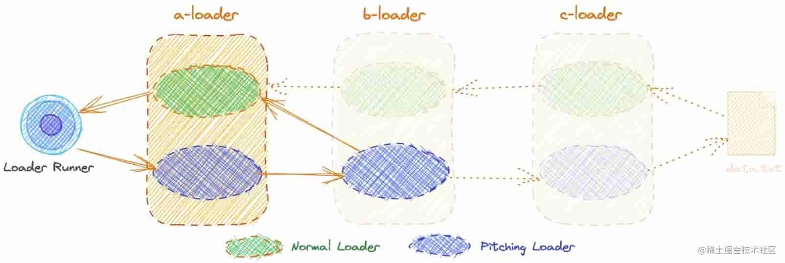

- [Loader 的本质](#loader-的本质)
- [Normal Loader 和 Pitching Loader](#normal-loader-和-pitching-loader)
  - [Normal Loader](#normal-loader)
    - [执行顺序](#执行顺序)
  - [Pitching Loader](#pitching-loader)
    - [执行顺序](#执行顺序-1)
    - [熔断效果](#熔断效果)
  - [Normal Loader 的类型](#normal-loader-的类型)

## Loader 的本质

Loader 的本质是一个导出的函数。该函数内部进行源文件处理及返回。

```js
function webpackLoader(content, map, meta) {
  return content.toUpperCase();
}
module.exports = webpackLoader;
```

比如要处理 css 文件，需要用到 `style-loader` 和 `css-loader` 。

具体配置如下：

webpack.config.js

```js
const path = require("path");

module.export = {
  entry: "./src/index.js",
  output: {
    filename: "bundle.js",
    path: path.resolve(__dirname, "dist")
  },
  module: {
    rules: [
      {
        test: /\.css$/i,
        use: ["style-loader", "css-loader"]
      }
    ]
  }
};
```

Webpack 的设计遵循了单一原则，每个 loader 都专注自己的职责，方便 loader 的组合和扩展。

若要将一个 css 的项目扩展成支持 sass，仅需安装 sass-loader 和增加 sass 相关 loader 的配置：

```js
module.export = {
	...
  module: {
    rules: [
      {
        test: /\.scss$/i,
        use: ["style-loader", "css-loader", "sass-loader"]
      }
    ]
  }
};
```

## Normal Loader 和 Pitching Loader

一个 loader 分为两个部分，一部分是导出的函数，另一部分是导出函数的 pitch 属性，我们又常称他们为 `Normal Loader` 和 `Pitching Loader`。

```js
// Normal Loader
function webpackLoader(content, map, meta) {}

// Pitching Loader
webpackLoader.pitch = function (remainingRequest, previousRequest, data) {};

module.exports = webpackLoader;
```

Loader 的执行阶段分为：`pitch阶段` **=>** `normal阶段`。

`pitch阶段` 会执行 `Pitching Loader`，`normal阶段` 会执行 `Normal Loader`。

### Normal Loader

我们开发中更常使用以及自定义开发的 loader 通常是 `Normal Loader`。

`Normal Loader` 即 loader 导出的函数：

```js
/**
 * @param {string|Buffer} content 源文件的内容
 * @param {object} [map] 可以被 https://github.com/mozilla/source-map 使用的 SourceMap 数据
 * @param {any} [meta] meta 数据，可以是任何内容
 */
function webpackLoader(content, map, meta) {}
module.exports = webpackLoader;
```

#### 执行顺序

在 webpack 配置中 `Normal Loader` 链式执行顺序为从右到左，以下方配置为例，则 loader 调用顺序为：sass-loader **=>** css-loader **=>** style-loader

```js
rules: [
  {
    test: /\.scss$/i,
    use: ["style-loader", "css-loader", "sass-loader"]
  }
];
```

### Pitching Loader

`Pitching Loader` 为 `Normal Loader` 的 `pitch` 属性，它也是一个函数：

```js
/**
 * @remainingRequest 剩余请求
 * @precedingRequest 前置请求
 * @data 数据对象
 */
webpackLoader.pitch = function (remainingRequest, precedingRequest, data) {
  // some code
};
```

其中 `data` 参数，可以用于数据传递。即在 `pitch` 函数中往 `data` 对象上添加数据，之后在 `normal` 函数中通过 `this.data` 的方式读取已添加的数据。

`remainingRequest` 参数示例：

/Users/fer/webpack-loader-demo/loaders/c-loader.js!/Users/fer/webpack-loader-demo/src/data.txt

`precedingRequest` 参数示例：

/Users/fer/webpack-loader-demo/loaders/a-loader.js

#### 执行顺序

`Pitching Loader` 优先于 `Normal Loader` 执行。

```js
rules: [
  {
    test: /\.scss$/i,
    use: ["style-loader", "css-loader", "sass-loader"]
  }
];
```

以如上配置为例，`pitch阶段` 中 `Pitching Loader` 执行顺序为：

[style-loader].pitch() **=>** [css-loader].pitch() **=>** [sass-loader].pitch()

执行完后才会执行 `normal阶段` ：

sass-loader **=>** css-loader **=>** style-loader

#### 熔断效果

> 熔断效果：当某个 **Pitching Loader** 返回非 `undefined` 值时，就会触发熔断效果，**它会立马掉头用`pitch`函数的返回值去执行前置的`noraml loader`。**



正常执行时是会读取资源文件的内容交给`normal loader`去处理，但是`pitch`存在返回值时发生熔断并不会读取文件内容了。此时`pitch`函数返回的值会交给将要执行的`normal loader`。

### Normal Loader 的类型

`narmal loader` 实际又分 4 种类型：pre 前置、normal 正常、inline 行内、post 后置。

在`webpack`进行编译文件前，资源文件匹配到对应`loader`：

不同 loader 类型执行顺序为：`pre 前置` **=>** `normal 正常` **=>** `inline 行内` **=>** `post 后置`。

**如何配置 loader 类型？**

通过 rule 对象的 enforce 属性可设置 loader 为 'pre'、'post'，不设置则默认值为'normal'。

```js
module.exports = {
		...
    rules: [
      {
        test: /\.txt$/i,
        use: ["a-loader"],
        enforce: "post", // post loader
      },
      {
        test: /\.txt$/i,
        use: ["b-loader"], // normal loader
      },
      {
        test: /\.txt$/i,
        use: ["c-loader"],
        enforce: "pre", // pre loader
      }
    ],
		...
};
```

以上例子中，loader 会按 c-loader **=>** b-loader **=>** a-loader 的顺序执行。

inline loader 指的是：

```js
import Styles from "style-loader!css-loader?modules!./styles.css";
```

<!-- TODO:  -->
