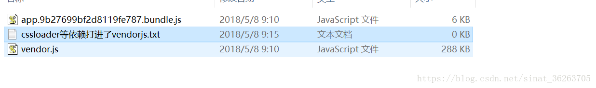

- [Webpack 主要功能](#webpack-主要功能)
- [核心概念](#核心概念)
  - [入口 entry](#入口-entry)
  - [出口 output](#出口-output)
  - [loader](#loader)
  - [插件 plugin](#插件-plugin)
  - [mode](#mode)
- [常用的webpack插件](#常用的webpack插件)
  - [配置类](#配置类)
    - [ProvidePlugin](#provideplugin)
    - [DefinePlugin](#defineplugin)
    - [ExtractTextPlugin](#extracttextplugin)
    - [HtmlWebpackPlugin](#htmlwebpackplugin)
  - [optimize优化类](#optimize优化类)
    - [uglifyjs-webpack-plugin](#uglifyjs-webpack-plugin)
    - [commonsChunkPlugin](#commonschunkplugin)
- [常用loader](#常用loader)
- [拓展](#拓展)
  - [模拟实现一个loader](#模拟实现一个loader)

## Webpack 主要功能
- `打包` 将多文件打包成一个文件，减少请求次数和下载带宽，起到降低服务器压力的作用。
- `转换` 将预编译语言转换成浏览器可识别语言。
- `优化` 性能优化

## 核心概念
### 入口 entry

`entry` 属性，用于告诉 webpack 从哪个文件开始构建，支持 string | object 。

**单入口**
```javascript
module.exports = {
  entry: './index.js'
};
```
**多入口**
```javascript
// 场景一：分离 应用程序(app) 和 第三方库(vendor) 入口
module.exports = {
  entry: {
    app: './src/app.js',
    vendors: './src/vendors.js'
  }
};
```

```javascript
// 场景二：多页面应用程序，告诉 webpack 需要 3 个独立分离的依赖图
module.exports = {
  entry: {
    pageOne: './src/pageOne/index.js',
    pageTwo: './src/pageTwo/index.js',
    pageThree: './src/pageThree/index.js'
  }
};
```

### 出口 output
`output` 属性用于告诉 webpack 打包后文件在哪里输出，以及输出文件名称格式。

**单出口**
```javascript
const path = require('path');

module.exports = {
  entry: './src/main.js',
  output: {
    filename: 'main.js',
    path: path.resolve(__dirname, 'dist')
  }
};
```

**多出口**
```javascript
const path = require('path');

module.exports = {
  entry: {
    app: './src/app.js',
    vendors: './src/vendors.js'
  },
  output: {
    filename: '[name].js',
    path: path.resolve(__dirname, 'dist')
  }
}
```

### loader
webpack 默认只能打包 javascript 文件， `loader` 能将其他文件转化为 webpack 能有效识别的模块。

**注意**：`loader` 无需引入。
```javascript
// 安装 loader
npm install --save-dev css-loader
```
```javascript
module.exports = {
  module: {
    rules: [{ 
        test: /\.css$/, 
        use: ['style-loader', 'css-loader']
    }]
  }
};

// 或

 module.exports = {
  module: {
    rules: [{ 
        test: /\.css$/, 
        use: ['style-loader', {
            loader: 'css-loader',
            options: {
                modules: true
            }
        }]
    }]
  }
};
```

**特性**：逆向编译，链式传递

```javascript
module.exports = {
  module: {
    rules: [{ 
        test: /\.css$/, 
        use: ['style-loader', 'css-loader', 'postcss-loader']
    }]
  }
};

// 如上，css 文件编译顺序依次为：postcss-loader ---> css-loader ---> style-loader
// 编译过程中，第一个loader的值 传递给下一个loader，依次传递；最后一个loader编译完成后，将预期值传递给 webpack
```

### 插件 plugin
`plugin` 属性用于引入插件，可以处理各种任务比如：打包优化、代码压缩、定义环境变量等等。

**注意**：
- 所有插件需在文件中使用 `require` 引入才能使用。
- 有些插件是内置插件，无需下载安装。

```bash
npm i html-webpack-plugin -D
```

```javascript
const HtmlWebpackPlugin = require('html-webpack-plugin'); 

module.exports = {
  plugins: [
    new HtmlWebpackPlugin({
        template: './src/index.html'
    })
  ]
};
```

**插件内部实现**

webpack 插件其实就是一个具有 `apply` 方法的对象。

`apply` 属性会被 webpack `compiler` 调用，并且 `compiler` 对象可在整个编译生命周期访问。
```javascript
// ConsoleLogOnBuildWebpackPlugin.js

const pluginName = 'ConsoleLogOnBuildWebpackPlugin';

class ConsoleLogOnBuildWebpackPlugin {
    apply(compiler) {
        compiler.hooks.run.tap(pluginName, compilation => {
            console.log("webpack 构建过程开始！");
        });
    }
}
```

### mode
webpack4 新增属性，用于区分环境，有以下可选值：
- development
- production
- none

**使用**

在配置文件中
```javascript
module.exports = {
  mode: 'production'
};
```

执行命令时
```bash
webpack --mode=production
```

|    选项     |                                                                                                                    描述                                                                                                                    |
| :---------: | :----------------------------------------------------------------------------------------------------------------------------------------------------------------------------------------------------------------------------------------: |
| development |                                                               会将 DefinePlugin 中 process.env.NODE_ENV 的值设置为 development。启用 NamedChunksPlugin 和 NamedModulesPlugin                                                               |
| production  | 会将 DefinePlugin 中 process.env.NODE_ENV 的值设置为 production。启用 FlagDependencyUsagePlugin, FlagIncludedChunksPlugin, ModuleConcatenationPlugin, NoEmitOnErrorsPlugin, OccurrenceOrderPlugin, SideEffectsFlagPlugin 和 TerserPlugin。 |
|    none     |                                                                                                            没有任何默认优化选项                                                                                                            |


在业务中区分环境
```javascript
if(process.env.NODE_ENV === 'development'){
    //开发环境 do something
}else{
    //生产环境 do something
}
```

## 常用的webpack插件
### 配置类
#### ProvidePlugin

用途：$ 出现，就会自动加载模块；$ 默认为'jquery'的exports

```javascript
new webpack.ProvidePlugin({
  $: 'jquery',
})
```

#### DefinePlugin
用途：定义全局常量

```javascript
new webpack.DefinePlugin({
    'process.env': {
        NODE_ENV: JSON.stringify(process.env.NODE_ENV)
    },
    PRODUCTION: JSON.stringify(PRODUCTION),
    APP_CONFIG: JSON.stringify(appConfig[process.env.NODE_ENV]),
}),
```

#### ExtractTextPlugin
用途：分离css文件

```javascript
new ExtractTextPlugin(PRODUCTION ? '[name]-[chunkhash].css' : '[name].css')
```

我们通常会在webpack配置中使用 css-loader 和 style-loader 来将css文件处理成js，如果不使用 extractTextPlugin ，css代码将会和js代码打包到一起，引入html后效果如下：

```html
<head>
  <script src="./index.js"></script>
  <style>
    p{
      color: red;
    }
  </style>
</head>
```
css 会以style标签的形式引入。

使用extractTextPlugin后，可以将css代码和js代码分离，打包成独立的文件，引入后效果如下：

```html
<head>
  <script src="./index.js"></script>
  <link href="./style.css" rel="stylesheet">
</head>
```

#### HtmlWebpackPlugin
用途：重构入口html，动态添加 `<link>` 和 `<script>` ，在以hash命名的文件上非常有用，因为每次编译都会改变

```javascript
new HtmlWebpackPlugin({
    template: './src/index.html'
})
```

### optimize优化类
#### uglifyjs-webpack-plugin
用途：js代码压缩

```javascript
new webpack.optimize.UglifyJsPlugin()
```

#### commonsChunkPlugin
用途：将公共模块合并为单独文件，从而可设置从缓存获取，优化网页性能。比如：全局js、依赖等

注意：只能在webpack4之前使用，在webpack4中已被移除

参数：
1. name: 提取出来的公共chunk的名字
2. filename: 生成公共文件的文件名，如果不配置，默认的output里面的filename
3. minChunks:  number|Infinity|function(module, count) -> boolean，三种选择。

    ```
        number：代表模块至少被调用定义的次数才会被放到公共模块当中；（默认为chunks的数量）

        Infinity： 生成的公共文件只包含webpack运行代码，不会包含其他的模块

        function：设置特定的模块，webpack会遍历工程的所有模块调用改函数，并作为module入参传入，只要匹配(return true)，该模块就会被编译进该公共js中
    ```
4. chunks：用于从公共模块当中再进行抽取。如vue工程配置由app.js，vendor.js，manifest.js。

**使用场景：**

1. 不使用commonsChunkPlugin时，会将代码都打包到一个文件下：

```
// 包含依赖代码，文件很大
app.asdadzxcasdadasdasd.js
```

2. 使用commonsChunkPlugin，分离业务模块app

```javascript
new webpack.optimize.CommonsChunkPlugin({
  name: 'app',
  async: 'vendor-async',
  children: true,
  minChunks: 3
})
```

3. 使用commonsChunkPlugin，分离公共模块vendor

将node_modules中有使用到的依赖独立打包到vendor.js文件，并为vendor.js文件设置缓存，优化性能
```javascript
new webpack.optimize.CommonsChunkPlugin({
    name: 'vendor',
    filename: '[name].js',
    minChunks (module) {
      // any required modules inside node_modules are extracted to vendor
      return (
        module.resource &&
        /\.js$/.test(module.resource) &&
        module.resource.indexOf(
          path.join(__dirname, '../node_modules')
        ) === 0
      )
    }
})
```



4. 使用commonsChunkPlugin，分离webpack运行代码模块manifest
```javascript
    new webpack.optimize.CommonsChunkPlugin({
      name: 'manifest',
      minChunks: Infinity
    }),
```
该模块仅包含webpack运行时代码，比如：vendor模块原本会有一段生成script标签并插入到html的代码，当业务改变会重新打包app文件生成新的hash，app.[hash].js文件名称也就改变了，此时又得重新打包新的vendor模块。

我们可以将这一类的webpack运行时代码打包到manifest模块中，这样就不会影响到vendor模块的缓存了。

## 常用loader
- file-loader：把文件输出到一个文件夹中，在代码中通过相对 URL 去引用输出的文件
- url-loader：和 file-loader 类似，但是能在文件很小的情况下以 base64 的方式把文件内容注入到代码中去
- source-map-loader：加载额外的 Source Map 文件，以方便断点调试
- image-loader：加载并且压缩图片文件
- babel-loader：把 ES6 转换成 ES5
- css-loader：加载 CSS，支持模块化、压缩、文件导入等特性
- style-loader：把 CSS 代码注入到 JavaScript 中，通过 DOM 操作去加载 CSS。
- eslint-loader：通过 ESLint 检查 JavaScript 代码

## 拓展
### 模拟实现一个loader
loader 也是一个 node 模块，它导出一个函数，该函数的参数是 require 的源模块，处理 source 后把返回值交给下一个 loader。所以它的 “模版” 应该是这样的：

```javascript
module.exports = function (source) {
    // 处理 source ...
    return handledSource;
}
```

如果是最后一个执行的loader，该loader需返回一个node可执行的 javascript 脚本（用字符串储存）。
```javascript
// 处理顺序排在最后的 loader
module.exports = function (source) {
    // 这个 loader 的功能是把源模块转化为字符串交给 require 的调用方
    return 'module.exports = ' + JSON.stringify(source);
}
```

**实现一个loader**

```bash
# 安装所需依赖
npm i html-loader minimize  -D
```

```javascript
// src/loaders/html-minify-loader.js

var Minimize = require('minimize');

module.exports = function(source) {
    var minimize = new Minimize();
    return minimize.parse(source);
};
```

```javascript
// webpack.config.js

const path = require('path')
module.exports = {
  entry: path.resolve(__dirname, './index.html'),
  output: {
    filename: 'index.html',
    path: path.resolve(__dirname, 'dist')
  },
  module: {
    rules: [
      {
        test: /\.html$/,
        use: ['html-loader', 'html-minify-loader'] // 处理顺序 html-minify-loader => html-loader => webpack
      }
    ]
  },
  resolveLoader: {
    // 因为 html-loader 是开源 npm 包，所以这里要添加 'node_modules' 目录
    modules: [path.join(__dirname, './src/loaders'), 'node_modules']
  }
}
```
**开始打包**
```bash
npx webpack --config webpack.config.js
```