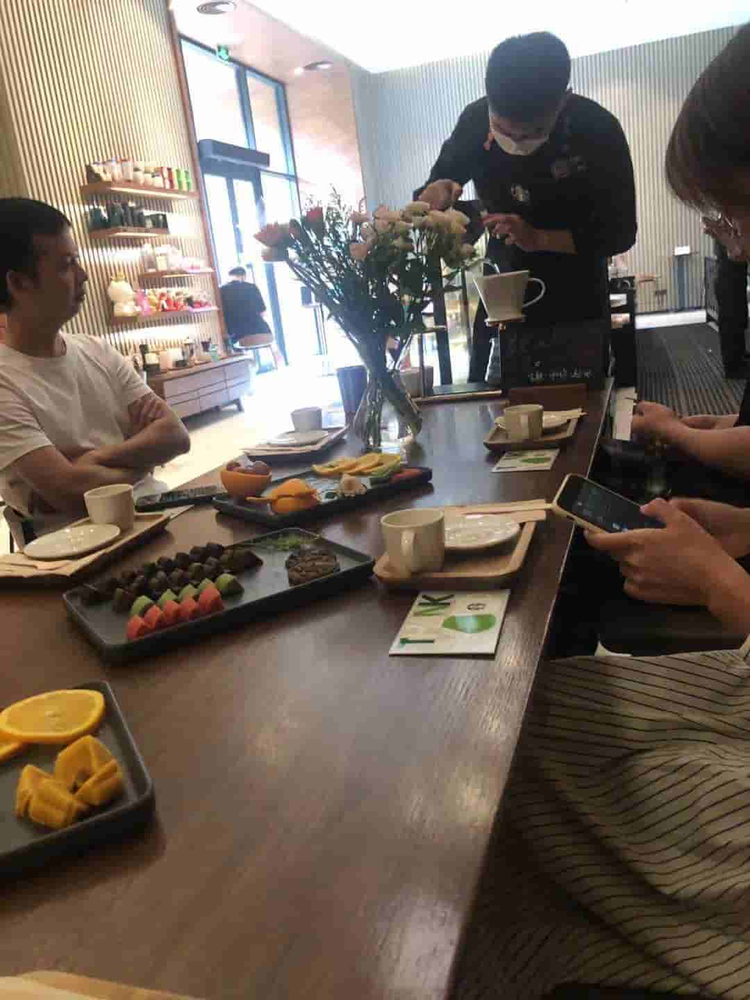

<!--
 * @Date: 2021-08-15 14:43:45
 * @LastEditors: wenfujie
 * @LastEditTime: 2021-08-15 15:29:40
 * @FilePath: /document-library/articles/个人随想/那些外向的小事儿.md
-->

## 偶然参加星巴克咖啡教学课

**时间：2021年8月15日16时**

去星巴克学习时，恰巧今天有开咖啡教学课，咖啡师问我要不要参加，之前没遇到过觉得新奇就答应了。

咖啡师共邀请店里的6位客人参加咖啡教学，课上咖啡师对两款咖啡做了介绍，并现场泡制给我们品尝，桌上还有星巴克的月饼以及水果。

有趣的是：在喝第一口咖啡时，入口有点苦有点酸，咖啡师让我们吃点水果后再喝看看，我吃了颗提子🍇，然后喝第二口咖啡，发现咖啡变味了，更香浓好喝了，神奇！咖啡师解释说是因为水果的糖分和咖啡里的酸综合导致的，又让我们吃口月饼后在喝试试。吃月饼后再喝的咖啡同样更香浓好喝。

咖啡教学课持续了半个小时，其实就是看咖啡师泡咖啡给我们喝，大家一起聊聊咖啡相关的趣事。

**感想：如果说人生是咖啡，它很苦。那努力、奋斗就是提子，提子让咖啡变甜，努力让你活得更甜。所以请继续努力！！！**