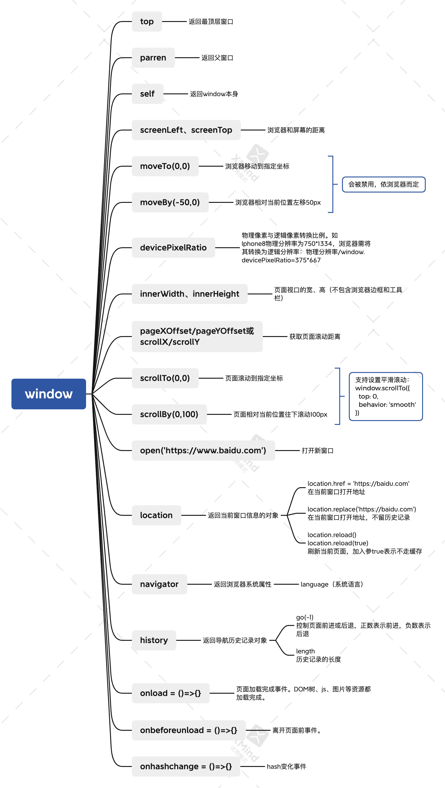
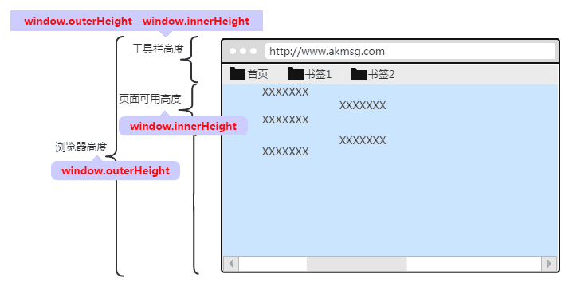

<!--
 * @Date: 2021-08-22 08:34:44
 * @LastEditors: wenfujie
 * @LastEditTime: 2021-08-22 13:52:34
 * @FilePath: /document-library/articles/浏览器/BOM.md
-->

- [window对象介绍](#window对象介绍)
- [获取页面视口宽高（考虑兼容）](#获取页面视口宽高考虑兼容)
  - [应用代码](#应用代码)
- [页面滚动](#页面滚动)

## window对象介绍



## 获取页面视口宽高（考虑兼容）

**获取窗口宽高**

```js
window.outerWidth;
window.outerHeight;
```

**获取页面视口宽高**

```js
window.innerWidth;
window.innerHeight;
```

两者区别：`outerHeight`包含工具栏的高度，`innerHeight`不包含


其他获取页面视口宽高方式

```js
document.documentElement.clientHeight;
document.documentElement.clientWidth;

document.body.clientHeight;
document.body.clientWidth;
```

其中 documentElement 是文档根元素，就是\<html>标签，body 就是\<body>元素

**两者区别**

- document.documentElement.clientHeight：不包括整个文档的滚动条，但包括<html>元素的边框

- document.body.clientHeight：不包括整个文档的滚动条，也不包括<html>元素的边框，也不包括<body>的边框和滚动条

### 应用代码

获取视口宽高

```js
function getViewPortSize() {
  let pageWidth = window.innerWidth;
  let pageHeight = window.pageHeight;

  if (typeof pageWidth !== "number") {
    if (document.compatMode === "CSS1Compat") {
      pageWidth = document.documentElement.clientWidth;
      pageHeight = document.documentElement.clientHeight;
    } else {
      pageWidth = document.body.clientWidth;
      pageHeight = document.body.clientHeight;
    }
  }
  return {pageWidth, pageHeight}
}
```

## 页面滚动

**获取页面滚动距离**

```js
// 纵向
window.pageYOffset // 1643
window.scrollY // 1643

// 横向
window.pageXOffset // 0
window.scrollX // 0
```

**滚动到指定位置**

```js
// 滚动到指定坐标
window.scrollTo(0,0)

// 相对当前位置滚动
window.scrollBy(0,100)
```

两个方法都支持设置平滑滚动

```js
window.scrollTo({
  top: 0,
  behavior: 'smooth' // 默认为auto，正常滚动
})
```