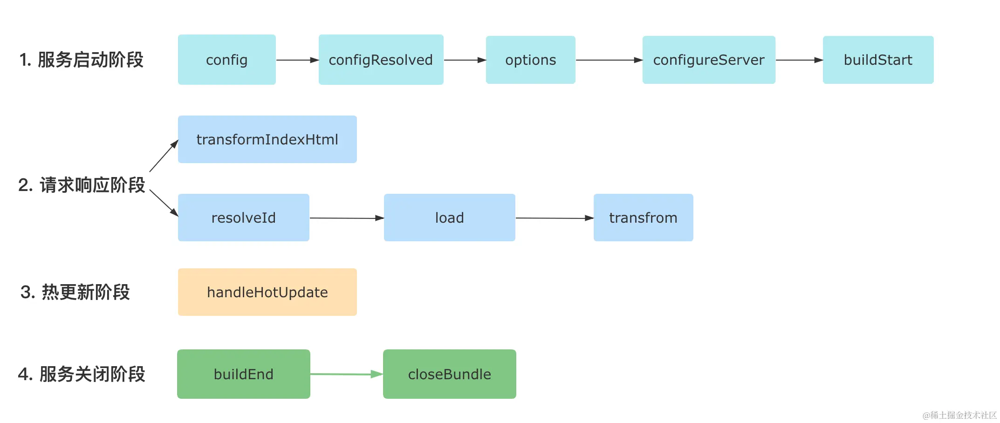

- [插件示例](#插件示例)
- [插件的钩子](#插件的钩子)
  - [Vite 插件模拟 Rollup 插件说明](#vite-插件模拟-rollup-插件说明)
  - [Vite 独有的钩子](#vite-独有的钩子)
    - [config 修改配置](#config-修改配置)
    - [configResolved 记录最终配置](#configresolved-记录最终配置)
    - [configureServer 扩展 dev server](#configureserver-扩展-dev-server)
    - [transformIndexHtml 转换 html](#transformindexhtml-转换-html)
    - [handleHotUpdate 扩展热更新](#handlehotupdate-扩展热更新)
- [插件执行顺序](#插件执行顺序)
- [apply 插件应用环境](#apply-插件应用环境)
- [插件实战 - 虚拟模块](#插件实战---虚拟模块)
- [插件调试](#插件调试)

## 插件示例

插件通常写作一个工厂函数

```js
// myPlugin.js
export function myVitePlugin(options) {
  console.log(options);
  return {
    name: "vite-plugin-xxx",
    load(id) {
      // 在钩子逻辑中可以通过闭包访问外部的 options 传参
    },
  };
}
```

> 如果插件是一个 npm 包，在 package.json 中的包命名也推荐以 vite-plugin 开头

使用

```js
// vite.config.ts
import { myVitePlugin } from "./myVitePlugin";
export default {
  plugins: [
    myVitePlugin({
      /* 给插件传参 */
    }),
  ],
};
```

## 插件的钩子

### Vite 插件模拟 Rollup 插件说明

在开发阶段，vite 会模拟 rollup 行为去调用与一些与 rollup 兼容的钩子，这些钩子分为三个阶段：

1. 服务器启动阶段: options 和 buildStart 钩子会在服务启动时被调用
2. 请求响应阶段: 当浏览器发起请求时，Vite 内部依次调用 resolveId、load 和 transform 钩子。
3. 服务器关闭阶段: Vite 会依次执行 buildEnd 和 closeBundle 钩子。

除了以上钩子，其他 Rollup 插件钩子(如 moduleParsed、renderChunk)均不会在 Vite 开发阶段调用。生产环境下，vite 插件的所有 Rollup 钩子都会生效。

### Vite 独有的钩子

vite 独有的钩子，放到 Rollup 会无效。

#### config 修改配置

方式一（推荐），返回部分配置，内部会深度合并

```js
export default () => ({
  name: "vite-plugin-modify-config",
  config: () => ({
    alias: {
      react: require.resolve("react"),
    },
  }),
});
```

方式二，直接修改

```js
export default () => ({
  name: "mutate-config",
  // command 为 `serve`(开发环境) 或者 `build`(生产环境)
  config(config, { command }) {
    // 生产环境中修改 root 参数
    if (command === "build") {
      config.root = __dirname;
    }
  },
});
```

#### configResolved 记录最终配置

Vite 在解析完配置之后会调用 configResolved 钩子，这个钩子一般用来记录最终的配置信息，而不建议再修改配置

```js
export default () => {
  let config;

  return {
    name: "read-config",

    configResolved(resolvedConfig) {
      // 记录最终配置
      config = resolvedConfig;
    },

    // 在其他钩子中可以访问到配置
    transform(code, id) {
      console.log(config);
    },
  };
};
```

#### configureServer 扩展 dev server

这个钩子仅在开发阶段会被调用，用于扩展 Vite 的 Dev Server，一般用于增加自定义 server 中间件

```js
export default () => ({
  name: "configure-server",
  configureServer(server) {
    // 姿势 1: 在 Vite 内置中间件之前执行
    server.middlewares.use((req, res, next) => {
      // 自定义请求处理逻辑
    });
    // 姿势 2: 在 Vite 内置中间件之后执行
    return () => {
      server.middlewares.use((req, res, next) => {
        // 自定义请求处理逻辑
      });
    };
  },
});
```

#### transformIndexHtml 转换 html

```js
const htmlPlugin = () => {
  return {
    name: 'html-transform',
    transformIndexHtml(html) {
      return html.replace(
        /<title>(.*?)</title>/,
        `<title>换了个标题</title>`
      )
    }
  }
}

// 也可以返回如下的对象结构，一般用于添加某些标签
const htmlPlugin = () => {
  return {
    name: 'html-transform',
    transformIndexHtml(html) {
      return {
        html,
        // 注入标签
        tags: [
          {
            // 放到 body 末尾，可取值还有`head`|`head-prepend`|`body-prepend`，顾名思义
            injectTo: 'body',
            // 标签属性定义
            attrs: { type: 'module', src: './index.ts' },
            // 标签名
            tag: 'script',
          },
        ],
      }
    }
  }
}
```

#### handleHotUpdate 扩展热更新

```js
const handleHmrPlugin = () => {
  return {
    async handleHotUpdate(ctx) {
      // 需要热更的文件
      console.log(ctx.file);
      // 需要热更的模块，如一个 Vue 单文件会涉及多个模块
      console.log(ctx.modules);
      // 时间戳
      console.log(ctx.timestamp);
      // Vite Dev Server 实例
      console.log(ctx.server);
      // 读取最新的文件内容
      console.log(await read());
      // 自行处理 HMR 事件
      ctx.server.ws.send({
        type: "custom",
        event: "special-update",
        data: { a: 1 },
      });
      return [];
    },
  };
};

// 前端代码中加入
if (import.meta.hot) {
  import.meta.hot.on("special-update", (data) => {
    // 执行自定义更新
    // { a: 1 }
    console.log(data);
    window.location.reload();
  });
}
```

## 插件执行顺序



## apply 插件应用环境

为 `string` 时

```js
{
  // 'serve' 表示仅用于开发环境，'build'表示仅用于生产环境
  apply: "serve";
}
```

为 `函数` 时，返回 boolean 控制是否启用

```js
apply(config, { command }) {
  // 只用于非 SSR 情况下的生产环境构建
  return command === 'build' && !config.build.ssr
}
```

## 插件实战 - 虚拟模块

> 虚拟模块：vite 在构建过程生成的模块，存在于内存而非磁盘。在 Vite（以及 Rollup）中都以 virtual: 为前缀

[vite 官网对虚拟模块的介绍](https://cn.vitejs.dev/guide/api-plugin.html#virtual-modules-convention)

用插件实现一个返回环境变量的虚拟模块

```js
import { Plugin, ResolvedConfig } from "vite";

export default function (): Plugin {
  let config: ResolvedConfig | null = null;
  const virtualModuleId = "virtual:env";
  const resolvedVirtualModuleId = "\0" + virtualModuleId;

  return {
    name: "my-plugin", // 必须的，将会在 warning 和 error 中显示
    resolveId(id) {
      // id 为模块路径
      if (id === virtualModuleId) {
        return resolvedVirtualModuleId;
      }
    },
    configResolved(resolvedConfig) {
      // 记录最终配置
      config = resolvedConfig;
    },
    load(id) {
      if (id === resolvedVirtualModuleId) {
        return `export const env = ${JSON.stringify(config!.env)}`;
      }
    },
  };
}
```

其中 `resolveId` 钩子用于处理模块地址，第一个参数 id 即用户导包代码 `import { env } from 'virtual:env'` 中的地址部分 `'virtual:env'`

使用

```js
import { env } from "virtual:env";

// { BASE_URL: "/", DEV: true, MODE: "development", PROD: false };
console.log(env);
```

## 插件调试

使用 vite-plugin-inspect 插件

```bash
pnpm i vite-plugin-inspect -D
```

引入

```js
// vite.config.ts
import inspect from 'vite-plugin-inspect';

// 返回的配置
{
  plugins: [
    ...,
    inspect()
  ]
}
```

重启项目，可以看到多了一个 `inspect` 的服务地址，上面可以看到各个模块的编译结果。