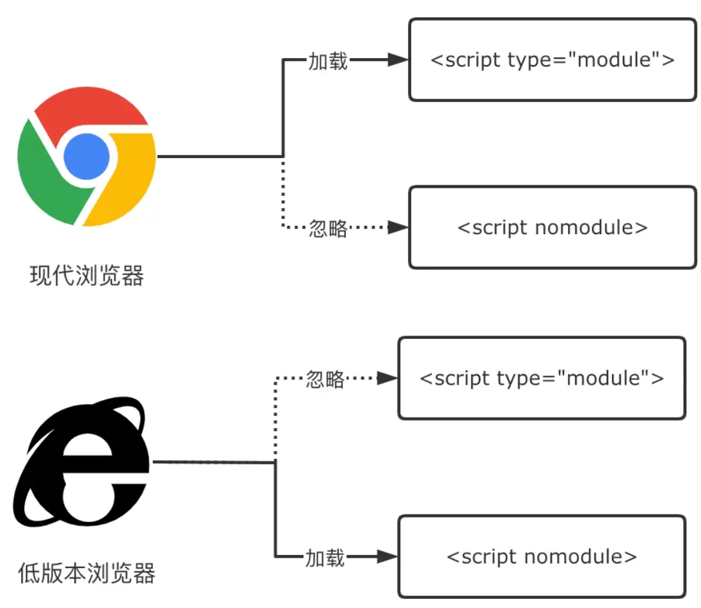

- [Vite 插件 @vitejs/plugin-legacy](#vite-插件-vitejsplugin-legacy)
  - [什么是 polyfill、babel](#什么是-polyfillbabel)
  - [什么是传统浏览器](#什么是传统浏览器)
  - [为传统浏览器生成 polyfill](#为传统浏览器生成-polyfill)
    - [指定要兼容的浏览器版本 - targets](#指定要兼容的浏览器版本---targets)
    - [指定特性范围 - polyfills](#指定特性范围---polyfills)
    - [打包效果](#打包效果)

# Vite 插件 @vitejs/plugin-legacy

[@vitejs/plugin-legacy 官网](https://github.com/vitejs/vite/tree/main/packages/plugin-legacy)

> Vite 默认打包的 runtime 依赖原生 esm，但在一些老的系统或浏览器原生不支持 esm 的，这个时候就需要用到该插件。

该插件作用是为传统浏览器 js 代码提供兼容性支持。

## 什么是 polyfill、babel

> babel: 只负责代码转换，将旧的语法转换为新的语法。

> polyfill: 也称为代码垫片，负责新特性的功能实现。

所以代码兼容一般由 babel + polyfill 一起实现。

## 什么是传统浏览器

> 传统浏览器一般指不支持 native ESM 的浏览器，如 chrome<60，Edge<15，Firefox<59 等等，如果使用 vite 打包而不做任何的处理的话，是无法在这些浏览器上面运行的，因为打包出来的代码使用了 js 新的规范。

## 为传统浏览器生成 polyfill

### 指定要兼容的浏览器版本 - targets

`targets: string | string[] | { [key: string]: string }` 属性指定要兼容的浏览器版本、系统版本，默认值：'last 2 versions and not dead, > 0.3%, Firefox ESR'，通常使用 [Browserslist](https://github.com/browserslist/browserslist) 语法来配置。可通过 [browserslist.dev](https://browserslist.dev/?q=bGFzdCAyIHZlcnNpb25z)查看值对应了哪些浏览器版本。

以下是 browserslist 的最佳实践，减轻配置负担。

```js
// 现代浏览器
last 2 versions and since 2018 and > 0.5%
// 兼容低版本 PC 浏览器
IE >= 11, > 0.5%, not dead
// 兼容低版本移动端浏览器
iOS >= 9, Android >= 4.4, last 2 versions, > 0.2%, not dead
```

### 指定特性范围 - polyfills

`polyfills: boolean | string[]` 属性指定要针对哪些特性生成 polyfill ，一般默认为 true 即可，可选值：

- true(默认)，对所有使用到的代码进行检测生成。（底层通过@babel/preset-env 的 useBuiltIns: 'usage'检测）
- string[]，指定新特性范围列表。可选值见[polyfill-specifiers](https://github.com/vitejs/vite/tree/main/packages/plugin-legacy#polyfill-specifiers)

### 打包效果

```js
import legacy from "@vitejs/plugin-legacy";

export default {
  plugins: [
    legacy({
      // ie 不低于 11 版本，全球超过 0.5% 使用，且还在维护更新的浏览器
      targets: 'ie >= 11, > 0.5%, not dead'
      polyfills: true,
    }),
  ],
};
```

打包后，多出了 index-legacy.js、vendor-legacy.js 以及 polyfills-legacy.js 三份产物文件，index.html 也有变化

```html
<!DOCTYPE html>
<html lang="en">
  <head>
    <meta charset="UTF-8" />
    <link rel="icon" type="image/svg+xml" href="/assets/favicon.17e50649.svg" />
    <meta name="viewport" content="width=device-width, initial-scale=1.0" />
    <title>Vite App</title>
    <!-- 1. Modern 模式产物 -->
    <script type="module" crossorigin src="/assets/index.c1383506.js"></script>
    <link rel="modulepreload" href="/assets/vendor.0f99bfcc.js" />
    <link rel="stylesheet" href="/assets/index.91183920.css" />
  </head>
  <body>
    <div id="root"></div>
    <!-- 2. Legacy 模式产物 -->
    <script nomodule>
      兼容 iOS nomodule 特性的 polyfill，省略具体代码
    </script>
    <script
      nomodule
      id="vite-legacy-polyfill"
      src="/assets/polyfills-legacy.36fe2f9e.js"
    ></script>
    <script
      nomodule
      id="vite-legacy-entry"
      data-src="/assets/index-legacy.c3d3f501.js"
    >
      System.import(
        document.getElementById("vite-legacy-entry").getAttribute("data-src")
      );
    </script>
  </body>
</html>
```

通过官方的 legacy 插件， Vite 会分别打包出 Modern 模式和 Legacy 模式的产物，然后将两种产物插入同一个 HTML 里面，Modern 产物被放到 type="module"的 script 标签中，而 Legacy 产物则被放到带有 nomodule 的 script 标签中。



这样产物便就能够同时放到现代浏览器和不支持 type="module"的低版本浏览器当中执行。
