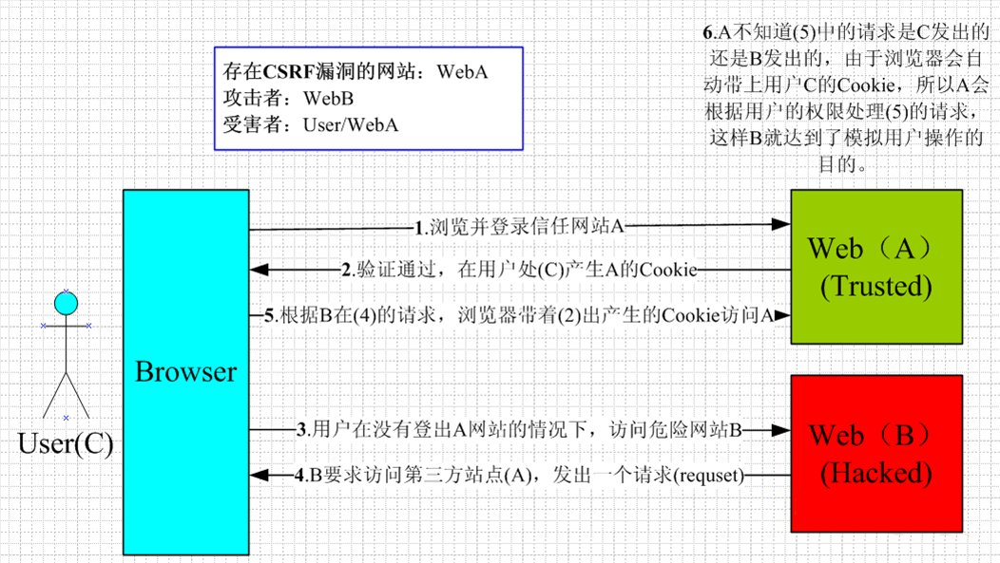

- [CSRF](#csrf)
  - [CSRF的基本概念](#csrf的基本概念)
  - [CSRF的攻击原理](#csrf的攻击原理)
  - [CSRF如何防御](#csrf如何防御)
- [XSS](#xss)
  - [XSS的基本概念](#xss的基本概念)
  - [XSS如何攻击](#xss如何攻击)
  - [XSS如何防御](#xss如何防御)
- [CSRF 和 XSS 的区别](#csrf-和-xss-的区别)
## CSRF

### CSRF的基本概念

CSRF（Cross-site request forgery）： **跨站请求伪造** 。

简答来说，CSRF就是利用用户的登录状态发起恶意请求

### CSRF的攻击原理



用户是网站A的注册用户，且登录进去，于是网站A就给用户下发cookie。

从上图可以看出，要完成一次CSRF攻击，受害者必须满足两个必要的条件：

（1）登录受信任网站A，并在本地生成Cookie。（如果用户没有登录网站A，那么网站B在诱导的时候，请求网站A的api接口时，会提示你登录）

（2）在不登出A的情况下，访问危险网站B（其实是利用了网站A的漏洞）。由于有同源策略，B网站可利用html tag不受同源策略限制，post 请求可使用 form 表单提交，get 请求可使用 img 标签请求。

我们在讲CSRF时，一定要把上面的两点说清楚。

温馨提示一下，cookie保证了用户可以处于登录状态，但网站B其实拿不到 cookie。

### CSRF如何防御

**方法一、Token 验证：** （用的最多）

（1）服务器发送给客户端一个token；

（2）客户端提交表单时，头部带上token。

（3）服务器验证token有效性来决定是否响应请求

**方法二、SameSite：**
有三个可选值

- Strict：最为严格，完全禁止第三方 Cookie，跨站点时，任何情况下都不会发送 Cookie
- Lax：仅get请求发送cookie
- None：不发送cookie

**方法三、Referer 验证：**

Referer 指的是页面请求来源。意思是， **只接受本站的请求，服务器才做响应** ；如果不是，就拦截。

## XSS

### XSS的基本概念

XSS（Cross Site Scripting）： **跨站脚本攻击** 。

>是一种网站应用程式的安全漏洞攻击，是代码注入的一种。它允许恶意使用者将程式码注入到网页上，其他使用者在观看网页时就会受到影响。

### XSS如何攻击

攻击类型有

1、反射型

发出请求时，XSS代码出现在url中，作为输入提交到服务器端，服务器端解析后响应，XSS代码随响应内容一起传回给浏览器，最后浏览器解析执行XSS代码。这个过程像一次反射，所以叫反射型XSS。

场景：修改url参数篡改html

```html
<!-- http://www.domain.com?name=<script>alert(1)</script> -->
<div>{{name}}</div>
```
上述 URL 输入可能会将 HTML 改为 `<div><script>alert(1)</script></div>` ，这样页面中就凭空多了一段可执行脚本。这种攻击类型是反射型攻击。

2、存储型

存储型XSS和反射型XSS的差别在于，提交的代码会存储在服务器端（数据库、内存、文件系统等），下次请求时目标页面时不用再提交XSS代码。

场景：富文本编写文档时增加恶意代码

假如站内有富文本编辑文章功能，用户编写了一篇包含攻击代码`<script>alert(1)</script>` 的文章，文章发布后，所有访问者都会被攻击到，这种属于存储型攻击。

### XSS如何防御

1. 转义输入输出内容

```javascript
function escape(str) {
  str = str.replace(/&/g, '&amp;')
  str = str.replace(/</g, '&lt;')
  str = str.replace(/>/g, '&gt;')
  str = str.replace(/"/g, '&quto;')
  str = str.replace(/'/g, '&#39;')
  str = str.replace(/`/g, '&#96;')
  str = str.replace(/\//g, '&#x2F;')
  return str
}
```

`<script>alert(1)</script>` 转义后

```javascript
escape('<script>alert(1)</script>') // &lt;script&gt;alert(1)&lt;&#x2F;script&gt;
```

2. 富文本添加白名单
对显示富文本来说，不能向上面一样转义所有字符，因为会把需要的格式也过滤掉。所以通过白名单的方式，仅对白名单的标签进行解析

```javascript
var xss = require('xss')
var html = xss('<h1 id="title">XSS Demo</h1><script>alert("xss");</script>')

console.log(html) // <h1>XSS Demo</h1>&lt;script&gt;alert("xss");&lt;/script&gt;
```

以上示例使用了js-xss实现，可以看到在输出中保留了h1标签，过滤掉script标签

3. CSP
>内容安全策略 (CSP) 是一个额外的安全层，用于检测并削弱某些特定类型的攻击，包括跨站脚本 (XSS) 和数据注入攻击等。无论是数据盗取、网站内容污染还是散发恶意软件，这些攻击都是主要的手段。

我们可以通过 CSP 来尽量减少 XSS 攻击。CSP 本质上也是建立白名单，规定了浏览器只能够执行特定来源的代码。

通过 HTTP Header 中的 `Content-Security-Policy` 来开启 CSP

- 只允许加载本站资源
```javascript
Content-Security-Policy: default-src ‘self’
```

- 只允许加载 HTTPS 协议图片
```javascript
Content-Security-Policy: img-src https://*
```

- 允许加载任何来源框架
```javascript
Content-Security-Policy: child-src 'none'
```

## CSRF 和 XSS 的区别

面试官还可能喜欢问二者的区别。

区别一：

  * CSRF：需要用户先登录网站A，获取 cookie。

  * XSS：不需要登录。

区别二：（原理的区别）

  * CSRF：是利用网站A本身的漏洞，去请求网站A的api。

  * XSS：是向网站 A 注入 JS代码，然后执行 JS 里的代码，篡改网站A的内容。


**本文转发自：**

https://github.com/qianguyihao/Web/blob/master/13-%E5%89%8D%E7%AB%AF%E9%9D%A2%E8%AF%95/01-%E9%9D%A2%E8%AF%95%E5%BF%85%E7%9C%8B/07-%E5%AE%89%E5%85%A8%E9%97%AE%E9%A2%98%EF%BC%9ACSRF%E5%92%8CXSS.md