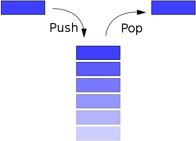
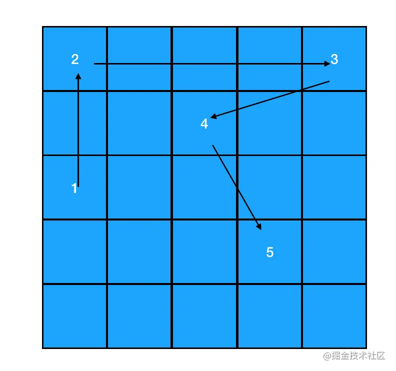
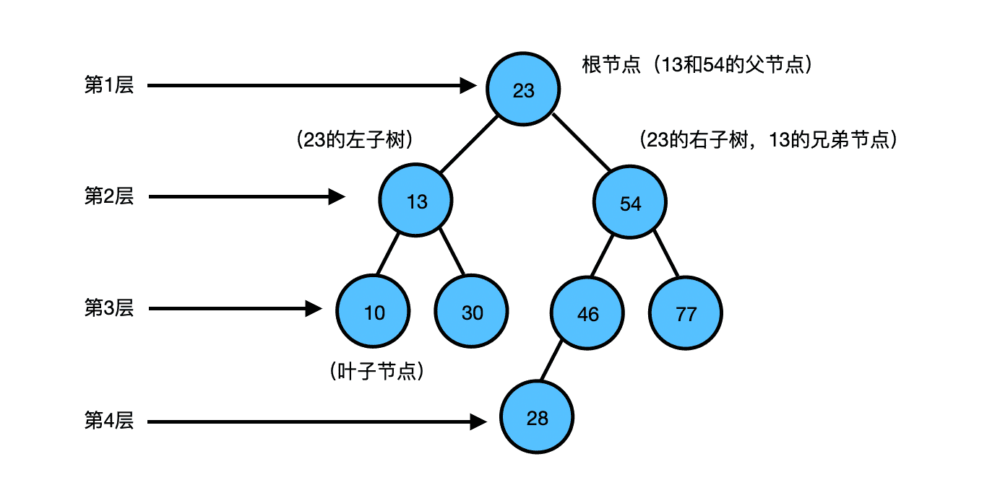
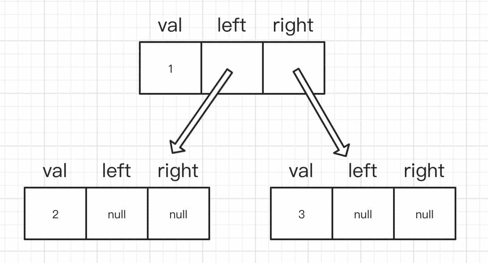
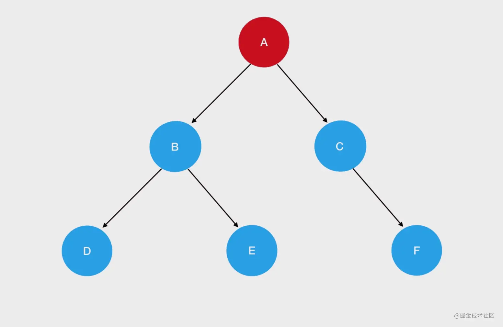
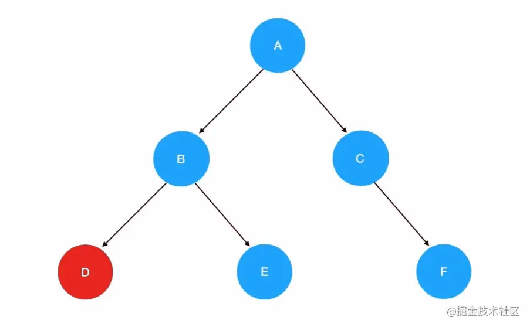
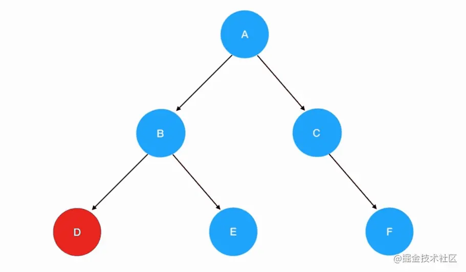
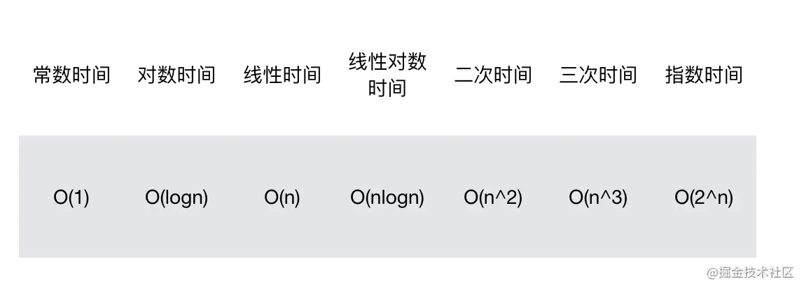
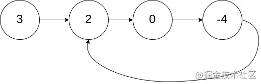
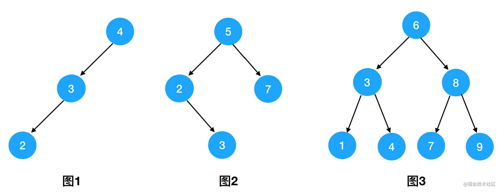

<!--
 * @Date: 2021-09-19 09:32:32
 * @LastEditors: wenfujie
 * @LastEditTime: 2021-10-10 10:08:23
 * @FilePath: /document-library/articles/开发相关知识/算法深入学习.md
-->

- [1. 数据结构](#1-数据结构)
  - [1.1 数组](#11-数组)
  - [1.2 栈（Stack）](#12-栈stack)
  - [1.3 队列（Queue）](#13-队列queue)
  - [1.4 链表](#14-链表)
  - [1.5 树](#15-树)
- [2. 算法基础技能](#2-算法基础技能)
  - [2.1 时间复杂度和空间复杂度](#21-时间复杂度和空间复杂度)
  - [2.2 反转字符串](#22-反转字符串)
  - [2.3 判断回文字符串](#23-判断回文字符串)
  - [2.4 数组排序](#24-数组排序)
- [3. 算法技巧](#3-算法技巧)
  - [3.1 对撞双指针](#31-对撞双指针)
  - [3.1 快慢双指针](#31-快慢双指针)
- [链表专题](#链表专题)
  - [环形链表](#环形链表)
- [二叉树专题](#二叉树专题)
  - [二叉树的迭代遍历](#二叉树的迭代遍历)
  - [二叉树的层序遍历](#二叉树的层序遍历)
  - [翻转二叉树](#翻转二叉树)
  - [二叉搜索树](#二叉搜索树)
  - [平衡二叉树](#平衡二叉树)
- [后语](#后语)

## 1. 数据结构

### 1.1 数组

该篇主讲在前端领域来学习算法，想必大家对数组已经很熟悉了，避免篇幅过长，数组就不多做介绍了，下文会有数组相关真题实战。

但是要点名的是，相比 `forEach、map` 等内置遍历方法，使用 for 遍历 Array 类型的数据是最高效的。

```js
for (let i = 0; i < arr.length; i++) {}
```

### 1.2 栈（Stack）

栈是类似数组的一种数据结构，栈遵循 `后进先出(LIFO，Last In First Out)` 原则，就好比我们把东西放到瓶子里，先放进去的都在瓶底，后放进去的就靠近瓶口，取得时候只能先把瓶口的东西先取出来才能取瓶底的东西。

栈的特征：

1. 只允许从尾部添加元素
2. 只允许从尾部取出元素

所以在 `JavaScript` 中，我们可以把栈理解为是仅有 `push` 和 `pop` 方法的一种特殊数组，`push` 负责往瓶子放东西，`pop` 负责移除。



看一个实例，用数组来模拟获取到最先进栈的元素：

```js
function getHead(stack) {
  let curr;
  while (stack.length) {
    curr = stack.pop();
  }
  return curr;
}

let stack = [];
stack.push(1);
stack.push(2);
getHead(stack); // 1
```

了解完啥是 `栈` 后，结合一道实战来加深理解：

**有效的括号**

[前往力扣做题](https://leetcode-cn.com/problems/valid-parentheses/)

> 给定一个只包括 '('，')'，'{'，'}'，'['，']' 的字符串 s ，判断字符串是否有效。
> 有效字符串需满足：
>
> 1.  左括号必须用相同类型的右括号闭合。
> 2.  左括号必须以正确的顺序闭合。

```js
输入：s = "()"输出：true

输入：s = "()[]{}"输出：true

输入：s = "(]"输出：false

输入：s = "([)]"输出：false

输入：s = "{[]}"输出：true
```

注意：

- 1 <= s.length <= 104
- s 仅由括号 '()[]{}' 组成

思路分析：

1. 数组长度要是偶数，不然 return false
2. 需要一个 map 来做左右括号的匹配，需要定义一个栈存储括号
3. 遍历字符串，遇到左括号入栈，遇到右括号时出栈并判断与该右括号是否为配对括号，如果配对继续下一轮，否则 return false
4. 遍历结束后，如果栈内还剩元素 return false ，否则 return true

实现代码：

```js
const map = new Map([
  ["(", ")"],
  ["{", "}"],
  ["[", "]"],
]);

var isValid = function (s) {
  if (s.length % 2 !== 0) return false;
  let arr = [];

  for (let i = 0; i < s.length; i++) {
    if (map.has(s[i])) {
      arr.push(s[i]);
    } else {
      if (map.get(arr.pop()) !== s[i]) return false;
    }
  }
  return arr.length === 0;
};
```

实现代码中使用了 ES6 的 Map 数据类型，如果对 ES6 不太熟悉的同学，使用 Object 实现也行哈。

可能有的同学觉得还不够过瘾，这边在罗列几道跟 `栈` 相关的常出题型，大家有空可以练练手：

- [每日温度](https://leetcode-cn.com/problems/iIQa4I/)：尝试用 `递减栈` 将时间复杂度降低到 `O(n)`
- [最小栈](https://leetcode-cn.com/problems/min-stack/)：这题很有意思，颠覆你的认知，居然能做到用 `O(1)` 来获取最小值

### 1.3 队列（Queue）

队列也是类似数组的一种数据结构，栈遵循 `先进先出（FIFO，First In First Out）` 原则。类似去食堂排队，排在前面的人取到餐后就可以先走了，而后头的人只能等前面的人走后才能取餐。

队列的特征：

1. 只能从头部移除元素
2. 只能从尾部添加元素

所以在 `JavaScript` 中，我们可以把队列理解为是仅有 `push` 和 `shift` 方法的一种特殊数组，`push` 负责将元素添加到队列末尾，`pop` 负责将队列第一个元素移除。

看个示例，用数组模拟队列排队取餐：

```js
function queueUp(queue) {
  while (queue.length) {
    console.log(queue[0] + "已取餐");
    queue.shift();
  }
}
let queue = [];
queue.push("张三");
queue.push("李四");
queueUp(queue);
```

### 1.4 链表

链表一种 `线性结构` 的有序列表，但是它在内存中是离散的：



链表的每一项我们都称为 `结点（Node）` ，每个节点包含储存的值和指向下一个结点的指针。

**创建链表结点**

在 `JavaScript` 我们可以这样构造结点：

```js
class NodeList {
  constructor(val) {
    this.val = val;
    this.next = null;
  }
}

let node = new NodeList(1);
```

**添加链表结点**

添加结点主要是围绕 `next` 指针做文章。

参照上边图中，我们要让结点 1 指向结点 2： `1=>2` ，代码要这样处理：

```js
let node = new NodeList(1);
let node2 = new NodeList(2);
node.next = node2;
```

这样我们就完成了结点 2 的添加。

如果要在链表之间插入结点，我们要 `找到插入位置的前一个结点和后一个结点`，并将 `前一个结点的next指针指向要插入的目标结点`，`目标结点的next指针指向要插入位置的后一个结点`。

我们改造上面的代码，在结点 1 和结点 2 之间插入结点 3：

```js
let node = new NodeList(1);
let node2 = new NodeList(2);
node.next = node2;

let node3 = new NodeList(3);
node.next = node3;
node3.next = node2;
```

**删除链表结点**

删除链表结点，需找到要删除结点的 `前驱结点` 并更改它的 next 指向即可。只要结点没被引用，就会被 JS 的垃圾回收器回收。

例如我们要将上文的链表 `1=>3=>2` 中的结点 3 删除：

```js
node.next = node2;
```

所以删除结点的关键并不是 `目标结点` 而是 `前驱结点` 。

**链表和数组的对比**

- 高效增删

  简单数组（只包含基础数据类型）的内存是连续的，当插入或删除一个元素会导致后面的所有元素向后或向前移动，复杂度为 O(n)。

  链表的内存是离散的，当插入或删除结点时仅需修改前驱结点和目标结点的 next 指向，复杂度为 O(1)

- 复杂访问

  简单数组中内存是连续的，通过索引计算偏移量可直接获取到具体的元素如 `arr[8]` ，复杂度为 O(1)

  链表中要访问具体结点，必须通过遍历需访问指定次数的 next，复杂度为 O(n)

一句总结：`数组的访问效率高，操作效率低；链表的访问效率低，操作效率高` 。

下面我们结合两道真题来理解链表：

**合并两个排序的链表**

[前往力扣做题](https://leetcode-cn.com/problems/he-bing-liang-ge-pai-xu-de-lian-biao-lcof/)

> 输入两个递增排序的链表，合并这两个链表并使新链表中的节点仍然是递增排序的。

```js
示例1：
输入：1->2->4, 1->3->4
输出：1->1->2->3->4->4
``` 

分析：

假如是合并两个有序数组，那我们很容易想到用双指针来一一对比两个数组的 item，将小的那个值加入到新数组中并且该指针往后移一步，这样直到有一个指针指向空时，将另外一个数组剩余项加入到新数组末尾。

回到链表，还是同样的道理，只不过是建立一个新链表，新链表把每次比较后较小的节点依次串联起来。

实现代码：

```js
/**
 * @param {ListNode} l1
 * @param {ListNode} l2
 * @return {ListNode}
 */
var mergeTwoLists = function (l1, l2) {
    let head = new ListNode(0)
    let curr = head

    while (l1 && l2) {
        if (l1.val <= l2.val) {
            curr.next = l1
            l1 = l1.next
        } else {
            curr.next = l2
            l2 = l2.next
        }
        curr = curr.next
    }
    if (l1) {
        curr.next = l1
    }
    if (l2) {
        curr.next = l2
    }

    return head.next
};
```

**删除排序链表中的重复元素**

[前往力扣做题](https://leetcode-cn.com/problems/remove-duplicates-from-sorted-list/)

> 存在一个按升序排列的链表，给你这个链表的头节点 head ，请你删除所有重复的元素，使每个元素 只出现一次 ，返回同样按升序排列的结果链表。

示例：
```js
输入：head = [1,1,2]
输出：[1,2]

输入：head = [1,1,2,3,3]
输出：[1,2,3]
```

分析：

这题对大家来说应该不难，因为链表是升序的所以相同的节点肯定是相邻的，我们仅需找到值比当前节点大的下一个节点并将 `next` 指针指向它即可。

```js
/**
 * @param {ListNode} head
 * @return {ListNode}
 */
const deleteDuplicates = function(head) {
    // 设定 cur 指针，初始位置为链表第一个结点
    let cur = head;
    // 遍历链表
    while(cur != null && cur.next != null) {
        // 若当前结点和它后面一个结点值相等（重复）
        if(cur.val === cur.next.val) {
            // 删除靠后的那个结点（去重）
            cur.next = cur.next.next;
        } else {
            // 若不重复，继续遍历
            cur = cur.next;
        }
    }
    return head;
};
```

关于链表基础暂时介绍到这，下文的【链表专题】小节会深入介绍更多类型的链表以及实战真题讲解喔😯。

### 1.5 树

`树` 这个数据结构会相对复杂些，本文篇幅仅着重讲 `二叉树` 。

先看一个 `二叉树` 示例：



**结合图片，了解树的相关概念**

- 二叉树：二叉树是每个节点最多有两个子树的树结构。
- 根节点：一棵树最上面的节点称为根节点。
- 父节点、子节点：如果一个节点下面连接多个节点，那么该节点称为父节点，它下面的节点称为子 节点。
- 叶子节点：没有任何子节点的节点称为叶子节点。
- 兄弟节点：具有相同父节点的节点互称为兄弟节点。
- 节点度：节点拥有的子树数。上图中，13的度为2，46的度为1，28的度为0。
- 树的深度：从根节点开始（其深度为0）自顶向下逐层累加的。上图中，13的深度是1，30的深度是2，28的深度是3。
- 树的高度：从叶子节点开始（其高度为0）自底向上逐层累加的。54的高度是2，根节点23的高度是3。

对于树中相同深度的每个节点来说，它们的高度不一定相同，这取决于每个节点下面的叶子节点的深度。上图中，13和54的深度都是1，但是13的高度是1，54的高度是2。

我们可以在 `JS` 中这样去构建二叉树节点：

```js
function TreeNode(val) {
    this.val = val;
    this.left = this.right = null;
}
```

跟链表结构有点类似，但 `二叉树` 有两个指针，`left指针` 指向左子节点，`right指针` 指向右子节点，如果子节点不存在则指向 `null` 。

通过指针去串联节点：

```js
const root = new TreeNode(1)
const left = new TreeNode(2)
const right = new TreeNode(3)

root.left = left
root.right = right
```

上述代码实现二叉树的实际形态效果：



光说不练 === 脱裤子放屁，下面我们开始 `二叉树` 的实操。

`二叉树` 最基础的题就是遍历节点，遍历二叉树有三种顺序：

- 先序遍历
- 中序遍历
- 后序遍历

这三种方式主逻辑是一样的，仅仅是输出节点的顺序不同，只要理解其中一种遍历就能推导出另外两种，这三种顺序的遍历在 `力扣` 上都有独立的题目，接下来手摸手让你 `解题量 +3` 。

什么是先序遍历？从根节点开始遍历，每一个节点遍历顺序都是 `根节点` => `左节点` => `右节点` ，如下为 `先序遍历` 的遍历顺序图：



下面来看道真题：

**二叉树的先序遍历**

[前往力扣做题](https://leetcode-cn.com/problems/binary-tree-preorder-traversal/)

> 给你二叉树的根节点 root ，返回它节点值的 前序 遍历。

示例：
```js
输入：root = [1,null,2,3] 输出：[1,2,3]

输入：root = [] 输出：[]

输入：root = [1] 输出：[1]

输入：root = [1,2] 输出：[1,2]

输入：root = [1,null,2] 输出：[1,2]
```

注意：

- 树中节点数目在范围 [0, 100] 内
- 100 <= Node.val <= 100

思路分析：

1. 根据前面对先序遍历的解释，我们很容易发现递归可以很简单实现二叉树的遍历
2. 递归函数逻辑仅需存储当前节点
3. 递归边界为当前节点为 `null` 

实现代码：

```js
/**
 * @param {TreeNode} root
 * @return {number[]}
 */
var preorderTraversal = function (root) {
    let result = []
    const recursive = (root) => {
        if (!root) return
        result.push(root.val)
        recursive(root.left)
        recursive(root.right)
    }
    recursive(root)
    return result
};
```

可以看到，在题解中我们定义了一个名叫 `recursive` 的递归函数，每次执行 `recursive` 我们都会把节点存在 `result` 中，由于 `先序遍历` 遵循的是`根节点` => `左节点` => `右节点`的遍历顺序，所以 `result.push(root.val)` 必须放在 `recursive(root.left)` 和 `recursive(root.right)` 之前，  `if (!root) return` 表示走到了叶子结点之下即 `null` ，表示递归结束。

搞定 `先序遍历` ，那 `中序遍历` 和 `后序遍历` 就简单了，我们先看下区别：

- 中序遍历：左子树 -> 根结点 -> 右子树



- 后序遍历：左子树 -> 右子树 -> 根结点



仅是遍历节点的顺序不同，我们根据前面的 `先序遍历` 解答稍作调整即可得出 `中、后序遍历` 的答案：

**二叉树的中序遍历**

[前往力扣做题](https://leetcode-cn.com/problems/binary-tree-inorder-traversal/)

>给定一个二叉树的根节点 root ，返回它的 中序 遍历。

实现代码：

```js
var inorderTraversal = function (root) {
    let result = []
    const recursive = (root) => {
        if (!root) return
        recursive(root.left)
        result.push(root.val)
        recursive(root.right)
    }
    recursive(root)
    return result
};
```

可以看到，我们仅把 `result.push(root.val)` 位置移动到 `recursive(root.left)` 之后，这样即可实现按照 左子树 -> 根结点 -> 右子树 的顺序遍历节点。

**二叉树的后序遍历**

[前往力扣做题](https://leetcode-cn.com/problems/binary-tree-postorder-traversal/)

>给定一个二叉树，返回它的 后序 遍历。

```js
var postorderTraversal = function(root) {
    let result = []
    const recursive = (root)=>{
        if(!root)return

        recursive(root.left)
        recursive(root.right)
        result.push(root.val)
    }
    recursive(root)
    return result
};
```

类似的，我们把 `result.push(root.val)` 位置移动到 `recursive(root.right)` 之后，这样即可实现按照 左子树 -> 右子树 -> 根结点 的顺序遍历节点。

关于二叉树的递归遍历，我们仅需记住一种就可以举一反三。大家不仅要记住思路还要能熟练的写出遍历代码，这样才能为更复杂的二叉树题奠定好基础（下文的【二叉树专题】小节会介绍更多类型的二叉树以及实战真题讲解喔😯）。

## 2. 算法基础技能

这一节主要介绍 `如何计算算法的复杂度` 和一些必备的 `基础算法` 。

很多复杂算法都会依赖一些基础算法，比如 `数组升序排序` 在双指针算法技巧中就常常运用到，所以这一小节中罗列的必备基础技能，大家一定要着重记忆并加以刻意练习，也为了后面做中等甚至困难难度的算法题奠定基础。

### 2.1 时间复杂度和空间复杂度

一个算法好不好 ☝🏻，主要靠 `时间复杂度` 和 `空间复杂度` 来评判。如果是笔试题，我们可以使用更易实现的算法去实现哪怕它的 `时间复杂度` 和 `空间复杂度` 相对较高，因为我们的目的是让机器跑通过，但是如果是面试官在面试，那我们肯定要尽量选取 `时间复杂度` 和 `空间复杂度` 相对较低的去实现，这样面试官才会觉得"哎哟，不错哦 😉"。所以说学会计算法 `时间复杂度` 和 `空间复杂度` 还是很重要的 😎。

**时间复杂度**

概念性的东西比较抽象，我们结合代码来看，算算以下这段代码被调用时会被执行几次？

```js
function traverse(arr) {
  var len = arr.length;
  for (var i = 0; i < len; i++) {
    console.log(arr[i]);
  }
}
```

1. 首先 `var len = arr.length` 和 `var i=0` 只执行一次，得到 `1+1`
2. 然后 `console.log(arr[i])` 和 `i++` 会执行 `arr.length` 次，也就是 n 次，所以得到 `n+n`
3. 最后 `i<len` 总会比 `i++` 多一次，也就是 n+1 次

合计：(1+1) + (n+n) + (n+1) = 3n + 3

也就是 `O(3n + 3)`，但是时间复杂度不是要计算代码总执行次数，而是要反映出影响代码总执行次数的 `变化趋势` ，所以它遵守以下规则：

1. 如果是常数，都简化为 1：O(100) => `O(1)`
2. 如果是多项式，只取最高项，且系数简化为 1：O(3n + 3) => `O(n)`

> 注意：空间复杂度亦遵循该规则。

所以上面例子的时间复杂度为：`O(n)` 。

综上我们还可以总结出，当算法具有外层嵌套一层内层遍历时，可直观看出算法时间复杂度为 `O(n^2)` ，因为其他项可直接忽略。那如果算法有 x 层嵌套遍历时，其时间复杂度为 `O(n^x)` 。

常用的复杂度除了 `常数项( O(1) )`、`多项式( O(n), O(n^2) )` 外，还有 `logn` 。可能很多人都不太记得啥是 `logn` ：

> 以 log2 n 为例：计算以 2 为底的对数（log2 n）为了得到数字 n 必须将 2 乘方多少次。

> 例如，log2 1 = 0，log2 2 = 1，log2 4 = 2，log2 32 = 5。

我们回到代码中：

```js
function fn(arr) {
  var len = arr.length;
  for (var i = 1; i < len; i = i * 2) {
    console.log(arr[i]);
  }
}
```

这段代码咋一看感觉跟上面的例子一样，时间复杂度为 `O(n)` ，实则不然，我们假设循环体会执行 n 次，`i=i*2` 同样会执行 n 次，所以 i 的值的变化经历：

```js
i = i*2 // 第一次
i = i*2*2 // 第二次
i = i*2*2*2 // 第三次
...
i = i*2*2*2*2...*2 // 第n次，乘以 n 个 2
```

数学好的同学可能已经看出来了

```js
i = i * log2n;
```

所以可以求出该例子的时间复杂度为 `O(log2n)` ，通常会把底数去掉计为 `O(logn)` 。

常见的时间复杂度按照从小到大的顺序排列，有以下几种：


**空间复杂度**

`空间复杂度` 相对比较好理解了，主要用来度量算法在运行过程中 `内存占用的增长趋势` 。

常用的 `空间复杂度` 有 `O(1)、O(n) 、 O(n^2)` 。

来看个例子：

```js
function traverse(arr) {
  var len = arr.length;
  for (var i = 0; i < len; i++) {
    console.log(arr[i]);
  }
}
```

运行这段代码，会在内存开辟空间，储存变量 `arr、len、i` ，并且变量内存空间不再变化，所以 `空间复杂度` 为 `O(1)` 。

再来看另一个例子：

```js
function init(n) {
  var arr = [];
  for (var i = 0; i < n; i++) {
    arr[i] = i;
  }
  return arr;
}
```

这个例子同样在内存开辟空间，储存变量 `arr、n、i` ，但在运行过程中 arr 占用空间一直在增大，并且是与 n 等比增长的，所以 `空间复杂度` 为 `O(n)` 。

`时间复杂度` 和 `空间复杂度` 暂时就介绍这些，大家可以在下文实战做题时，算算自己的算法实现是怎样的复杂度。

平时做算法时多思考思考 🤔，有没有更低复杂度的解法，在学习算法的过程中，培养这样的意识非常重要，因为在大厂的算法面试中，写出算法只是第一步，面试官更看重的是你能否对代码逻辑以及性能做优化。只有在平时做算法时多去思考、不断优化解法，才能在面试中游刃有余 😉。

### 2.2 反转字符串

利用数组的 `reverse` 方法

```js
const str = "hello world";

str = str.split("").reverse().join(""); // 'dlrow olleh'
```

### 2.3 判断回文字符串

> 回文字符串：正读和反读都一样的字符串，比如“level”或者“noon”等等就是回文串。

**判断方法一**

由于回文字符串正序和反序会相同，我们可利用这一特性并结合 `2.2 反转字符串` 小节来判断是否是回文字符串：

```js
function isPalindrome(str) {
  const reversedStr = str.split("").reverse().join("");
  // 判断反转前后是否相等
  return reversedStr === str;
}
```

**判断方法二**

遍历字符串，每次比较 `第i项` 与 `str.length - 1 - i项` 是否相同，遍历到数组的一半即可结束遍历。

```js
function isPalindrome(str) {
  const len = str.length;
  for (let i = 0; i < len / 2; i++) {
    if (str[i] !== str[len - 1 - i]) {
      return false;
    }
  }
  return true;
}
```

### 2.4 数组排序

前端提供了原生的排序方法，那就是数组的 `sort方法` 。

```js
let arr = [4, 2, 1, 3];

// 升序
arr.sort((a, b) => a - b); // [1,2,3,4]

// 降序
arr.sort((a, b) => b - a); // [4,3,2,1]
```

在写算法的过程，如果有依赖排序时直接使用上述方式进行排序即可。虽然有开箱即用的方法，但是一些经典的排序算法我们还是要掌握的。主要掌握以下 5 种即可：

基础排序算法：

- 冒泡排序
- 插入排序
- 选择排序

进阶排序算法

- 归并排序
- 快速排序

学习排序算法，我们首要是理解算法的原理，而不是背诵去默写代码，排序算法的复杂度不会很高，知道排序的原理，正常情况下都能推导并写出实现代码来 😉。

**冒泡排序**

冒泡排序的原理：从第 1 个元素开始，比较相邻的两个项，若前者比后者大那两元素互换位置，否则位置不变。一轮比较下来后，数组末尾的项为最大值。以此类推，进行 n 轮后数组就按从小到大排序。

来看下数组进行冒泡排序一轮的过程：

```js
[7, 2, 1, 5, 3]
 ↑  ↑
[2, 7, 1, 5, 3]
    ↑  ↑
[2, 1, 7, 5, 3]
       ↑  ↑
[2, 1, 5, 7, 3]
          ↑  ↑
[2, 1, 5, 3, 7]
```

可以看出，数组经过一轮后，数组末尾的项为该数组的最大值 7 。要注意的是，既然每一轮都能在末尾排序一个项，那进行下一轮时就不必和已排序好的项进行比较了。

代码实现：

```js
function bubbleSort(arr) {
  let len = arr.length;

  for (let i = 0; i < len; i++) {
    // 避免和排序好的项作比较，所以结束判断为 j < len - 1 - i
    for (let j = 0; j < len - 1 - i; j++) {
      // 若前一项比后一项大，则互换位置
      if (arr[j] > arr[j + 1]) {
        [arr[j + 1], arr[j]] = [arr[j], arr[j + 1]];
      }
    }
  }
  return arr;
}
```

理论上，给出上面👆🏻的代码后冒泡排序就打完收工了，同学们可以算算 `时间复杂度` 是多少（ 答案是 O(n^2) ）。

突然，面试官话锋一转说，如果我用一个已经排序好的数组来跑这段代码， `时间复杂度` 是多少？你算了下，说 `O(n^2)` 。面试官开心的笑了说，那你试着优化成 `O(n)` 。

其实不难，一开始我们并未考虑数组是有序的情况，如果能判断数组是有序的，那直接 return 掉就好，避免不必要的遍历和判断。

问题怎么判断数组是有序的呢？很简单，如果一轮遍历下来都没有经历互换位置，那数组就是有序的。

优化下代码：

```js
function bubbleSort(arr) {
  let len = arr.length;
  let swapped = false;
  
  for (let i = 0; i < len; i++) {
    // 是否交换位置
    swapped = false;
    for (let j = 0; j < len - 1 - i; j++) {
      if (arr[j] > arr[j + 1]) {
        [arr[j + 1], arr[j]] = [arr[j], arr[j + 1]];
        swapped = true;
      }
    }
    // 未交换位置，表示数组是有序的
    if (swapped === false) return arr;
  }
  return arr;
}
```

优化后的代码，增加了是否交换过位置的判断，如果数组是有序的，那外循环只会遍历一次，所以 `时间复杂度` 是 `O(n)` ， 避免掉数组是有序后的额外开销，给面试官一个满意的答卷😉。

**选择排序**

选择排序原理：遍历数组，找到最小的数并移动到数组头部，缩小搜索范围继续下一次遍历..直到排序完成。

选择排序就是这么无脑，不多说直接看代码：

```js
function selectSort(arr) {
  if (arr.length <= 1) return arr;
  // 记录最小数的索引
  let minIndex;
  // 仅需遍历到倒数第2个数
  for (let j = 0; j < arr.length - 1; j++) {
    minIndex = j;
    for (let i = j + 1; i < arr.length; i++) {
      if (arr[i] < arr[minIndex]) {
        minIndex = i;
      }
    }
    // 将该轮最小值与头部值互换位置
    [arr[j], arr[minIndex]] = [arr[minIndex], arr[j]]
  }
  return arr;
}
```

需注意的是，外层遍历只需遍历到倒数第 2 个，因为在倒数第 2 个时仅剩当前项和末尾项，所以该轮结束后数组就已经是有序的了。快速排序 `时间复杂度` 为 `O(n^2)` 。

**插入排序**

插入排序原理：假设数组头部是有序的，遍历数组将每一项插入到数组头部中并保持有序性。

描述有点抽象，来看个演算过程：

```js
// 最开始有序的头部是 [3]
[3,1,4,2]
// 开始遍历，从索引 1 开始，1 > 3 需将 1 移到 3 之前，有序头部变为 [1,3]
[3,1,4,2] => [1,3,4,2]
   ↑
// 当前项为 4 ，4 需插入到 [1,3] 的末尾，有序头部变为 [1,3,4]
[1,3,4,2] => [1,3,4,2]
     ↑
// 当前项为 2 ，2 需插入到 3 之前，有序头部变为 [1,2,3,4]
[1,3,4,2] => [1,2,3,4]
       ↑
```

看完演算，应该能理解了，下面上代码：

```js
function insertSort(arr) {
  let curr;
  for (let i = 1; i < arr.length; i++) {
    for (let j = 0; j < i; j++) {
      if (arr[j] >= arr[i]) {
        // 将当前项插入到头部指定位置，维持有序性
        arr.splice(j, 0, arr.splice(i, 1)[0]);
      }
    }
  }
  return arr;
}
```

插入排序 `时间复杂度` 为 `O(n^2)` 。

比较基础的三种排序算法讲完了，一般情况下它们的 `时间复杂度` 都是 `O(n^2)` ，👇🏻下面要说的就是两种进阶的排序算法 `归并排序` 和 `快速排序` ，这两种排序方式会比前面三种复杂一些，但它们的 `时间复杂度` 也相对来说更低。

**归并排序**

归并排序的原理：将数组从中间切开，得到2个数组，将2个数组从中间切开，得到4个数组，将4个数组...如此循环直到每个被切开的数组仅剩一个数为止，再将切开的数组两两合并且保持有序，直到完整的数组有序。

有点抽象，看下算法演算过程：

```js
// 第一轮分割
[3,1,4,|2,0] => [3,1,4] [2,0]

// 第二轮分割
[3,1,|4] => [3,1] [4] ， [2,|0] => [2] [0]

// 第三轮分割
[3,|1] => [3] [1] ， [4] ， [2] [0]

// 分割结果
[3] [1] [4] [2] [0]

// 第一轮合并
[3] [1] [4] [2] [0] => [1,3] [2,4] [0]
 →   ←   →   ←
// 第二轮合并
[1,3] [2,4] [0] => [1,2,3,4] [0]
  →     ←
// 第三轮合并
[1,3,4] [0] => [0,1,2,3,4]
   →     ←
```

有的同学看完后可能有点懵了😳，排序而已搞介么复杂，又是分割又是合并的。但是同学们，可不能光看人的外表啊，得注重内在（好像在相亲🤷‍♂️🤷‍♀️）。虽然它的实现过程复杂，但是 `时间复杂度` 低啊对不，人面试官问你，你知道哪些排序算法，你反手一套 3 连：`冒泡` `选择` `插入` ，那人面试官就得追问了，有木有其他性能更好的捏？所以啊，把 `归并` 学好👌，够他喝一壶得了。

扯了半天，那 `归并排序` 的 `时间复杂度` 是多少呢？一起来算下：

1. 首先数组的对半分割要执行 `log2n` 次，看演算过程，每一轮分割是针对所有子集的，所以是 `log2n` 次而不是 n 喔😯。分割一次数组的 `时间复杂度` 为 `O(1)` ，所以整个数组分割的复杂度为：`分割次数 * 分割一次的复杂度 = O(log2n * 1) = O(logn)` 
2. 合并数组与分割数组是类似的，需执行 `log2n` 次。合并两个数组并且保持有序，用 `双指针` （下文有专门篇幅介绍）实现 `时间复杂度` 为 `O(n)` 。所以所有子集合并的复杂度为 `合并次数 * 合并一次的复杂度 = O(log2n * n) = O(nlogn)` 

综合以上可得 `归并排序` 的 `时间复杂度` 为：`总分割 +  总合并 = O(logn) + O(nlogn) = O((n+1)logn)` ，通常直接计为 `O(nlogn)` 。

在👆🏻上文篇幅关于 `时间复杂度` 的介绍中可知，`O(nlogn) < O(n^2)` ，所以相对前面三个排序算法来说 `归并` 在 `时间复杂度` 上更胜一筹。 

## 3. 算法技巧

### 3.1 对撞双指针

> `对撞双指针`：在有序数组中，将指向最左侧的索引定义为左指针(left)，最右侧的定义为右指针(right)，然后从两头向中间进行数组遍历。

只要遇到 `数组、求和、对比大小` 的算法，我们就要想到对撞双指针，使用对撞指针的前提需要数组是有序的，这是一种常用解题思路。

对撞双指针的伪代码：

```js
function fn (list) {
  var left = 0;
  var right = list.length - 1;

  //遍历数组
  while (left <= right) {
    left++;
    // 一些条件判断 和处理
    ... ...
    right--;
  }
}
```

来看个对撞双指针算法题：

**救生艇**

[前往力扣做题](https://leetcode-cn.com/problems/boats-to-save-people/)

> 第  i  个人的体重为  people[i]，每艘船可以承载的最大重量为  limit。每艘船最多可同时载两人，但条件是这些人的重量之和最多为  limit。返回载到每一个人所需的最小船数。(保证每个人都能被船载)。

示例：

输入：people = [3,2,2,1], limit = 3

输出：3

解释：3 艘船分别载 (1, 2), (2) 和 (3)

**解题分析**

1. 将数组按升序排序，定义最终需要船的数量 result = 0
2. 左指针指向索引 0，右指针指向末尾
3. 两指针相加<=limit,左右指针向中间移一步，result++
4. 两指针相加>limit,右指针左移，result++
5. 当 left >= right 结束遍历
6. 最后如果两指针指向同一索引，表示该索引未处理，result++

**解题代码**

```js
/**
 * @param {number[]} people
 * @param {number} limit
 * @return {number}
 */
var numRescueBoats = function (people, limit) {
  let left = 0,
    right = people.length - 1,
    result = 0;
  people = people.sort((a, b) => a - b);
  while (left < right) {
    while (left < right && people[left] + people[right] > limit) {
      right--;
      result++;
    }
    while (left < right && people[left] + people[right] <= limit) {
      left++;
      right--;
      result++;
    }
  }
  if (left === right) {
    result++;
  }
  return result;
};
```

这题相对简单，下面来题难度大些的：

**三数之和**

[前往力扣做题](https://leetcode-cn.com/problems/3sum/)

> 给你一个包含 n 个整数的数组  nums，判断  nums  中是否存在三个元素 a，b，c ，使得  a + b + c = 0 ？请你找出所有和为 0 且不重复的三元组。

注意：答案中不可以包含重复的三元组。

示例：

输入：nums = [-1,0,1,2,-1,-4]

输出：[[-1,-1,2],[-1,0,1]]

这题看起来相当复杂，看完题目可以发现，又是 `数组、求和`，所以我们思路可以往对撞双指针这边靠，利用对撞双指针降低复杂度：

**解题思路**

1. 将数组按升序排序
2. 遍历数组，双指针放在当前项的下一项和数组末尾
3. 判断当前项和两个指针值的和与 0 相减，如果结果为 0 表示成立，如果<0 把 left 指针向右移，如果>0 把 right 指针向左移。
4. 为避免重复，移动指针到下一个时遇到相同的数需跳过

**解题代码**

```js
var threeSum = function (nums) {
  let result = [];
  const len = nums.length;

  if (len < 3) return result;
  nums = nums.sort((a, b) => a - b);

  // len - 2 是因为遍历到倒数第三个，左右指针各指向最后两个数
  for (let i = 0; i < len - 2; i++) {
    // 避免重复，相同的数直接跳过
    if (i > 0 && nums[i] === nums[i - 1]) continue;
    let left = i + 1, // 左指针
      right = len - 1; // 右指针
      
    while (left < right) {
      if (nums[i] + nums[left] + nums[right] === 0) {
        result.push([nums[i], nums[left], nums[right]]);
        left++;
        right--;
        // 左指针遇到相同的数跳过
        while (left < right && left - i > 1 && nums[left] === nums[left - 1]) {
          left++;
        }
        // 右指针遇到相同的数跳过
        while (left < right && nums[right] === nums[right + 1]) {
          right--;
        }
      } else if (nums[i] + nums[left] + nums[right] < 0) {
        left++;
        // 左指针遇到相同的数跳过
        while (left < right && left - i > 1 && nums[left] === nums[left - 1]) {
          left++;
        }
      } else {
        right--;
        // 右指针遇到相同的数跳过
        while (left < right && nums[right] === nums[right + 1]) {
          right--;
        }
      }
    }
  }
  return result;
};
```

这题算还是挺有难度的，很多边界情况需要考虑，学习算法过程中大家一定要多动手写代码，有时候有思路并不表示能写出代码，只有经过需要大量练习把算法思路刻在脑海里，在面试的高压下才能快速反应。

### 3.1 快慢双指针

**如何取数组的中间数？** 

大家都知道直接取数组长度一半的那个索引的值即可： `arr[Math.floor(arr.length / 2)]` 。

**那如何求链表的中间数呢？**

由于并没有方法能直接获得链表的长度，并且链表也不能向数组那样直接根据索引获取到对应节点的值，所以上面数组的方案是行不通的。

有的同学很快就想到方案：先遍历一遍链表得到链表长度，然后在遍历链表的一半长度得到数组的中间数。

这个方案是没问题的，时间复杂度为 `O(1.5n)` ，但是用到了两次循环有点不够美观，是否可以优化下呢🐶？此时就要引出 `快慢双指针` 了。

`快慢双指针` 获取中间数方案：定义两个指针，慢指针一次走一步，快指针一次走两步，当快指针指向 `null` 时表示链表遍历完毕，此时慢指针会停在链表的中间数位置。

看下伪代码：

```js
var getCenterOfNodeList = function (list) {
  let [slow, fast] = [list, list.next]
  while (fast) {
    slow = slow.next
    fast = fast?.next?.next
  }
  return slow.val
}
```

不知道大家看完后有木有跟笔者一样觉得耳目一新，很优雅，水中贵族 `百岁山` 不过如此。

来到快慢指针的真题：


**删除链表的倒数第 N 个结点**

[前往力扣做题](https://leetcode-cn.com/problems/remove-nth-node-from-end-of-list/)

> 给你一个链表，删除链表的倒数第 n 个结点，并且返回链表的头结点。

>进阶：你能尝试使用一趟扫描实现吗？

示例：
```js
输入：head = [1,2,3,4,5], n = 2
输出：[1,2,3,5]

输入：head = [1], n = 1
输出：[]

输入：head = [1,2], n = 1
输出：[1]
```

分析：

我们看示例中第一个例子：
```js
输入：head = [1,2,3,4,5], n = 2
输出：[1,2,3,5]

倒数第 2 个数是 4 ，索引是 3
```
再看第二个例子：
```js
输入：head = [1], n = 1
输出：[]

倒数第 1 个数是 1 ，索引是 0
```
再看第三个例子：
```js
输入：head = [1,2], n = 1
输出：[1]

倒数第 1 个数是 2 ，索引是 1
```

大家有没有发现 `n + 索引 === 链表长度` 是成立的。这样一来，我们可以得出 `链表长度 - n = 索引` ，把这个公司转换成我们的代码逻辑：
1. 定义一个快指针先走 n 步（剩下的未走的步数即为索引数 ）
2. 当指针在第 n 步时，定义一个慢指针和指针一起走，这样慢指针走的步数为 `链表长度 - n` 
3. 快指针指向 `null` 时结束

实现代码：

```js
const removeNthFromEnd = function(head, n) {
    // 初始化 dummy 结点
    const dummy = new ListNode()
    // dummy指向头结点
    dummy.next = head
    // 初始化快慢指针，均指向dummy
    let fast = dummy
    let slow = dummy

    // 快指针闷头走 n 步
    while(n!==0){
        fast = fast.next
        n--
    }
    
    // 快慢指针一起走
    while(fast.next){
        fast = fast.next
        slow = slow.next
    }
    
    // 慢指针删除自己的后继结点
    slow.next = slow.next.next
    // 返回头结点
    return dummy.next
};
```

这样一来也满足了**进阶要求：仅使用一趟扫描实现。** 

这清奇的解题思路，还是那句 **水中贵族 百岁山** 不过如此。如果大家遇到要取具体某个索引或者某个节点的情景，`快慢双指针` 是一大利器，跟普通解法相比它更能让人眼前一亮，面试过程要得就是这一亮，所以大家要好好掌握 `快慢双指针` 哦 😉。

## 链表专题

链表最常考的题就是反转链表，我们先反转个链表热热身：

**反转链表**

[前往力扣做题](https://leetcode-cn.com/problems/reverse-linked-list/)

>给你单链表的头节点 head ，请你反转链表，并返回反转后的链表。

```js
示例 1：
输入：head = [1,2,3,4,5]
输出：[5,4,3,2,1]

示例 2：
输入：head = [1,2]
输出：[2,1]

示例 3：
输入：head = []
输出：[]
```

分析：

要反转链表，我们需要遍历每个节点，让每一个节点指向前一个节点（头节点指向null），去修改节点的 `next` 指针的指向时，我们需要将下一个节点存起来（代码中用 next 变量）用于下次遍历，并且还需要知道上一个节点是谁（代码中用 prev 变量）。

```js
var reverseList = function(head) {
    let curr = head
    let prev = null
    let next
    while(curr){
        next = curr.next
        curr.next = prev
        prev = curr
        curr = next
    }
    return prev
};
```

### 环形链表

>环形链表：链表的最后一个结点的指针域指向链表中的某个结点，形成一个环。



环形链表理解起来不难，常用的考点无非就是判断链表是否有环、找到环的入口等，下面我们结合真题来加深 `环形链表` 的理解。

**判断是否是环形链表**

[前往力扣做题](https://leetcode-cn.com/problems/linked-list-cycle/)

>给定一个链表，判断链表中是否有环。如果链表中存在环，则返回 true 。 否则，返回 false 。

分析：

遍历每个节点并设置 flag 为 true，当遇到 flag 为 true 的节点时，就表示有环，否则遍历到 null 节点表示结束链表五环。

```js
var hasCycle = function(head) {
    while(head){
        if(head.flag){
            return true
        }else{
            head.flag = true
        }
        head = head.next
    }
    return false
};
```

**链表开始入环的第一个节点**

[前往力扣做题](https://leetcode-cn.com/problems/linked-list-cycle-ii/)

>给定一个链表，返回链表开始入环的第一个节点。 如果链表无环，则返回 null。

>说明：不允许修改给定的链表。

分析：

既然不让修改链表结构，我们可以使用 `ES6` 的 `Map` 将遍历过得节点存起来，当遇到存过的节点时，那这个节点就是入口了。

实现代码：

```js
var detectCycle = function (head) {
    const map = new Map()

    while (head) {
        if (map.get(head)) {
            return head
        } else {
            map.set(head, true)
        }
        head = head.next
    }
    return null
};
```

这种解法空间复杂度为 `O(N)` ， N 为链表中节点的数目。大家想想看是否能将空间复杂度降为 `O(1)` 呢？（提示：使用前面介绍过得 `快慢双指针` ）

## 二叉树专题

二叉树🌲是个花里胡哨的数据类型，它衍生出多种不同类型的二叉树如：`二叉搜索树` 、`平衡二叉树` 、`红黑树` ，但是在大厂面试中关于二叉树的面试题出现的频率很高，所以专设该小节专门来帮助大家攻克二叉树，大家在看到篇幅相关真题时可以自己先想下实现思路并动手写代码，之后在看解题思路和解题代码，这样有助于理解和记忆 👊。

### 二叉树的迭代遍历

在前文的 `1.5树` 一小节中，已经介绍过二叉树的 `前、中、后序遍历` 的 `递归` 实现方式，`递归` 遍历二叉树在下文的 `翻转二叉树` 就会应用到，而在 `二叉搜索树` 中我们常常要用到 `迭代` 的方式来遍历二叉树，所以 `迭代遍历二叉树` 同样需要重点掌握 😉。

`迭代遍历二叉树` 会比 `递归遍历二叉树` 复杂一丢丢 🤏 。由于前文已附过 `遍历二叉树` 的真题，这边就不再附上题目，需要的同学可去 `1.5树` 找。

下边一起来看看如何以 `迭代` 方式实现二叉树的 `前、中、后序遍历` 。

**前序遍历**

[前往力扣做题](https://leetcode-cn.com/problems/binary-tree-preorder-traversal/)

分析：
1. 前序遍历遵循：`根节点` => `左节点` => `右节点` 遍历顺序
2. 利用栈后进先出的原理，遍历节点时先将 `右节点` 入栈其次才到 `左节点` ，这样能保证左节点优先出栈
3. 栈空时结束循环

实现代码：

```js
var preorderTraversal = function (root) {
    if (!root) return []
    let stack = [root]
    let result = []
    let item;

    while (stack.length > 0) {
        item = stack.pop()
        result.push(item.val)
        if (item.right) {
            stack.push(item.right)
        }
        if (item.left) {
            stack.push(item.left)
        }
    }
    return result
};
```

**后序遍历**

[前往力扣做题](https://leetcode-cn.com/problems/binary-tree-postorder-traversal/)

`后序遍历` 其实跟 `前序遍历` 很相似，区别是：

- 前序遍历：`根节点` => `左节点` => `右节点`
- 后续遍历：`左节点` => `右节点` => `根节点`

可看到 `根节点` 被移至末尾，这意味着 `根节点` 要最后被遍历，要处理这一情况，我们可将上述 `前序遍历` 代码中对最终结果 `result` 的 `push` 改为 `unshift` 即可，但由于 `unshift` 颠倒了遍历结果的顺序，所以入栈顺序要调整为先 `左节点` 再到 `右节点` 。

实现代码：

```js
var postorderTraversal = function (root) {
    if (!root) return []
    let stack = [root]
    let result = []
    let item;

    while (stack.length > 0) {
        item = stack.pop()
        result.unshift(item.val)
        if (item.left) {
            stack.push(item.left)
        }
        if (item.right) {
            stack.push(item.right)
        }
    }
    return result
};
```

**中序遍历**

[前往力扣做题](https://leetcode-cn.com/problems/binary-tree-inorder-traversal/)

`中序遍历` 跟 `前、后序遍历` 则不同，它的边界问题并不在根节点，所以无法用 `前、后序遍历` 的方式来处理。

分析：

遵循的遍历顺序是 `左节点` => `根节点` => `右节点` 。

要从 `最左节点` 开始，我们可以遍历找到 `最左节点` ，然后再从 `左节点` 回到根节点，但我们知道 `子节点` 是没办法找到 `父节点` 的，怎么解决呢？

1. 我们从 `根节点` 遍历找到 `最左节点` 时，将沿途的节点都入栈，之后出栈的回溯不就是我们想要的 `子找父` 的过程了吗。
2. 回溯过程中，如果存在 `右节点` ，那要把 `右节点` 当做 `根节点` 并执行 `1` 步骤。
3. 栈空时结束循环

```js
var inorderTraversal = function (root) {
    let curr = root
    let stack = []
    let result = []

    while (curr || stack.length) {
        // 找到最左节点
        while (curr) {
            stack.push(curr)
            curr = curr.left
        }
        curr = stack.pop()
        result.push(curr.val)
        curr = curr.right
    }
    return result
};
```

由于后面篇幅会运用到 `二叉树的迭代遍历` ，所以该小节需大家着重练习和掌握哦😯。

### 二叉树的层序遍历

`层序遍历` 指的是从上往下对树的每一行的节点的遍历。 `层序遍历` 难度不大，而且还是关键考点。

层序遍历比较好理解，我们直接结合真题来：

**二叉树的层序遍历**

[前往力扣做题](https://leetcode-cn.com/problems/binary-tree-level-order-traversal/)

>给你一个二叉树，请你返回其按 层序遍历 得到的节点值。 （即逐层地，从左到右访问所有节点）。

示例：
二叉树：[3,9,20,null,null,15,7],

```js
    3
   / \
  9  20
    /  \
   15   7
```
返回其层序遍历结果：

```js
[
  [3],
  [9,20],
  [15,7]
]
```

分析：

1. 我们从顶层开始，逐层遍历当前层的节点，遍历过程中将每个节点的子节点存储（为下一层遍历做准备），同时存储当前节点的值
2. 当不存在下一层节点时结束遍历

实现代码：

```js
var levelOrder = function (root) {
    if(!root)return []
    let res = [] // 最终结果
    let currTreeNode = [root] // 当前层节点集合
    let nextTreeNode = [] // 下一层节点集合
    let values = [] // 当前层值的集合
    let curr = null
    while (currTreeNode.length) {
        nextTreeNode = []
        values = []
        while (currTreeNode.length) {
            curr = currTreeNode.shift()
            values.push(curr.val)
            curr.left && nextTreeNode.push(curr.left)
            curr.right && nextTreeNode.push(curr.right)
        }
        currTreeNode = nextTreeNode;
        res.push(values)
    }
    return res
};
```

### 翻转二叉树

顾名思义，`翻转二叉树` 就是从根节点向下划一条与底边垂直的竖线，整棵树以这条线为轴旋转 `180°` 后就得到翻转后的二叉树了。

在力扣对应题中，有以下备注：

>这个问题是受到 Max Howell 的 原问题 启发的 ：

>谷歌：我们90％的工程师使用您编写的软件(Homebrew)，但是您却无法在面试时在白板上写出翻转二叉树这道题，这太糟糕了。

搜索了解到其中的故事：Homebrew 的作者去面 Google 时被一道 `翻转二叉树` 难倒了，最后面试结果是被 Google 拒绝了，上面 👆那段话摘自 Google 给 Homebrew 的作者的拒绝信，当然故事的真实性有待考察，大家看后一笑而过就好。

下面让我们来看看这道 `"难题"`

**翻转二叉树**

[前往力扣做题](https://leetcode-cn.com/problems/invert-binary-tree/)

>翻转一棵二叉树。

示例：

输入：

```js
     4
   /   \
  2     7
 / \   / \
1   3 6   9
```
输出：

```js
     4
   /   \
  7     2
 / \   / \
9   6 3   1
```

分析：

1. 观察示例，我们很容易看出，其原理就是将每个节点的 `左节点` 和 `右节点` 互换位置。
2. 每个节点都执行某一个操作，很容易想到递归来处理

实现代码：

```js
var invertTree = function (root) {
    if (!root) return root
    let left = invertTree(root.left)
    let right = invertTree(root.right)
    root.left = right
    root.right = left
    return root
};
```

没错就是这么简单的几行代码就实现了。如果你看到这并理解了这道题，那在算法上你已经领先了半数的前端，这样说一点都不夸张，`Vue作者尤雨溪`  在知乎的回答说过，一些专注于纯表现层的前端一辈子都不会写翻转二叉树，确实是这样，以笔者个人经验来说前端能使用到复杂算法的场景是比较少的，但又怎奈何得了算法是大厂面试的必考项呢，用一句骚话来概括就是： `你可以不用，但不能没有` 🐶。

### 二叉搜索树

>二叉搜索树:
>1. 空树属于二叉搜索树。
>2. 或者是具有下列性质的二叉树： 若它的左子树不空，则左子树上所有结点的值均小于它的根结点的值； 若它的右子树不空，则右子树上所有结点的值均大于它的根结点的值； 它的左、右子树也分别为二叉搜索树。



图示 3 种都属于 `二叉搜索树` 。由于 `左子树 <= 根节点 <= 右子树` ，这个顺序跟二叉树的 `中序遍历` 顺序是一致的，所以我们可以得出：`二叉搜索树的中序遍历是以升序排列的` ，这个性质很重要，大家一定要记牢 👌。

`二叉搜索树` 考点主要是围绕 `搜索、插入` 等操作以及它的 `升序` 特性 来展开的，👇🏻下面我们结合真题来揭开 `二叉搜索树` 的面纱。

**二叉搜索树中的搜索**

[前往力扣做题](https://leetcode-cn.com/problems/search-in-a-binary-search-tree/)

>给定二叉搜索树（BST）的根节点和一个值。 你需要在BST中找到节点值等于给定值的节点。 返回以该节点为根的子树。 如果节点不存在，则返回 NULL。

例如，

给定二叉搜索树:

```js
        4
       / \
      2   7
     / \
    1   3
```

和值: 2
你应该返回如下子树:

```js
      2     
     / \   
    1   3
```
在上述示例中，如果要找的值是 5，但因为没有节点值为 5，我们应该返回 NULL。

分析：

这道题应该难不倒大家，思路很简单：

1. 从根节点开始递归
2. 如果当前节点值与目标 `相等` 直接返回，如果 `大于` 则递归左子树，如果 `小于` 则递归右子树
3. 遇到节点为 `null` 时结束

实现代码：

```js
var searchBST = function(root, val) {
    if(!root)return root

    if(root.val === val){
        return root
    } else if(root.val > val){
        return searchBST(root.left, val)
    } else{
        return searchBST(root.right, val)
    }
};
```

查找节点算是开胃甜点，下面进阶一丢丢 🤏，来到插入节点

**二叉搜索树中的插入操作**

[前往力扣做题](https://leetcode-cn.com/problems/insert-into-a-binary-search-tree/)

>给给定二叉搜索树（BST）的根节点和要插入树中的值，将值插入二叉搜索树。 返回插入后二叉搜索树的根节点。 输入数据 保证 ，新值和原始二叉搜索树中的任意节点值都不同。

输入：root = [4,2,7,1,3], val = 5
```js
        4
       / \
      2   7
     / \
    1   3
```
输出：[4,2,7,1,3,5]
```js
      4
    /   \
   2     7
  / \   / 
  1  3 5
```

分析：

要插入节点就必须先找到要插入的位置，我们先回顾一下查找节点，查找节点的边界为 `遇到节点为 null 时结束` ，这点很关键，在二叉搜索树查找节点时，总是会往节点最有可能出现的路径去遍历，如果出现了 `null` 那就意味着这个位置是最适合目标值的位置，所以思路为：

1. 查找要插入节点最适合的位置
2. 创建结点并插入到该位置

实现代码：

```js
var insertIntoBST = function(root, val) {
    if(!root){
        return new TreeNode(val)
    }
    if(root.val > val){
        root.left = insertIntoBST(root.left, val)
    } else {
        root.right = insertIntoBST(root.right, val)
    }
    return root
};
```

上面两道主要是考验 `二叉搜索树` 操作，下面来看两道检验 `二叉搜索树` 特性的题

**验证二叉搜索树**

[前往力扣做题](https://leetcode-cn.com/problems/validate-binary-search-tree/)

>给你一个二叉树的根节点 root ，判断其是否是一个有效的二叉搜索树。

有效 二叉搜索树定义如下：

- 节点的左子树只包含 小于 当前节点的数。
- 节点的右子树只包含 大于 当前节点的数。
- 所有左子树和右子树自身必须也是二叉搜索树。

```js
输入：root = [2,1,3]
输出：true
```

```js
输入：root = [5,1,4,null,null,3,6]
输出：false
解释：根节点的值是 5 ，但是右子节点的值是 4 。
```

分析：

1. 二叉树需遵循 `左子树 < 根节点 < 右子树` 。
2. 判定当前是左孩子还是右孩子，进而决定是进行大于判定还是小于判定

实现代码：

```js
var isValidBST = function (root) {
    const recursive = (root, min, max) => {
        if (!root) return true
        const val = root.val
        if (val <= min || val >= max) return false
        return recursive(root.left, min, val) && recursive(root.right, val, max)
    }
    return recursive(root, -Infinity, Infinity)
};
```

在递归过程中，如果单独维护一段逻辑，用于判定当前是左孩子还是右孩子，进而决定是进行大于判定还是小于判定，也是没问题的。但是在上面的编码中我们采取了一种更简洁的手法，通过设置 `min` 和 `max` 为极小和极大值，来确保 `root.val <= minValue || root.val >= maxValue` 这两个条件中有一个为 false 的，该树则 `非二叉搜索树` 。

最后在来一道很经典的转换二叉搜索树：

**将有序数组转换为二叉搜索树**

[前往力扣做题](https://leetcode-cn.com/problems/convert-sorted-array-to-binary-search-tree/)

>给你一个整数数组 nums ，其中元素已经按 升序 排列，请你将其转换为一棵 高度平衡 二叉搜索树。

>高度平衡 二叉树是一棵满足「每个节点的左右两个子树的高度差的绝对值不超过 1 」的二叉树。

```js
输入：nums = [-10,-3,0,5,9]

输出：[0,-3,9,-10,null,5]

        0
       / \
     -3   9
     /   /
   -10  5
```

分析：

我们观察实例的输出顺序：`0 => -3 => 9 => -10 => 5` ，有没有想起👆🏻上文的 `归并排序` ，这边要做的是把数组的中位数提取为 `根节点` ，并将左右两边的数划分为两个集合，`根节点` 下的 `左节点` 的值为左集合的中位数，`根节点` 下的 `右节点` 的值为右集合的中位数，依次类推..

实现代码：
```js
var sortedArrayToBST = function (nums) {
    const recursive = (min, max)=>{
        if(min > max)return null
        const mid = Math.round((min + max) / 2)
        const root = new TreeNode(nums[mid])

        root.left = recursive(min, mid - 1)
        root.right = recursive(mid + 1, max)
        return root
    }
    return recursive(0, nums.length - 1)
};
```

出于性能上的考虑，这边并没有去划分集合，而是使用两个指针 `min 、 max` 来指定集合的位置从而达到划分集合的目的，同学们可以先试着用自己想的方案来写喔，先是有思路，然后是编码实现，最后结合性能问题来优化方案。

关于 `二叉搜索树` 就介绍这些啦，相信大家也对 `二叉搜索树` 有了新的认识，如果大家对小节中的真题理解得足够透彻，那力扣上其他衍生的 `二叉搜索树` 的题应该也 `洒洒水` 啦 😉。

### 平衡二叉树


## 后语

**参考文献**

[前端算法与数据结构面试：底层逻辑解读与大厂真题训练](https://juejin.cn/book/6844733800300150797)

[数据结构与算法之二叉树的基本概念和类型
](https://www.cnblogs.com/sunshineliulu/p/7775063.html)