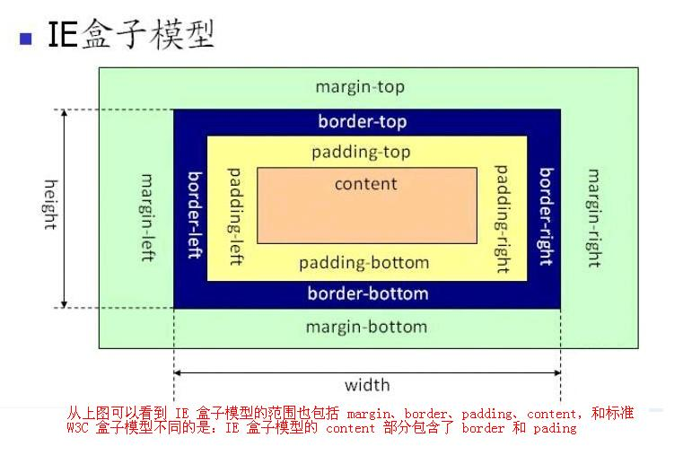

## html
### 盒子模型
-  标准盒模型
-  IE盒模型




两种模型都是由 `margin` `border` `padding` `content` 组成。

区别是标准盒模型的宽高为 `content` 宽高，而IE盒模型宽高为 `content + padding + border` 。

**设置模型**
```css
    /* 设置当前盒子为 标准盒模型（默认） */
    box-sizing: content-box;

    /* 设置当前盒子为 IE盒模型 */
    box-sizing: border-box;
```

**js获取盒模型的宽高**
- 方式一：使用元素的 `style` 属性
  ```javascript
  element.style.width;

  element.style.height;
  ```
  缺点：仅能获取 `内联样式`。

- 方式二：（通用型）
  ```javascript
  window.getComputedStyle(Element).width
  ```
  兼容Chrom、火狐
- 方式三：
  ```javascript
	element.getBoundingClientRect().width;

  // 能获取到元素以下属性
  bottom: 33
  height: 25
  left: 8
  right: 544
  top: 8
  width: 536
  x: 8
  y: 8
  ```

**margin重叠**

margin在垂直方向相邻元素会发生重叠，margin取数值大的为值

### BFC
**什么是BFC？**

BFC就是一个有特定规则的区域，这块区域内的元素只遵循特定规则，不受外部影响。

**BFC规则**

- 规则一：BFC是一块独立规则的区域，不受外部影响，而内部元素也不会影响到外部。
- 规则二：清除浮动。触发BFC后能感知得到浮动元素的存在。
- 规则三：BFC感知得到浮动元素的高度。

**如何触发BFC**
- 根元素
- float属性不为none
- position为absolute或fixed
- display为inline-block, table-cell, table-caption, flex, inline-flex
- overflow不为visible（常用）

## js基础
- 写一个原型链继承的例子。
- 模拟操作符 new，封装一个操作对象的方法。
- for...in 和 Object.keys(obj) 和 Object.getOwnPropertyNames(obj) 的区别？
- 什么是闭包？使用场景？注意事项？

## 对工具的理解
- 说说对 http 协议的理解
- 浏览器打开一个网站经历了哪些步骤

## 解决方案
- 怎么解决跨域
- 移动端自适应方案
- 性能优化
- 部署流程
- 模块化的几种方式
- 项目中如何支持 ES6 语法
- 首屏加载速度慢如何解决

## 知识点

### 前端错误监控
**前端错误类型**
- 即时运行错误（代码错误）
- 资源加载错误

使用 `try catch` 或 `window.addEventListener` 监听。

资源加载错误，使用加载资源标签对应错误回调监听。