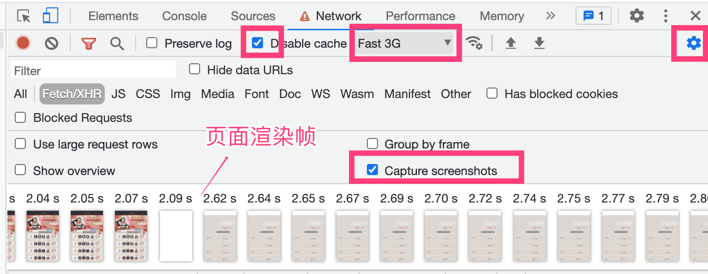

<!--
 * @Date: 2021-08-11 10:41:08
 * @LastEditors: wenfujie
 * @LastEditTime: 2021-08-12 18:03:29
 * @FilePath: /document-library/articles/浏览器/谷歌浏览器开发者工具.md
-->

## 调慢网速，逐帧观察页面渲染

Chrome Dev Tools -> Network -> Disable Cache -> Fast 3G（4G、WIFI 过快不易观察） -> 右侧 ⚙️ -> Capture ScreenShots

## 截图DOM元素、页面

**截图元素**

Elements tab -> 选中元素，右键点击 -> 选择Capture node screenshot

**截图整个页面**

- command + shift + p （弹出指令输入框）
- 输入指令 `Capture full size screenshot`

## 重新发起xhr请求

Network tab -> 右键请求 -> 点击Replay XHR选项

## 编辑页面上的任何文本

在控制台输入document.body.contentEditable="true"或者document.designMode = 'on'就可以实现对网页的编辑了。

## Animation动画面板

右上角更多按钮（三个点） -> More tools -> Animations

## 将图片复制为数据 URI

在Network tab下，对图片请求的相应图片右键并点击copy image data as uri选项