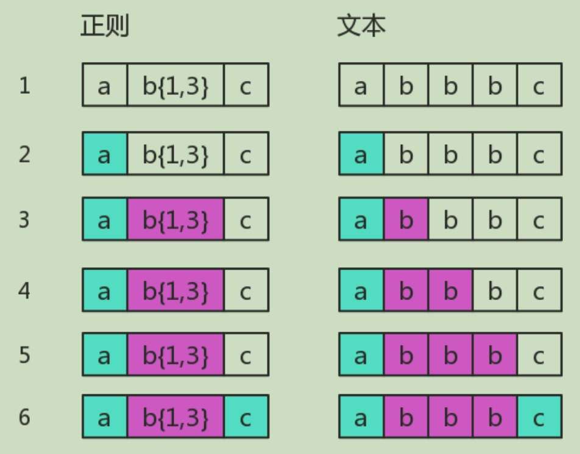
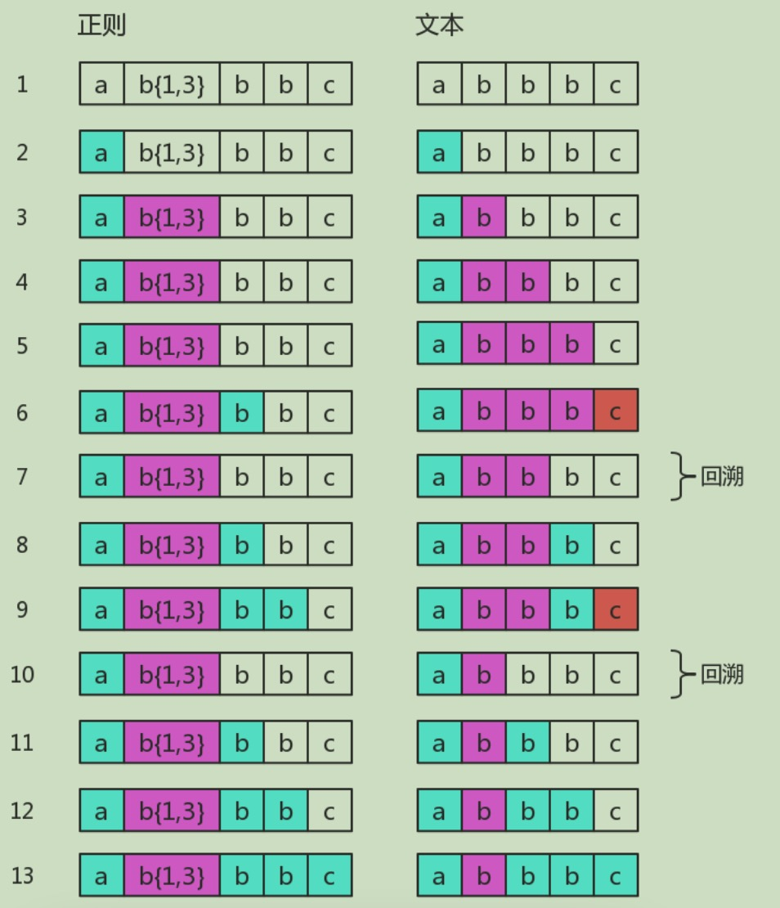

- [《JavaScript 正则表达式迷你书》——老姚，读书笔记](#javascript-正则表达式迷你书老姚读书笔记)
  - [书的结构](#书的结构)
  - [字符匹配](#字符匹配)
    - [横向模糊 - {}](#横向模糊---)
    - [纵向模糊 - \[\]](#纵向模糊---)
    - [范围表示 -](#范围表示--)
    - [排除字符 ^](#排除字符-)
    - [常用字符简写](#常用字符简写)
    - [量词简写](#量词简写)
    - [贪婪匹配、惰性匹配](#贪婪匹配惰性匹配)
    - [多选分支 |](#多选分支-)
    - [小试牛刀](#小试牛刀)
      - [匹配 16 进制颜色值](#匹配-16-进制颜色值)
      - [匹配小时时间](#匹配小时时间)
      - [匹配日期 yyyy-mm-dd](#匹配日期-yyyy-mm-dd)
  - [位置匹配](#位置匹配)
    - [开头和结尾 ^ $](#开头和结尾--)
    - [单词边界 \\b \\B](#单词边界-b-b)
    - [匹配模式位置 (?=p) 和 (?!p)](#匹配模式位置-p-和-p)
    - [小试牛刀](#小试牛刀-1)
      - [数字分隔符](#数字分隔符)
      - [密码校验](#密码校验)
  - [括号 () 的作用](#括号--的作用)
    - [字符分组](#字符分组)
    - [分支结构](#分支结构)
    - [分组引用](#分组引用)
    - [反向引用](#反向引用)
    - [小试牛刀](#小试牛刀-2)
      - [trim 方法](#trim-方法)
  - [回溯法](#回溯法)
  - [速查表](#速查表)
    - [字符组](#字符组)
    - [量词](#量词)
    - [位置](#位置)
    - [括号的作用](#括号的作用)
    - [修饰符](#修饰符)
    - [String 相关实例方法](#string-相关实例方法)
    - [RegExp 相关实例方法](#regexp-相关实例方法)

# 《JavaScript 正则表达式迷你书》——老姚，读书笔记

## 书的结构

[《JS 正则迷你书》](https://github.com/qdlaoyao/js-regex-mini-book)

正则即匹配，要么匹配字符，要么匹配位置。

- 第 1,2 章讲解基础，使用括号捕获数据
- 第 3 章讲括号的作用，了解匹配原理
- 第 4 章讲回溯法原理，正则得会看会写
- 第 5 章从读的角度拆分正则
- 第 6 章从写的角度构建正则
- 第 7 章讲用户、API、注意事项

## 字符匹配

模糊匹配主要考察 `{}` `[]` 及 `多选分支` 的使用。

### 横向模糊 - {}

横向模糊：字符确定但出现的次数不定。

`{m, n}` 表示前一个字符出现次数为 m ~ n 次。

```js
// b可能出现1-3次
/ab{1,3}c/;
```

### 纵向模糊 - []

纵向模糊：字符内容不确定。

`[abc]` 表示为 a,b,c 中任意一个字符。

```js
// 可能为 1a3 1b3 1c3
/1[abc]3/;
```

### 范围表示 -

用 `-` 来表示连续的值。

```js
[123456abcdefGHIJKLM]

// 可写成
[1-6a-fG-M]
```

注：若要把 `-` 当做字符，在前面添加转义符 `\` 即可，如 [a\\-z]

### 排除字符 ^

```js
// 表示除abc以外的任意一个字符
[^abc]
```

### 常用字符简写

| 字符组 | 具体含义                                                                                                                                                              |
| ------ | --------------------------------------------------------------------------------------------------------------------------------------------------------------------- |
| \d     | 表示 [0-9]。表示是一位数字。记忆方式：其英文是 digit（数字）。                                                                                                        |
| \D     | 表示 [^0-9]。表示除数字外的任意字符。                                                                                                                                 |
| \w     | 表示 [0-9a-zA-Z_]。表示数字、大小写字母和下划线。记忆方式：w 是 word 的简写，也称单词字符。                                                                           |
| \W     | 表示 [^0-9a-zA-Z_]。非单词字符。                                                                                                                                      |
| \s     | 表示 [ \t\v\n\r\f]。表示空白符，包括空格、水平制表符、垂直制表符、换行符、回车符、换页符。记忆方式：s 是 space 的首字母，空白符的单词是 white space。                 |
| \S     | 表示 [^ \t\v\n\r\f]。 非空白符。                                                                                                                                      |
| .      | 表示 [^\n\r\u2028\u2029]。通配符，表示几乎任意字符。换行符、回车符、行分隔符和段分隔符除外。记忆方式：想想省略号 … 中的每个点，都可以理解成占位符，表示任何类似的东西 |

注：[\d\D]、[\w\W]、[\s\S] 和 [^] 任意一个都可以表达任意字符。

### 量词简写

若字符出现次数具有不定性，可使用以下简写

| 量词 | 具体含义                                                                                                              |
| ---- | --------------------------------------------------------------------------------------------------------------------- |
| {m,} | 表示至少出现 m 次。                                                                                                   |
| {m}  | 等价于 {m,m}，表示出现 m 次。                                                                                         |
| ?    | 等价于 {0,1}，表示出现或者不出现。记忆方式：问号的意思表示，有吗？                                                    |
| +    | 等价于 {1,}，表示出现至少一次。记忆方式：加号是追加的意思，得先有一个，然后才考虑追加。                               |
| \*   | 等价于 {0,}，表示出现任意次，有可能不出现。记忆方式：看看天上的星星，可能一颗没有，可能零散有几颗，可能数也数不过来。 |

### 贪婪匹配、惰性匹配

```js
var regex = /\d{2,5}/g;
var string = "123 1234 12345 123456";
console.log(string.match(regex));
// => ["123", "1234", "12345", "12345"]
```

该正则意在匹配 2-5 位的连续数字，那 2 位和 5 位数字都会满足条件。

- 贪婪匹配：尽量以满足最大条件去匹配，即尽量匹配 5 位数字。
- 惰性匹配：尽量以满足最小条件去匹配，即尽量匹配 2 位数字。

正则默认为贪婪匹配，在量词后加个 `?` 就可实现惰性匹配

```js
var regex = /\d{2,5}?/g;
var string = "123 1234 12345 123456";
console.log(string.match(regex));
// => ["12", "12", "34", "12", "34", "12", "34", "56"]
```

下面罗列所有贪婪和惰性场景

| 惰性量词 | 贪婪量词 |
| -------- | -------- |
| {m,n}?   | {m,n}    |
| {m,}?    | {m,}     |
| ??       | ?        |
| +?       | +        |
| \*?      | \*       |

### 多选分支 |

多选分支意为有多个模式人选其一即可。

其形式如：(p1|p2|p3)，其中 p1,p2,p3 为子模式匹配其一即可

```js
var regex = /good|nice/g;
var string = "good idea, nice try.";
console.log(string.match(regex));
// => ["good", "nice"]
```

注：多选分支为惰性，优先级从左到右，匹配上后面的就不再尝试。

### 小试牛刀

#### 匹配 16 进制颜色值

```js
// #ffbbad
// #Fc01DF
// #FFF
// #ffE

/#([0-9a-fA-F]{6}|[0-9a-fA-F]{3})/g;
```

#### 匹配小时时间

```js
// 23:59
// 02:07
var regex = /^([01][0-9]|[2][0-3]):[0-5][0-9]$/;
```

#### 匹配日期 yyyy-mm-dd

```js
// 2017-06-10
var regex = /^[0-9]{4}-(0[1-9]|1[0-2])-(0[1-9]|[12][0-9]|3[01])$/;
```

## 位置匹配

### 开头和结尾 ^ $

`^` 匹配开头，`￥` 匹配结尾。

```js
var result = "hello".replace(/^|$/g, "#");
console.log(result);
// => "#hello#"
```

### 单词边界 \b \B

`\b` 表示单词边界的位置，包括 `\w 与 \W` 之间的位置、`^ 与 \w` 之间的位置、`\w 与 $` 之间的位置。

```js
var result = "[JS] Lesson_01.mp4".replace(/\b/g, "#");
console.log(result);
// => "[#JS#] #Lesson_01#.#mp4#"
```

`\B` 与 `\b` 相反，表示非单词边界，具体说来就是 \w 与 \w、 \W 与 \W、^ 与 \W，\W 与 $ 之间的位置。

### 匹配模式位置 (?=p) 和 (?!p)

`(?=p)` 中 p 表示模式，以为匹配 p 模式的位置。

```js
var result = "hello".replace(/(?=l)/g, "#");
console.log(result);
// => "he#l#lo"
```

`(?!p)` 与 `(?=p)` 相反，表示不匹配 p 模式的位置。

```js
var result = "hello".replace(/(?!l)/g, "#");
console.log(result);
// => "#h#ell#o#"
```

### 小试牛刀

#### 数字分隔符

```js
var result = "12345678".replace(/(?!^)(?=(\d{3})+$)/g, ",");
console.log(result);
// => "12,345,678"
```

其中 `(?!^)` 用于避免开头为出现分隔符情况

```js
"122238888".replace(/(?=(\d{3})+$)/g, ",");
// ',122,238,888'
```

#### 密码校验

要求：密码长度 6-12 位，由数字、小写字符和大写字母组成，但必须至少包括 2 种字符。

```js
// 前半句很好实现
/[0-9a-zA-Z]{6-12}/;
```

如何实现 `至少包括 2 种字符` ？

```js
// 必须包含数字
/(?=.*[0-9])^/;
```

`.*` 表示任意个字符，`[0-9]` 表示一个数字，组合起来就是 n 个字符后有一个数字，其实就是必须包含数字。

那同时包含两种字符即

```js
// 必须包含数字和小写字母
/(?=.*[0-9])(?=.*[a-z])^/;
```

组合所有情况

```js
var regex =
  /((?=.*[0-9])(?=.*[a-z])|(?=.*[0-9])(?=.*[A-Z])|(?=.*[a-z])(?=.*[A-Z]))^[0-9A-Za-z]{6,12}$/;
console.log(regex.test("1234567")); // false 全是数字
console.log(regex.test("abcdef")); // false 全是小写字母
console.log(regex.test("ABCDEFGH")); // false 全是大写字母
console.log(regex.test("ab23C")); // false 不足6位
console.log(regex.test("ABCDEF234")); // true 大写字母和数字
console.log(regex.test("abcdEF234")); // true 三者都有
```

## 括号 () 的作用

### 字符分组

`()` 将字符分为一组进行匹配。

```js
var regex = /(ab)+/g;
var string = "ababa abbb ababab";
console.log(string.match(regex));
// => ["abab", "ab", "ababab"]
```

### 分支结构

`()` 中可产生多个分支模式。

```js
var regex = /^I love (JavaScript|Regular Expression)$/;
console.log(regex.test("I love JavaScript"));
console.log(regex.test("I love Regular Expression"));
// => true
// => true
```

### 分组引用

`()` 可多正则进行分组。

```js
var regex = /(\d{4})-(\d{2})-(\d{2})/;
var string = "2017-06-12";
console.log(string.match(regex));
// => ["2017-06-12", "2017", "06", "12", index: 0, input: "2017-06-12"]
```

> match 返回的一个数组，第一个元素是整体匹配结果，然后是各个分组（括号里）匹配的内容，然后是匹配下标，最后是输入的文本。另外，正则表达式是否有修饰符 g，match 返回的数组格式是不一样的。

### 反向引用

反向引用：在正则中对出现过的分组进行引用。

看一个匹配 yyyy-mm-dd 的正则

```js
var regex = /\d{4}(-|\/|\.)\d{2}(-|\/|\.)\d{2}/;

var string1 = "2017-06-12";
var string2 = "2017/06/12";
var string3 = "2016-06/12";
console.log(regex.test(string1)); // true
console.log(regex.test(string2)); // true
console.log(regex.test(string3)); // true
```

示例中，2016-06/12 也返回了 true，这不是我们想要的。

那如何让分隔符保持一致？使用反向引用

```js
var regex = /\d{4}(-|\/|\.)\d{2}\1\d{2}/;
var string4 = "2016-06/12";
console.log(regex.test(string4)); // false
```

`\1` 表示匹配分组 1 `(-|\/|\.)` 所匹配到的字符。

### 小试牛刀

#### trim 方法

```js
function trim(val) {
  return val.replace(/^\s+|\s+$/g, "");
}

trim("  asdas asdas   "); // 'asdas asdas'
```

## 回溯法

正则表达式匹配字符串的这种方式，有个学名，叫回溯法。

> 回溯法也称试探法，它的基本思想是：从问题的某一种状态（初始状态）出发，搜索从这种状态出发所能达到的所有“状态”，当一条路走到“尽头”的时候（不能再前进），再后退一步或若干步，从另一种可能“状态”出发，继续搜索，直到所有的“路径”（状态）都试探过。这种不断“前进”、不断“回溯”寻找解的方法，就称作“回溯法”。

回溯法常发生于 `贪婪量词` 如 b{1,3}、`惰性量词` 如 \d{1,3}? 、`分支结构` 如 /can|candy/ 等。

无回溯的匹配

```js
/ab{1,3}c/.test("abbbc");
```

匹配过程：



有回溯的匹配

```js
/ab{1,3}bbc/.test("abbbc");
```

匹配过程：



## 速查表

### 字符组

| 模式      | 说明                                                                 |
| --------- | -------------------------------------------------------------------- |
| [abc]     | 匹配 "a"、"b"、"c" 其中任何一个字符。                                |
| [a-d1-4]  | 匹配 "a"、"b"、"c"、"d"、"1"、"2"、"3"、"4" 其中任何一个字符。       |
| [^abc]    | 匹配除了 "a"、"b"、"c" 之外的任何一个字符。                          |
| [^a-d1-4] | 匹配除了 "a"、"b"、"c"、"d"、"1"、"2"、"3"、"4" 之外的任何一个字符。 |
| .         | 通配符，匹配除了少数字符（\n）之外的任意字符。                       |
| \d        | 匹配数字，等价于 [0-9]。                                             |
| \D        | 匹配非数字，等价于 [^0-9]。                                          |
| \w        | 匹配单词字符，等价于 [a-zA-Z0-9_]。                                  |
| \W        | 匹配非单词字符，等价于 [^a-zA-Z0-9_]。                               |
| \s        | 匹配空白符，等价于 [ \t\v\n\r\f]。                                   |
| \S        | 匹配非空白符，等价于 [^ \t\v\n\r\f]。                                |

### 量词

| 模式   | 说明                           |
| ------ | ------------------------------ |
| {n,m}  | 连续出现 n 到 m 次。贪婪模式。 |
| {n,}   | 至少连续出现 n 次。贪婪模式。  |
| {n}    | 连续出现 n 次。贪婪模式。      |
| ?      | 等价于 {0,1}。贪婪模式。       |
| \+     | 等价于 {1,}。贪婪模式。        |
| \*     | 等价于 {0,}。贪婪模式。        |
| {n,m}? | 连续出现 n 到 m 次。惰性模式。 |
| {n,}?  | 至少连续出现 n 次。惰性模式。  |
| {n}?   | 连续出现 n 次。惰性模式。      |
| ??     | 等价于 {0,1}?。惰性模式。      |
| +?     | 等价于 {1,}?。惰性模式。       |
| \*?    | 等价于 {0,}?。惰性模式。       |

### 位置

| 模式    | 说明                                                                  |
| ------- | --------------------------------------------------------------------- |
| ^       | 匹配开头的位置，当正则有修饰符 m 时，表示匹配行开头位置。             |
| $       | 匹配结尾的位置，当正则有修饰符 m 时，表示匹配行结尾位置。             |
| \b      | 匹配单词边界，即，\w 与 \W、^ 与 \w、\w 与 $ 之间的位置。             |
| \B      | 匹配非单词边界，即，\w 与 \w、\W 与 \W、^ 与 \W，\W 与 $ 之间的位置。 |
| (?=abc) | 匹配 "abc" 前面的位置，即此位置后面匹配 "abc"。                       |
| (?!abc) | 匹配非 "abc" 前面的位置，即此位置后面不匹配 "abc"。                   |

### 括号的作用

| 模式           | 说明                                                                      |
| -------------- | ------------------------------------------------------------------------- |
| (ab)           | 捕获型分组。把 "ab" 当成一个整体，比如 (ab)+ 表示 "ab" 至少连续出现一次。 |
| (?:ab)         | 非捕获型分组。与 (ab) 的区别是，它不捕获数据。                            |
| (good\|nice)   | 捕获型分支结构。匹配 "good" 或 "nice"。                                   |
| (?:good\|nice) | 非捕获型分支结构。与 (good                                                |
| \num           | 反向引用。比如 \2，表示引用的是第二个括号里的捕获的数据。                 |

### 修饰符

| 符号 | 说明                                     |
| ---- | ---------------------------------------- |
| g    | 全局匹配，找到所有满足匹配的子串。       |
| i    | 匹配过程中，忽略英文字母大小写。         |
| M    | 多行匹配，把 ^ 和 $ 变成行开头和行结尾。 |

### String 相关实例方法

| 方法    | 说明                                                                   |
| ------- | ---------------------------------------------------------------------- |
| search  | 返回正则匹配到的第一个子串在目标字符串中的下标位置。                   |
| split   | 以正则匹配到的子串，对目标字符串进行切分。返回一个数组。               |
| match   | 对目标字符串执行正则匹配操作，返回的匹配结果数组中包含具体的匹配信息。 |
| replace | 对目标字符串进行替换操作。正则是其第一个参数。返回替换后的字符串。     |

### RegExp 相关实例方法

| 方法 | 说明                                                   |
| ---- | ------------------------------------------------------ |
| test | 判断目标字符串中是否有满足正则匹配的子串。返回布尔值。 |
| exec | 比 match 更强大的正则匹配操作。返回结果与 match 一致。 |
