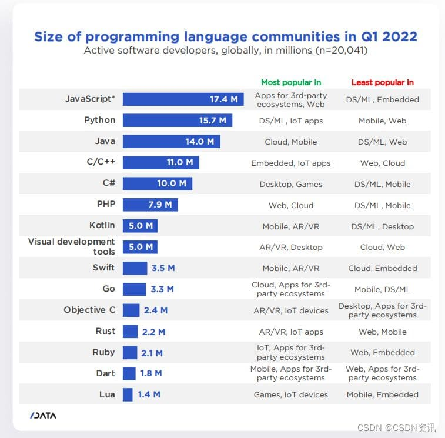

- [前言](#前言)
- [类型介绍](#类型介绍)
  - [基础类型](#基础类型)
  - [为函数指定类型](#为函数指定类型)
  - [接口类型(interface)](#接口类型interface)
    - [`?:` 可缺省](#-可缺省)
    - [`readonly` 只读](#readonly-只读)
    - [函数类型接口](#函数类型接口)
    - [任意属性](#任意属性)
  - [枚举类型(enum)](#枚举类型enum)
  - [泛型](#泛型)
    - [语法](#语法)
    - [多种类型泛型的使用](#多种类型泛型的使用)
    - [泛型约束](#泛型约束)
    - [默认类型](#默认类型)
- [类型进阶](#类型进阶)
  - [类型推断、字面量类型](#类型推断字面量类型)
  - [类型断言](#类型断言)
  - [type 类型别名](#type-类型别名)
  - [keyof 类型索引](#keyof-类型索引)
  - [| \& 高级类型：联合、交叉、合并接口类型](#--高级类型联合交叉合并接口类型)
- [内置类型工具](#内置类型工具)
  - [操作接口](#操作接口)
    - [Partial 和 Required](#partial-和-required)
    - [Pick 和 Omit](#pick-和-omit)
  - [操作联合类型](#操作联合类型)
    - [Exclude 和 Extract](#exclude-和-extract)
    - [NonNullable](#nonnullable)
    - [Record](#record)
  - [操作函数](#操作函数)
    - [Parameters](#parameters)
    - [ReturnType](#returntype)
- [声明文件](#声明文件)
  - [包已存在声明文件](#包已存在声明文件)
  - [书写声明文件](#书写声明文件)
    - [\<script\> 标签引入的包](#script-标签引入的包)
    - [npm 包](#npm-包)
- [常用配置](#常用配置)
  - [检索文件的路径](#检索文件的路径)
  - [路径别名智能提示、跟踪](#路径别名智能提示跟踪)
- [实战](#实战)
  - [编写类型工具常用语法](#编写类型工具常用语法)
    - [使用泛型](#使用泛型)
    - [联合类型传入泛型的坑](#联合类型传入泛型的坑)
    - [类型推断 infer 获取类型入参的组成部分](#类型推断-infer-获取类型入参的组成部分)
    - [根据索引获取子类型](#根据索引获取子类型)
    - [typeof 获取变量、属性类型](#typeof-获取变量属性类型)
    - [映射类型 in](#映射类型-in)
- [后语](#后语)
  - [更多 ts 学习资料](#更多-ts-学习资料)

## 前言

开发者调查分析公司 SlashData 发布了 2022 年《开发者报告》，在连续十次的调查中，JavaScript 受欢迎程度都位居第一



> `JS` ：感谢曾经瞧不起我的那些语言，打不倒我的令我更强大。

在零几年的时候， `js` 的程序员常被 `Java` 、`C++` 的程序员瞧不上，他们认为 `js` 就是轻量的脚本语言，但也确实那时候的 `js` 能做的事寥寥无几。

现今时不同往日咦：

以前说 `js` 是弱语言，我们现在支持 `ts` ，强得很（库克：抄袭？）；

以前说 `js` 效率低写不了大工程，我们现在手持三大宝剑：`Vue、React、Angular`，30s 就能搭好一个工程，成熟的模块化多大都受得了 😎；

以前说 `js` 只能操作 `DOM`，我们现在 nodeJS 能写服务，查数据还嗷嗷快；

有感而发，`js` 真不是以前那个小老弟了，它已长成苍天大树，而前端程序员就是它的枝芽，他们相辅相成。

回观 `ts` ， `ts` 是 `js` 前行的重要一环，它改变了 `js` 是弱类型语言的定义，使得对大项目的维护变得简单也提升了开发的效率，所以 `ts` 是前端程序员必学的知识 。不知道大家是不是跟我一样对 `ts` 也是 🪴 种草已久，一段时间使用下来给我的感受是，用前膜拜 🙏，初用痛苦 😫，再用舒服 😋，再到最后巴不得所有的项目都上 `ts` 。

如果你也刚开始用 `ts` ，那千万要坚持下去，苦后才会逢甘露。

这里推荐一个在线写 `ts` 代码的网站：[TypeScript 演练场](https://www.typescriptlang.org/zh/play)，赶紧上车，开启我们的 `ts` 之旅 😎。

## 类型介绍

`ts` 的类型系统其实不难，大家无需死记硬背，多写多敲，敲代码过程中忘记了就打开文章复习几次自然就都记得了。可以给本文点个赞，写代码时忘了语法可以更快传送回来偷瞄一眼。😳

### 基础类型

这边直接把所有的类型使用都罗列出来。

```ts
/** 原始类型包含：number、string、boolean、null、undefined、symbol */
let num: number = 1;

/** 数组 */

let arrayOfNumber: number[] = [1, 2, 3];
let arrayOfString: string[] = ["x", "y", "z"];

// 泛型写法
let arrayOfNumber2: Array<number> = [1, 2, 3];
let arrayOfString2: Array<string> = ["x", "y", "z"];

/** any */
let anything: any = {};
anything = 1; // 不会提示错误
anything = "x"; // 不会提示错误
// 需要明白且记住：Any is Hell（Any 是地狱）。

/** 元组类型 */
// 表示一个已知元素数量和类型的数组，各元素的类型不必相同
let arr: [string, number] = ["hello", 0];

/** unknown */
let result: unknown;

// unknown 类型仅能赋值给 unknown 或 any 类型
let num1: number = result; // 提示 ts(2322)
let anything1: any = result; // 不会提示错误

// unknown 类型 无法直接调用方法
result.toFixed(); // 提示 ts(2571)
// 需缩小类型范围后才能调用方法
if (typeof result === "number") {
  result.toFixed(); // 此处 hover result 提示类型是 number，不会提示错误
}

/** 类型断言 */
// 在运行代码前，ts仅知道结果可能是 number 或 undefined，所以就报错了
const arrayNumber: number[] = [1, 2, 3, 4];
const greaterThan2: number = arrayNumber.find((num) => num > 2); // 提示 ts(2322)

// 我们可以这样写
const greaterThan3: number = arrayNumber.find((num) => num > 2) as number;
```

### 为函数指定类型

我们一般会为函数指定参数类型和返回值类型

```js
const add = (a: number, b: number): number => {
  return a + b;
};
```

ts 的 => 用来定义一个函数，而 es6 的 => 是用来实现一个函数，两者结合使用：

```js
type Adder = (a: number, b: number) => number; // TypeScript 函数类型定义
const add: Adder = (a, b) => a + b; // ES6 箭头函数
```

`?:` 表示可选参数：

```js
function test(param?: string) {
  console.log(param);
}
test(); // undefined
```

函数参数支持多类型：

```js
function log3(x: number | string = "hello") {
  console.log(x);
}
```

剩余参数：

```js
function sum(...nums: number[]) {
  return nums.reduce((a, b) => a + b, 0);
}

sum(1, 2); // => 3
sum(1, 2, 3); // => 6
sum(1, "2"); // ts(2345) Argument of type 'string' is not assignable to parameter of type 'number'
```

### 接口类型(interface)

`interface` 用来定义对象类型和函数类型，通常以大写字母开头。

```js
interface ProgramLanguage {
  /** 语言名称 */
  name: string;
  /** 使用年限 */
  age: () => number;
}

// 约束变量结构
let TypeScript: ProgramLanguage;

// 约束函数入参结构
function NewStudy(language: ProgramLanguage) {
  console.log(
    `ProgramLanguage ${language.name} created ${language.age()} years ago.`
  );
}
```

#### `?:` 可缺省

```js
/** 关键字 接口名称 */
interface OptionalProgramLanguage {
  /** 语言名称 */
  name: string;
  /** 使用年限 */
  age?: () => number;
}
let OptionalTypeScript: OptionalProgramLanguage = {
  name: "TypeScript",
}; // ok
```

#### `readonly` 只读

```js
interface data {
  readonly name: string;
}
let obj: data = {
  name: "张三",
};
/** ts(2540)错误，name 只读 */
data.name = "李四";
```

#### 函数类型接口

```js
interface StudyLanguage {
  (language: ProgramLanguage): void;
}

/** 单独的函数实践 */
let StudyInterface: StudyLanguage = (language) =>
  console.log(`${language.name} ${language.age()}`);
```

#### 任意属性

`任意属性` 就是允许接口有任意的属性。

使用 `[xxx: string]: any;` 来定义。

```js
interface Person {
  name: string;
  age?: number;
  [propName: string]: any;
}

let tom: Person = {
  name: "Tom",
  gender: "male",
};
```

注意

1. 确定属性和可选属性的类型都必须是任意属性类型的子集
2. 只能定义一个任意属性

使用任意属性可以**定义数组类型**，但一般很少这么用

```js
interface NumberArray {
  [index: number]: number;
}
let fibonacci: NumberArray = [1, 1, 2, 3, 5];
```

举个 🌰，类数组的定义：

```js
function sum() {
  let args: number[] = arguments;
}
// Type 'IArguments' is missing the following properties from type 'number[]': pop, push, concat, join, and 24 more.
```

可以看到，使用普通方式定义会报错。

我们使用任意属性来处理这个问题：

```js
function sum() {
  let args: {
    [index: number]: number,
    length: number,
    callee: Function,
  } = arguments;
}
```

实际开发中，类数组都有自己的接口定义，如 IArguments, NodeList, HTMLCollection ，我们直接使用即可。

### 枚举类型(enum)

在 `es6` 中，通常这样定义`常量集合`

```js
const CAR_MAP = {
  bmw: new Symbol("bmw"),
  byd: new Symbol("byd"),
};
```

在 `ts` 中使用枚举来定义 `常量集合` ，非常简洁

```js
enum Day {
    SUNDAY,
    MONDAY,
    TUESDAY,
    WEDNESDAY,
    THURSDAY,
    FRIDAY,
    SATURDAY
}
```

ts 会将枚举转化为如下 js ，属性为常量、命名值从 0 开始递增数字映射的对象：

```js
var Day = void 0;
(function (Day) {
  Day[(Day["SUNDAY"] = 0)] = "SUNDAY";
  Day[(Day["MONDAY"] = 1)] = "MONDAY";
  Day[(Day["TUESDAY"] = 2)] = "TUESDAY";
  Day[(Day["WEDNESDAY"] = 3)] = "WEDNESDAY";
  Day[(Day["THURSDAY"] = 4)] = "THURSDAY";
  Day[(Day["FRIDAY"] = 5)] = "FRIDAY";
  Day[(Day["SATURDAY"] = 6)] = "SATURDAY";
})(Day || (Day = {}));
```

开发过程中有 **7 种常见的枚举类型**

- 数字类型
- 字符串类型
- 异构类型
- 常量成员和计算（值）成员、枚举成员类型
- 联合枚举
- 常量枚举
- 外部枚举

**数字类型**

可以给指定成员赋值（不建议对数字类型枚举执行该操作）：

```js
enum Day {
    FRIDAY,
    SATURDAY = 5
  }
```

**字符串枚举**

```js
enum Day {
    SUNDAY = 'SUNDAY',
    MONDAY = 'MONDAY',
    ...
}
```

**异构枚举**

`异构枚举` 就是支持数字、字符串类型同时使用的枚举。感觉很鸡肋。

```js
enum Day {
    SUNDAY = 'SUNDAY',
    MONDAY = 2,
    ...
  }
```

**常量成员和计算成员**

```js
enum FileAccess {
    // 常量成员
    None,
    Read = 1 << 1,
    Write = 1 << 2,
    ReadWrite = Read | Write,
    // 计算成员
    G = "123".length,
  }
```

我们只需记住缺省值（从 0 递增）、数字字面量、字符串字面量肯定是常量成员

**常量枚举**

```js
const enum Day {
    SUNDAY,
    MONDAY
  }
  const work = (d: Day) => {
    switch (d) {
      case Day.SUNDAY:
        return 'take a rest';
      case Day.MONDAY:
        return 'work hard';
    }
  }
}
```

**外部枚举**

使用 declare 描述一个在其他地方已经定义过的枚举类型，通过这种方式定义出来的枚举类型，被称之为外部枚举：

```js
declare enum Day {
  SUNDAY,
  MONDAY,
}
const work = (x: Day) => {
  if (x === Day.SUNDAY) {
    x; // 类型是 Day
  }
}
```

### 泛型

泛型用于在定义函数、接口或类的时候不为其指定具体的类型，在使用的时候再进行指定类型。

使用泛型能让定义的属性更加灵活。

#### 语法

```typescript
名字<T1, T2, ...>
```

`名字`一般表示**函数名、接口名、类名**，`T1, T2, ...` 表示一个或多个**名字任意**的**类型变量**，实际开发中常常以**首字母大写**的标识符作为类型变量名。泛型在使用时**必须以真实类型替换类型变量**

多类型写法

```ts
function reflectExtraParams<P, Q>(p1: P, p2: Q): [P, Q] {
  return [p1, p2];
}
```

举个 🌰，使用泛型**解决输入输出一致问题**

定义一个 `print` 函数用于打印数据：

```typescript
function print(arg: string): string {
  console.log(arg);
  return arg;
}
```

这样写会导致打印其他类型时会报错，使用泛型解决：

```ts
function print<T>(arg: T): T {
  console.log(arg);
  return arg;
}
```

#### 多种类型泛型的使用

**泛型数组**

语法

```ts
Array<T>

// 简写
number[]
```

```ts
// 定义数字数组
let arr: number[] = [1, 2, 3];

// 完全等价于
let arr: Array<number> = [1, 2, 3];
```

```js
function reflectArray<P>(param: P[]) {
  return param;
}
const reflectArr = reflectArray([1, "1"]); // reflectArr 是 (string | number)[]
```

**泛型函数**

```ts
function identity<T>(m: T): T {
  // T 注解了函数内部的变量定义
  let n: T = m;
  return n;
}

// 调用泛型函数，此时用string类型替换类型变量 T
// identity<string> 作为一个整体相当于一个函数名
let m: string = identity<string>("hello world");
```

**泛型类**

```ts
// 定义泛型类，包含两个类型变量
class Identity<T1, T2> {
  attr1: T1;
  attr2: T2;
  show(m: T1, n: T2): T2 {
    return n;
  }
}

// 用真实类型替换泛型类的类型变量
// Identity<string, number>作为一个整体相当于一个类名
let a: Identity<string, number>;
// 初始化变量a
a = new Identity<string, number>();
a.attr1 = "hello";
a.attr2 = 99;

// error TS2322: Type '"good"' is not assignable to type 'number'
a.attr2 = "good";
```

**泛型接口**

```ts
// 定义泛型接口
interface Identity<T> {
  attr: T;
}

// 用真实类型替换泛型接口的类型变量
// Identity<number>作为一个整体相当于一个接口名
let a: Identity<number> = { attr: 10 };
// Identity<string>作为一个整体相当于一个接口名
let b: Identity<string> = { attr: "hello" };

// 错误，类型不匹配，数字10是数字类型，而类型变量为布尔类型
// error TS2322: Type 'number' is not assignable to type 'boolean'.
let c: Identity<boolean> = { attr: 10 };

// 一个复杂点的例子
function fn() {}
let c: Identity<typeof fn> = {
  attr() {},
};
```

#### 泛型约束

**使用未知属性报错问题**

```ts
// 定义泛型函数
function getLength<T>(arg: T): number {
  // 错误，编译器不知道类型变量T是否包含属性length，默认为不存在
  // error TS2339: Property 'length' does not exist on type 'T'
  return arg.length;
}
```

例子中，并没有明文约束 `arg` 存在 `length` 属性，从而 `arg.length` 导致了异常。

泛型约束就是用来解决该问题。

**泛型约束语法**

```ts
<T extends xx类型>
```

类型约束关键字为 `extends`，和继承关键字一样。实际上，类型约束**跟继承同义，类型变量继承了被约束类型的所有成员**

**使用泛型约束解决未知属性问题**

```ts
// 声明接口
interface WithLength {
  length: number;
}

// 正确，T现在被接口类型WithLength约束，包含属性 length
function getLength<T extends WithLength>(arg: T): number {
  return arg.length;
}
```

#### 默认类型

**语法**

```
<T = string>
```

**举例**

```ts
interface MyType<T = string> {
  value: T;
}

// 正确，在类型参数没有显示指定的情况下，采用了默认类型 string
let x1: MyType = {
  value: "hello world",
};
// 等价于
let x1: MyType<string> = {
  value: "hello world",
};

// 错误， error TS2322: Type 'number' is not assignable to type 'string'
let x2: MyType = {
  value: 123,
};

// 正确，覆盖默认的 string 类型
let x3: MyType<number> = {
  value: 123,
};
```

## 类型进阶

### 类型推断、字面量类型

啥是类型推断？ts 会自动判断变量或返回值的类型。

```js
let num: number = 1;
// 等价于
let num = 1;
```

初始化变量值、函数参数默认值、函数返回值等都会自动类型推断。

```js
/** 推断参数 num 的类型是数字或者 undefined，返回值的类型也是数字 */
function getNum(num = 1) {
  return num;
}
```

**字面量类型**
ts 支持 `字符串、数字、布尔值` 三种字面量类型，来看个例子：

```js
{
  let specifiedStr: "this is string" = "this is string";
  let specifiedNum: 1 = 1;
  let specifiedBoolean: true = true;
}
```

字面量类型时集合类型的子集。

字面量类型能赋值给集合类型，但是反之是不可行的：

```js
let hello: "hello" = "hello";
let hello2: string = hello; // ok
hello = "hi"; // ts(2322) Type '"hi"' is not assignable to type '"hello"'
```

通常会结合联合类型使用：

```js
type Direction = "up" | "down";
function move(dir: Direction) {
  // ...
}

move("up"); // ok
move("right"); // ts(2345) Argument of type '"right"' is not assignable to parameter of type 'Direction'
```

数字字面量和布尔值字面量也是类似用法：

```js
interface config {
  size: "small" | "big";
  margin: 0 | 10;
  isEnable: false | true;
}
```

**let、const 定义变量值相同但类型不一致问题**

```js
let str = "hello"; // str: string
const str2 = "hello"; // str2: 'hello'
```

这是由于 const 定义变量值不会改变，这样就缩小了变量的类型范围。

### 类型断言

语法

```ts
// 1、尖括号语法
<类型表达式>值;

// 2、as语法
值 as 类型表达式;
```

为了避免和 `JSX` 语法产生冲突，尖括号语法只能在 `tsx` 文件中使用

```ts
let someValue: any = "this is a string";

// 1、尖括号语法
let strLength: number = (<string>someValue).length;
// 2、as语法
let strLength: number = (someValue as string).length;
```

### type 类型别名

类型别名用来给一个类型起个新名字，常用于联合类型。

别名不会创建一个新的类型，它只是原类型的一个引用，和原类型**完全等价**，它的定义方式有点类似 let 。

语法： `type 别名 = 类型` 。

合法的类型别名声明：

```ts
// 数字类型别名
type myNumber = number;
// 布尔类型别名
type myBoolean = boolean;
// 联合类型别名
type transition = "EASE" | "EASEIN" | "EASEOUT";
// 联合类型别名
type StringOrNumber = string | number;
// 联合类型别名
type Text = string | { text: string };
// 泛型的实际类型别名
type NameLookup = Dictionary<string, Person>;
// 通过类型查询定义别名
type ObjectStatics = typeof Object;
// 泛型函数别名
type Callback<T> = (data: T) => void;
// 元组泛型别名
type Pair<T> = [T, T];
// 泛型的实际类型别名
type Coordinates = Pair<number>;
// 联合类型别名
type Tree<T> = T | { left: Tree<T>; right: Tree<T> };
```

声明了别名以后，别名就相当于是一个**类型的标识符**，可以用于注解语法中：

```ts
// 声明transition为联合类型的别名
type transition = "EASE" | "EASEIN" | "EASEOUT";

// transition此时是一个类型标识符
const boxTransition: transition = "EASE";
```

### keyof 类型索引

```ts
interface A {
  a: string;
  b: number;
}
// 等效于 'a' | 'b'
type customType = keyof A;
let param: customType = "a";
```

### | & 高级类型：联合、交叉、合并接口类型

`联合类型` ，`|` 表示或。

`交叉类型`， `&` 表示且。

```js
type test = string | number;
// 没啥意义，一般在合并接口时才用 &
type test = string & number;

// 具体值的联合类型
type girlName = "张胜男" | "王建国";
type boyName = "王建国" | "李世平";

type nameGroup = girlName | boyName;

let newName: nameGroup = "张胜男"; // ok , '王建国'、'李世平'也可以

type nameGroup2 = girlName & boyName;
let newName2: nameGroup2 = "王建国"; // ok , 其他值都报错
```

**联合、交叉组合**

`联合操作符 | 的优先级低于交叉操作符 &` 。

```js
type UnionIntersectionA =
  | ({ id: number } & { name: string })
  | ({ id: string } & { name: number }); // 交叉操作符优先级高于联合操作符

type UnionIntersectionB =
  | ("px" | "em" | "rem" | "%")
  | ("vh" | "em" | "rem" | "pt"); // 调整优先级
```

**合并接口类型**

```js
type IntersectionType = { id: number, name: string } & { age: number };
const mixed: IntersectionType = {
  id: 1,
  name: "name",
  age: 18,
};
```

## 内置类型工具

### 操作接口

#### Partial 和 Required

`Partial` 用于将一个接口的所有属性设置为可选状态，反之，`Required` 则是将所有属性改为必须状态。

```ts
type Person = {
  id: string;
  age: number;
  name: string;
};
// 等价{ id?:string, age?:number, name?:string }
type NewPerson = Partial<Person>;
```

#### Pick 和 Omit

`Pick` 主要用于提取接口的某几个属性，反之，`Omit` 用于剔除部分属性。

```ts
// 等价 {id: string, age: number }
type NewPickPerson = Pick<Person, "id" | "age">;
```

### 操作联合类型

#### Exclude 和 Extract

`Exclude` 用于从联合类型中剔除类型。

```ts
// 实现代码
type Exclude<T, U> = T extends U ? never : T;
```

```ts
// 简单使用
type T = Exclude<"a" | "b" | "c", "a">; // => 'b' | 'c'
```

```ts
// 实现 Omit
type CustomOmit<T, U extends keyof T> = {
  [key in Exclude<keyof T, U>]: T[key];
};

interface Animal {
  name: string;
  age: number;
}
type OmitAge = CustomOmit<Animal, "age">; // { name: string; }
```

`Extract` 用于从联合类型中提取类型。

```ts
// 实现代码
type Extract<T, U> = T extends U ? T : never;
```

```ts
// 简单使用
type T = Extract<"a" | "b" | "c", "a">; // => 'a'
```

```ts
// 实现工具类型【获取两个接口类型的交集】
type intersect<T, U> = {
  [key in Extract<keyof T, keyof U>]: T[key];
};

interface Animal {
  name: string;
  age: number;
}
interface Animal2 {
  name: string;
  sex: number;
}
type intersectAnimal = intersect<Animal, Animal2>; // { name: string; }
```

#### NonNullable

从联合类型中将 null 和 undefined 剔除

```js
// 实现代码
type NonNullable<T> = T & {};
```

```ts
// use
type test = NonNullable<"a" | null | undefined>; // "a"
```

#### Record

用于生成接口类型，接收两个参数，第一个是联合类型用于指定接口的 key，第二个是接口类型用于指定子 key 的值的类型。

```ts
// 代码实现
type Record<K extends keyof any, T> = {
  [P in K]: T;
};
```

```ts
type MenuKey = "home" | "about";
type Menus = Record<
  MenuKey,
  {
    path: string;
  }
>; // { home: { path: string; }; about: { path: string; }; }
```

### 操作函数

#### Parameters

获取函数类型的入参类型

```ts
// 实现
type Parameters<T extends (...args: any) => any> = T extends (...args: infer P) => any ? P : never;
```

```ts
// use
type Fun = (name: string, age: number) => void
const func = (name: string) => {}

type Params1 = Parameters<Fun> //  [name: string, age: number]
type Params2 = Parameters<typeof func> // [name: string]
```

#### ReturnType

获取函数类型的返回值类型

```ts
// 实现
type ReturnType<T extends (...args: any) => any> = T extends (...args: any) => infer R ? R : any;
```

```ts
// use
type Fun = () => void
const func = (): string => ''

type return1 = ReturnType<Fun> //  void
type return2 = ReturnType<typeof func> // string
```

## 声明文件

当使用第三方库时，我们需要引用它的声明文件，才能获得对应的代码补全、接口提示等功能。

如 `jQuery` ，引入后直接使用如 `$.get(URL, callback)` 时，ts 会报错，因为 ts 不知道何为 `$` ，更不知道 `$` 有哪些属性方法。所以需要 [`声明文件`](https://www.typescriptlang.org/docs/handbook/declaration-files/introduction.html) 让 ts 识别到第三方的特性。

声明文件是以 xxx.d.ts 的格式命名。

### 包已存在声明文件

根据以下两种方式来判断一个包是否存在声明文件：

1. 包的 package.json 中有 types 字段，或者有一个 index.d.ts 声明文件。这种模式不需要额外安装其他包。
2. 发布到 @types 里。我们只需要在 [社区声明文件网站](https://www.typescriptlang.org/dt/search) 上即可查询是否存在已维护的声明文件。这种模式一般是由于 npm 包的维护者没有提供声明文件，所以只能由其他人将声明文件发布到 @types 里了。

其中 方式 2 直接 `npm i @types/xxx -D` 下载即可无需额外配置。

例如为 jQuery 添加声明文件：

```js
npm install @types/jquery --save-dev
```

### 书写声明文件

当一个第三方库没有提供声明文件时，我们就需要自己书写声明文件了。

#### \<script\> 标签引入的包

当通过 \<script\> 标签引入第三方库，需注入全局变量

```js
// src/jQuery.d.ts
declare let $: (selector: string) => any;
```

```js
$("#foo");
```

#### npm 包

如何为 npm 包写声明文件：[前往查看](https://ts.xcatliu.com/basics/declaration-files.html#npm-%E5%8C%85)

## 常用配置

ts 的配置文件一般位于根目录 `tsconfig.json`

### 检索文件的路径

```js
{
	// 包含
  "include": [
    "src/**/*.ts",
    "src/**/*.d.ts",
    "src/**/*.vue",
    "types/**/*.d.ts",
    "vite.config.ts"
  ],
	// 排除
  "exclude": ["node_modules", "dist", "**/*.js"]
}

```

### 路径别名智能提示、跟踪

当在打包工具配置路径别名 alias 后，编辑器 ide 是无法识别路径提供智能提示和智能跟踪文件的。

要解决该问题，需增加如下 ts 配置，让 ts 识别到路径别名。

```ts
{
  "compilerOptions": {
    "paths": {
      "@/*": ["src/*"],
      "#/*": ["types/*"]
    }
  }
}

```

## 实战

### 编写类型工具常用语法

#### 使用泛型

```ts
{
  // bad
  type isX = 1 extends number ? true : false;

  // good
  type isXX<Child, Parent> = Child extends Parent ? true : false;
  // 扩展
  type isStr = isXX<"str", string>; // true
  type isNum = isXX<1, number>; // true
}
```

#### 联合类型传入泛型的坑

```ts
{
  type BoolOrStr = boolean | string;
  type BoolOrNumArray<E> = E extends boolean | number ? E[] : E;
  // 联合类型传入泛型，会拆解为单个并逐个执行
  type WhatIsIt = BoolOrNumArray<BoolOrStr>; // string | false[] | true[]
  // 非泛型中则是当做整体对待
  type WhatIsIt2 = BoolOrStr extends boolean | number ? BoolOrStr[] : BoolOrStr; // string | boolean

  // 强制联合类型为一个整体（使用[]）
  type BoolOrNumArray2<E> = [E] extends boolean | number ? E[] : E;
  type WhatIsIt3 = BoolOrNumArray2<BoolOrStr>; // boolean | string
}
```

#### 类型推断 infer 获取类型入参的组成部分

```ts
{
  type isExtendObj<T> = T extends { a: infer X; b: infer Y } ? [X, Y] : never;
  type WhatIsIt = isExtendObj<{ a: string; b: 1 }>; // [string, 1]
}
```

#### 根据索引获取子类型

```ts
{
  interface MixedObj {
    animal: {
      type: "fish" | "dog";
    };
    [propName: string]: {
      type: string;
    };
  }
  type Animal = MixedObj["animal"]; // { type: "fish" | "dog"; }
  type Str = MixedObj["str"]; // { type: string; }
  type Str2 = MixedObj[string]; // { type: string; }
}
```

#### typeof 获取变量、属性类型

```ts
{
  let str: string = "str";
  let someStr: typeof str = "someStr"; // let someStr: string
  type WhatType = typeof str; // string

  let animal = {
    name: "fish",
  };
  type Animal = typeof animal; // { name: string; }
}
```

#### 映射类型 in

in 仅可在类型别名中使用，在 interface 中会报错

```ts
{
  // 拷贝类型
  type CopyType<S> = {
    [key in keyof S]: S[key];
  };
  interface Animal {
    readonly name: string;
    age?: number;
  }
  type Animal2 = CopyType<Animal>; // { readonly name: string; age?: number | undefined; }

  // 所有属性只读且可选
  type CopyTypeReadonly<S> = {
    readonly [key in keyof S]?: S[key];
  };
  // 所有属性取消只读和可选
  type CopyTypeNotReadonly<S> = {
    -readonly [key in keyof S]-?: S[key];
  };
  type Animal3 = CopyTypeReadonly<Animal>; // { readonly name?: string; readonly age?: number | undefined; }
  type Animal4 = CopyTypeNotReadonly<Animal>; // { name: string; age: number; }

  // 内置工具类型Pick实现
  type CustomPick<O, K extends keyof O> = {
    [key in K]: O[key];
  };
  // 内置工具类型Omit实现
  type CustomOmit<O, K extends keyof O> = CustomPick<O, Exclude<keyof O, K>>;

  interface Person {
    name: string;
    age: number;
  }
  type OnlyName = CustomPick<Person, "name">; // { name: string; }
  type OmitName = CustomOmit<Person, "name">; // { age: number; }
}
```

## 后语

对 `ts` 的介绍就到这，虽然篇幅介绍的内容没有很深入，但以入门来说广度还是足够的。本文旨在抛砖引玉让更多人入门 `ts` ，让我们 `ts` 社区更加活跃，`ts` 越来越规范化。

对文章内容有疑问可在评论区留言，本文如果对你有一点点帮助你的点赞 👍🏻 就是对我最大的支持， peace 🤙

### 更多 ts 学习资料

[typescript-tutorial (Star 8.9k)](https://github.com/xcatliu/typescript-tutorial)

[深入理解 TypeScript (Star 5.5k)](https://github.com/jkchao/typescript-book-chinese)

ts 规范，看到 clean-code ，dddd（懂的都懂）：[clean-code-typescript (Star 6.1k)](https://github.com/labs42io/clean-code-typescript)

[TypeScript 官网翻译 （出自冴羽）](https://ts.yayujs.com/)

[TypeScript 速成教程 (Star 0.4k)](https://github.com/joye61/typescript-tutorial)
