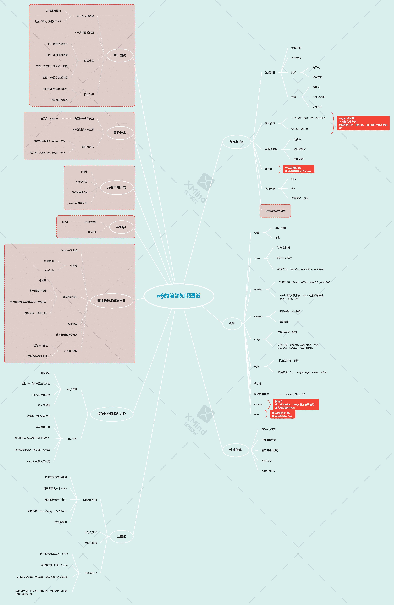
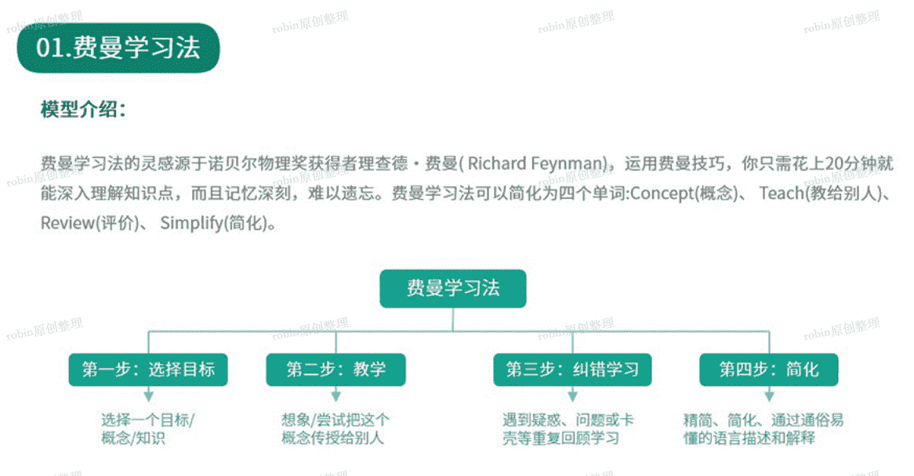

<!--
 * @Date: 2021-08-10 13:57:15
 * @LastEditors: wenfujie
 * @LastEditTime: 2021-08-15 09:50:35
 * @FilePath: /document-library/articles/面试知识/学习规划.md
-->

# 认识自己

## 1.构建自己的思维导图

- 了解别人的前端知识图谱
- 照着前端知识图谱学习和搜索，理解每一个知识节点承载的内容
- 慢慢构建自己的知识图谱
- 在现有的脑图中添加新知识点，学习越来越轻松

## 2.如何输出

`如何向别人解释一个知识？`

### 2.1运用费曼技巧，「以教为学」

- **关键词联想**：记住知识图谱中的关键词，利用关键词能联想到知识点
- **复述知识点**：模拟要同别人解释知识点，遇到问题或不顺畅的地方纪录在图谱上，不断训练直到讲的流畅
- **用自己的话来阐述**：一些枯燥、晦涩的专业术语，用最通俗的话表达，用其他案例打比方的形式

### 2.2五个why

构建脑图知识点时，可以问问自己以下五个问题：

- 技术诞生的背景和迭代时间线
- 技术原理
- 应用场景
- 横向比较，同类技术的优缺点
- 未来可能会支持哪些新特性

把知识的这五点摸清楚，对知识的理解才够全面，同时能加深记忆。学习还能做到更绝的最后一步，把学的知识忘掉，剩下的思维能力才是你的。

## 3.梳理个人履历

要常做一些阶段性回顾，以一个项目为周期或者以半年为周期，把人生当中的关键节点梳理出来，这不只是为了面试时快速反应，也是为了更加认识自己。

- 梳理2-3个亮点项目，并能通过 [STAR 法则](#结尾)描述，让面试官了解做这个项目，我们不仅仅是完成 KPI / 需求，你在项目里是有思考，有主动求变的行为的，这种意识叫做 owner 精神，阿里很看重这个。
- 梳理人生的失败经历，正面例子是：通过失败的经历，传递你面对失败时的态度，反求诸己，并加以改变，最后获得了成长。反面例子：遇到失败就放弃，逃避，抱怨，对方会觉得你内心的复原力，逆商不够。
- 梳理人生的高光时刻，传递你的价值观和需求层次。这件事情为什么会让你觉得是人生的高光时刻，你当前处在[马斯洛需求层次](#结尾)的哪个层次
- 梳理自身性格优缺点，放大优点，缩小缺点
- 梳理职业规划方向，思考未来想成为一个什么样的人

# 结尾

**参考文章**

[进大厂连载 1/15：失败 4 次成功入职阿里巴巴](https://juejin.cn/post/6844904181854109710#heading-4)

**相关批注**

`马斯洛需求层次理论`：
从层次结构的底部向上，需求分别为：生理（食物和衣服），安全（工作保障），社交需要（友谊），尊重和自我实现。

`STAR法则`：是情境(situation)、任务（task）、行动(action)、结果(result)四项的缩写。STAR法则是一种常常被面试官使用的工具，用来收集面试者与工作相关的具体信息和能力。