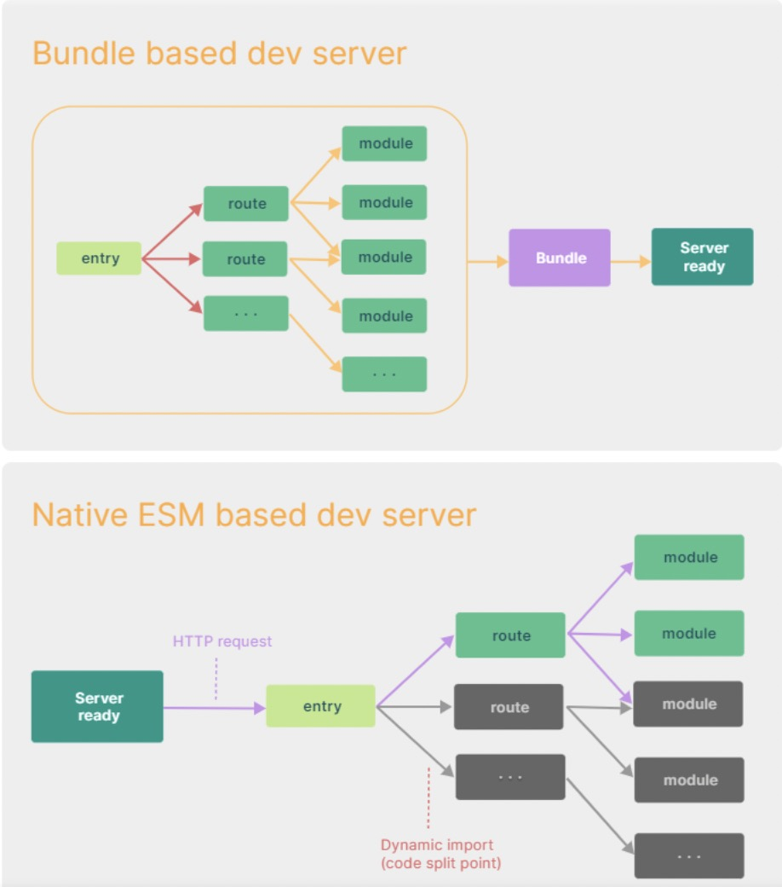

# vite为何冷启动、热更快？

## 如何做到冷启动快？

1. vite 以原生 `ESM 方式` 并 `按需构建` 业务代码。
2. 使用 Esbuild 对依赖进行预构建。

第一点意旨，因为使用 `ESM` 方式， vite 支持了 `按需构建`，即在浏览器运行到某个模块时 vite 才会对该模块代码转换和响应，节省了冷启动时对全量代码构建时间。

### 什么是预构建？

预构建用于解决引入三方依赖的两个问题：

1. 提前将依赖转换成 ESM 模块。
2. 合并包的二次依赖。

其中第二点，以 lodash 举例，lodash 依赖许多库，预构建时就会把这些库都请求并组成一个文件，避免了在项目启动后加载 lodash 时会发起多个请求。

### 为什么 Esbuild 效率这么高？

Esbuild 在构建速度上比传统工具快 10~100 倍。那么，它是如何达到这样超高的构建性能的呢？

主要原因可以概括为 4 点

1. 使用 Golang 开发，构建逻辑代码直接被编译为原生机器码，而不用像 JS 一样先代码解析为字节码，然后转换为机器码，大大节省了程序运行时间。
2. 多核并行。内部打包算法充分利用多核 CPU 优势，所有的步骤尽可能并行，这也是得益于 Go 当中多线程共享内存的优势。
3. 从零造轮子。 几乎没有使用任何第三方库，所有逻辑自己编写，大到 AST 解析，小到字符串的操作，保证极致的代码性能。
4. 高效的内存利用。Esbuild 中从头到尾尽可能地复用一份 AST 节点数据，而不用像 JS 打包工具中频繁地解析和传递 AST 数据（如 string -> TS -> JS -> string），造成内存的大量浪费。

## 如何做到热更新快？

webpack 为什么热更慢？因为只要开发时改动了代码，就会触发项目所有代码重新打包，随着项目迭代依赖增加，热更只会越来越慢。

在 vite 中，代码变化时，vite 会定位到发生变化的局部模块，也就是找到 `HMR` 的边界，基于这个边界去更新，其他模块不会受到影响。
