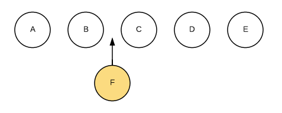
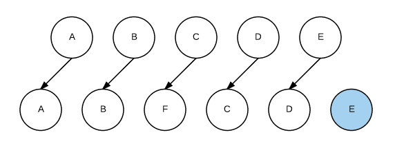
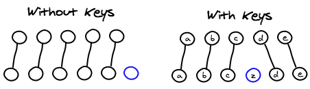

## 前言
**Vue中key的作用？**

可以围绕一句话来阐述

Vue中，key的主要作用是 **`为了更高效的更新DOM` 。**

**key在更新DOM中起到什么作用呢？** 

接着往下看。

## 简单了解vue如何更新DOM
- vue使用虚拟节点Vnode来更新视图
- 状态变更时，使用 `diff算法` 比对新、旧Vnode差异
- vue会尽量复用元素，仅更新差异部分，以达到快速渲染的效果

其中，在使用 `diff算法` 比对新、旧Vnode的过程中，key起到了关键性的作用，key作为节点的唯一标识，`diff算法` 能快速判断哪些节点是删除、哪些是新增、需要插入节点的位置，仅需比对 `sameVnode`，避免了冗余计算。

## 对比使用key和不使用key

假设要在 A B C D E 列表的 B C 之间插入 F。



不使用key时，diff算法默认是这样处理的：

C更新成F，D更新成C，E更新成D，在插入一个新的E，效率很低。



使用key后，每个节点拥有唯一标识，diff算法能识别到要插入的节点和对应要插入的位置



## 为什么不能使用index作为key
先说结论

**因为index会随着元素增加或删除而发生变化，key值也发生了改变并变得絮乱，导致diff算法无法正确配对的去比较新、旧VNode节点，从而产生了一些冗余的渲染甚至出现bug**

举个例子

```javascript
<template>
  <div v-for="(item, index) in list" :key="index" >{{item}}</div>
</template>

<script>
  export default {
    data(){
      return {
        list: ['a','b','c','d']
      }
    }
  }
</script>
```

一个 list 列表的渲染。每一项 item 和 索引 index 以及 key 对应关系是

| item  | index |  key  |
| :---: | :---: | :---: |
|   a   |   0   |   0   |
|   b   |   1   |   1   |
|   c   |   2   |   2   |
|   d   |   3   |   3   |

此时把 item b 删除，他们对应关系变成

| item  | index |  key  |
| :---: | :---: | :---: |
|   a   |   0   |   0   |
|   c   |   1   |   1   |
|   d   |   2   |   2   |

可以看到，c d 的key值同时会受到影响。此时 diff算法比对VNode的 c d节点，旧VNode上的c节点key为2，新VNode上的c节点key为1，判断是否为sameVnode条件之一就是key值要相同，所以会判断他们不是sameVnode，同样的新旧Vnode上d节点也不是sameVnode，从而导致了c d无法复用触发了多于的额外渲染。

## 总结

- 使用key能更高效更新DOM
- key可以帮助diff算法匹配 sameVnode
- key作为节点唯一标识，帮助快速找到要删除、增加、插入节点
- 不使用index做为key，因为index会随着元素增删而变化，从而导致不必要的渲染

**面试时可陈述：**

key的主要作用就是更高效的渲染DOM。

定义key就为元素打上了唯一标识。在节点发生变化的时候，key可以帮助diff算法判断新旧VNode是否是sameVnode从而避免不必要的渲染，diff算通过key可以快速知道要删除节点位置、新增元素要插入的位置，提高了渲染速度。