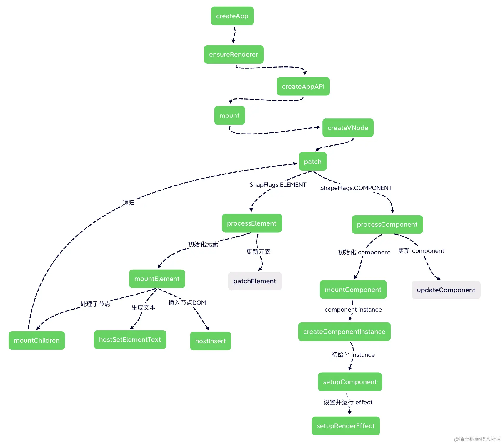

- [组件渲染成 DOM 的过程](#组件渲染成-dom-的过程)
  - [组件对象如何被加载？](#组件对象如何被加载)
  - [如何创建 VNode？](#如何创建-vnode)
  - [将 VNode 渲染为 DOM](#将-vnode-渲染为-dom)
- [总结](#总结)

## 组件渲染成 DOM 的过程

组件的样子

```vue
<template>
  <div class="helloWorld">hello world</div>
</template>
<script>
export default {
  setup() {
    // ...
  },
};
</script>
```

> `.vue` 文件无法在浏览器直接加载，所以要使用 `webpack` 通过 `vue-loader` 编译，其中 `template` 部分会被编译成 `render函数` 存储到组件对象中，`script` 会编译成 js 并导出组件对象，`style` 部分编译成 css 文件。

`template` 编译后结果

```js
import {
  openBlock as _openBlock,
  createElementBlock as _createElementBlock,
} from "vue";

const _hoisted_1 = { class: "helloWorld" };

export function render(_ctx, _cache, $props, $setup, $data, $options) {
  return _openBlock(), _createElementBlock("div", _hoisted_1, " hello world ");
}
```

`template` 和 `script` 编译的结果

```js
{

  render(_ctx, _cache, $props, $setup, $data, $options) {
    // ...
  },
  setup() {
    // ...
  }
}
```

> HTML 通过 http 请求加载 js 和 css 文件，完成 DOM 渲染。

### 组件对象如何被加载？

js 被加载后，会执行 `main.js` 入口文件代码

```js
import { createApp } from "vue";
import App from "./App.vue";

createApp(App).mount("#app");
```

`createApp` 函数

```js
// packages/runtime-core/src/apiCreateApp.ts
function createAppAPI(render, hydrate) {
  // createApp createApp 方法接收的两个参数：根组件的对象和 prop
  return function createApp(rootComponent, rootProps = null) {
    const app = {
      // ... 省略很多不需要在这里介绍的属性
      _component: rootComponent,
      _props: rootProps,
      mount(rootContainer, isHydrate, isSVG) {
        // ...
      },
    };
    return app;
  };
}
```

`mount` 函数

```js
// packages/runtime-core/src/apiCreateApp.ts
mount(rootContainer, isHydrate, isSVG) {
  if (!isMounted) {
    // ... 省略部分不重要的代码
    // 1. 创建根组件的 vnode
    const vnode = createVNode(
      rootComponent,
      rootProps
    )

    // 2. 渲染根组件
    render(vnode, rootContainer, isSVG)
    isMounted = true
  }
}
```

> `mount` 函数执行，先调用 `createVNode` 方法将根组件转换为虚拟节点 `VNode` ，接着调用 `render` 方法把 `VNode` 渲染为 DOM。

### 如何创建 VNode？

> `VNode` 是对 DOM 进行描述的一个对象。

`VNode` 的样子

```js
const vnode = {
  type: "div",
  props: {
    class: "helloWorld",
  },
  children: "helloWorld",
  // ...
};
```

`createVNode` 函数

```js
// packages/runtime-core/src/vnode.ts
function createBaseVNode(...) {
  const vnode = {
    type,
    props,
    key: props && normalizeKey(props),
    children,
    component: null,
    shapeFlag,
    patchFlag,
    dynamicProps,
    dynamicChildren: null,
    // ... 一些其他属性
  }
  // ...
  return vnode
}
function createVNode(type, props = null, children = null) {
  if (props) {
    // 如果存在 props 则需要对 props 进行一些处理，这里先省略
  }
  // ...
  // 处理 shapeFlag 类型
  const shapeFlag = isString(type)
    ? ShapeFlags.ELEMENT
    : __FEATURE_SUSPENSE__ && isSuspense(type)
    ? ShapeFlags.SUSPENSE
    : isTeleport(type)
    ? ShapeFlags.TELEPORT
    : isObject(type)
    ? ShapeFlags.STATEFUL_COMPONENT
    : isFunction(type)
    ? ShapeFlags.FUNCTIONAL_COMPONENT
    : 0

  // ...
  return createBaseVNode(
    type,
    props,
    children,
    patchFlag,
    dynamicProps,
    shapeFlag,
    isBlockNode,
    true
  )
}
```

> `createBaseVNode` 调用了 `createBaseVNode` 创建 `VNode` ，其中包含 `shapeFlag` 属性用于描述组件类型。

### 将 VNode 渲染为 DOM

将 `VNode` 渲染为 `DOM` 用到了渲染器 `renderer` ，具体可阅读 [渲染器的设计](/docs/Vue3/Vue3设计和原理/renderer/渲染器的设计.md) ，这边不再赘述。

## 总结


