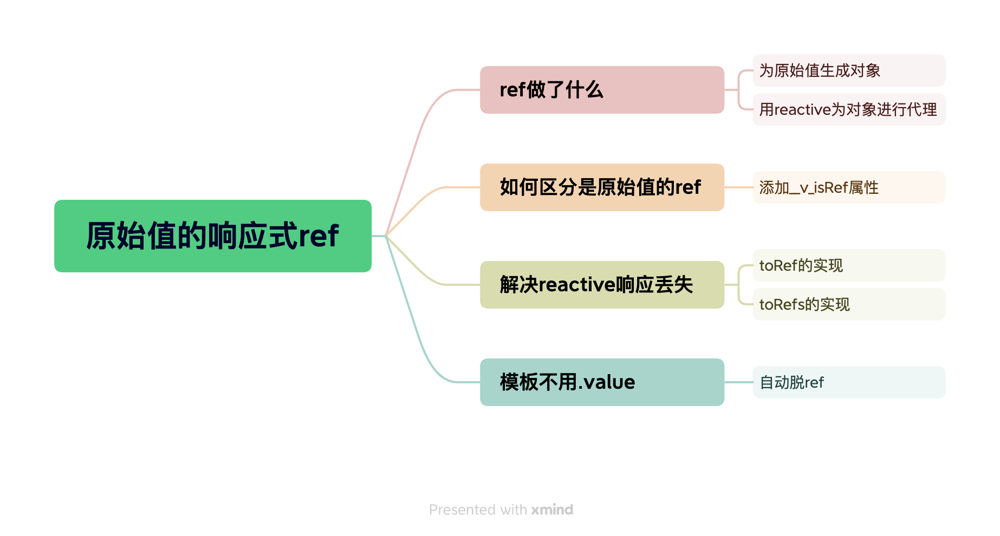

- [ref 做了什么、如何区分是原始值的 ref](#ref-做了什么如何区分是原始值的-ref)
- [解决 reactive 响应丢失](#解决-reactive-响应丢失)
  - [toRef 的实现](#toref-的实现)
  - [toRefs 的实现](#torefs-的实现)
- [模板不用.value](#模板不用value)

## ref 做了什么、如何区分是原始值的 ref

```js
function ref(val) {
  // 为原始值生成对象
  const wrapper = {
    value: val,
  };
  // 添加标记，用于判断是ref
  Object.defineProperty(wrapper, "__v_isRef", { value: true });
  // 用reactive为对象进行代理
  return reactive(wrapper);
}
```

## 解决 reactive 响应丢失

丢失响应场景

```js
const obj = reactive({ foo: 1, bar: 2 });

const val = obj.foo; // val不具有响应性
const { foo, bar } = obj; // foo,bar不具有响应性
```

### toRef 的实现

实现

```js
function toRef(obj, key) {
  const wrapper = {
    get value() {
      return obj[key];
    },
    set value(val) {
      obj[key] = val;
    },
  };
  return wrapper;
}
```

使用

```js
const obj = reactive({ foo: 1, bar: 2 });

const foo = toRef(obj, "foo"); // 具有响应性
```

### toRefs 的实现

实现

```js
function toRefs(obj) {
  const ret = {};
  for (const key in obj) {
    ret[key] = toRef(obj, key);
  }
  return ret;
}
```

使用

```js
const obj = reactive({ foo: 1, bar: 2 });

const objRefs = toRefs(obj);
const val = objRefs.foo; // val具有响应性，使用 val.value
const { foo } = objRefs; // foo具有响应性，使用 foo.value
```

## 模板不用.value

```js
const MyComponent = {
  setup() {
    const foo = ref(0);

    // 返回的对象会使用 proxyRefs 方法处理
    return {
      foo,
    };
  },
};
```

`proxyRefs`

使用到 [ES6 Api Reflect](https://es6.ruanyifeng.com/#docs/reflect)

```js
function proxyRefs(target) {
  return new Proxy(target, {
    get(target, key, receiver) {
      const value = Reflect.get(target, key, receiver);
      return value.__v_isRef ? value.value : value;
    },
    set(target, key, newValue, receiver) {
      const value = target[key]
      if(value.__v_isRef){
        value.value = newValue
        return true
      }

      return Reflect.set(target, key, newValue, receiver);
    },
  });
}
```
