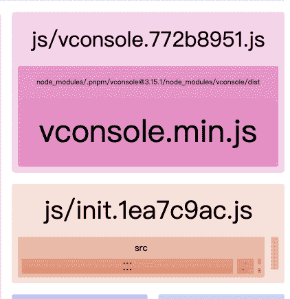
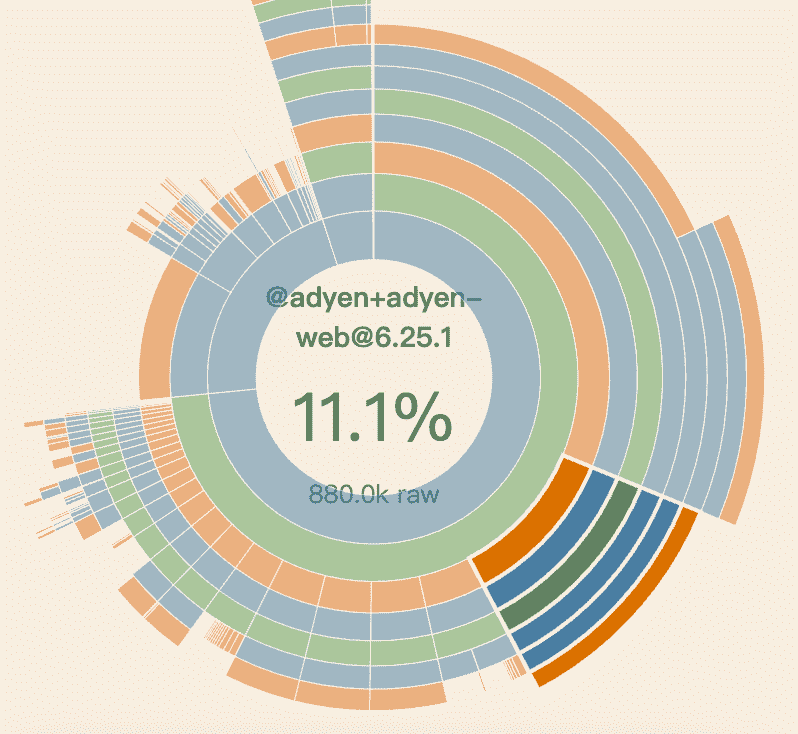

## webpack-bundle-analyzer

可视化分析产物，[查看](https://github.com/webpack/webpack-bundle-analyzer)

## Webpack Visualizer

从文件夹到模块逐层看到 bundle 的组成，[查看](https://chrisbateman.github.io/webpack-visualizer/)

## Statoscope 网页版

比对两次构建产物的差异，[查看](https://statoscope.tech)
