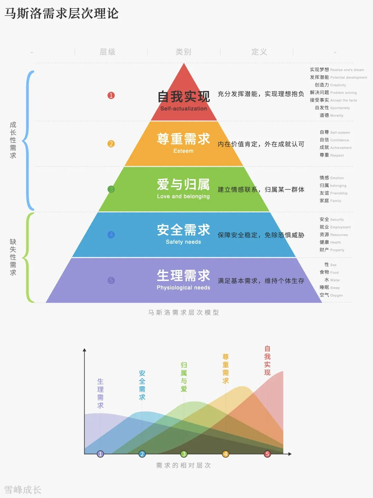

## 介绍

美国心理学家亚伯拉罕·马斯洛从人类动机角度提出需求层次理论。

人的需求分为5个层级，并且由低到高逐级形成并得到满足：

- 生理需求
- 安全需求
- 爱与归属
- 尊重需求
- 自我实现

马斯洛认为，一个饥肠辘辘的人，人生目标就是食物果腹；一个缺乏安全感的人，他对生命的追求就是安全；尚未成家或缺少之心好友的人，会更多的关注情感和爱；缺乏自信或不被尊重的人，更多渴望于得到他人的认可；自我实现是少数人的追求，因为它是高层级需求，只有已满足低层级需求的人才会对自我实现有所渴望。

## 需求层次的含义

### 生理需求

呼吸、饮食、衣着、居住、休息、医疗、性生活等

### 安全需求

保证、稳定、依赖、保护、秩序、法律等安全感

### 爱和归属

爱的需求：爱情、关怀、被接受等；

归属需求：团体、交往、友谊等

### 尊重需求

自尊：自尊心、自豪感、自主性 ；

他尊：权力、威望、荣誉、地位等

### 自我实现

发挥自身潜能，完善自己

## 需求层次间的关系

马斯洛认为，需求的产生由低级向高级呈波浪式的推进，在低一层级需求尚未完全满足时，高一层级需求就会产生，当低一层级需求基本满足后，高一级需求逐步加强，直到成为主要需求层级。

低层次需求满足后，它的激励作用将会降低，转变为高层次需求来推动人的行为。

## 需求层次的意义

马斯洛需求层次理论模型最大的意义，就是告诉我们，人在满足基本需求后就要去实现更高的需求目标。

