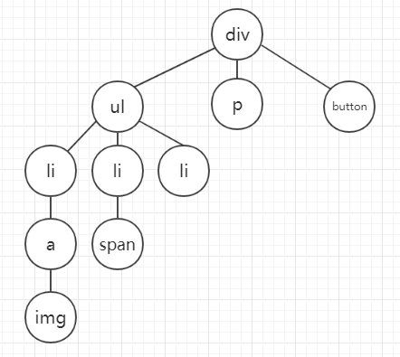
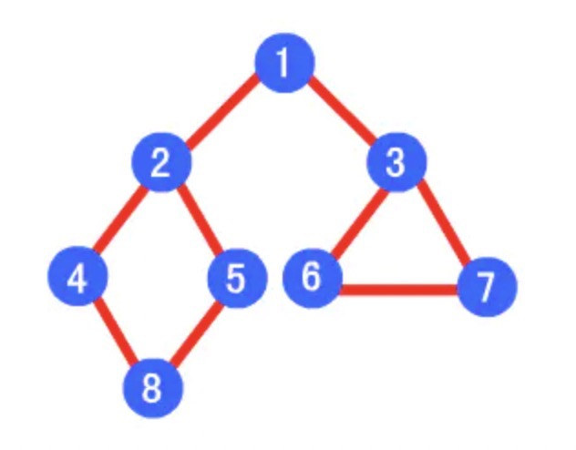

- [相关知识](#相关知识)
  - [什么是二叉树](#什么是二叉树)
  - [深度优先遍历和广度优先遍历](#深度优先遍历和广度优先遍历)
- [生成随机数](#生成随机数)
- [递归](#递归)
- [快速排序](#快速排序)
- [选择排序](#选择排序)
- [冒泡排序](#冒泡排序)

## 相关知识

### 什么是二叉树
js中的二叉树常指DOM树的node节点。通过 `node.children` 可以获取到该节点下的所有子节点，返回一个node类型的类数组。

比如如下html标签

```html
<div id="root">
    <ul>
        <li>
            <a href="">
                
            </a>
        </li>
        <li>
            <span></span>
        </li>
        <li>
        </li>
    </ul>
    <p></p>
    <button></button>
</div>
```

可转化为二叉树



### 深度优先遍历和广度优先遍历

先看一棵树


深度优先遍历的结果是

1，2，4，8，5，3，6，7

广度优先遍历的结果是

1，2，3，4，5，6，7，8

**实现深度优先遍历**

```javascript
  // 深度优先遍历收集所有节点
  function getEachNode(node, list) {
    if (node) {
      list.push(node)
      if (node.children) {
        for (let i = 0; i < node.children.length; i++) {
          const item = node.children[i];
          getEachNode(item, list)
        }
      }
    }
    return list;
  }
```

**实现广度优先遍历
```javascript
function breadthFirstSearch(node) {  
    var nodes = [];  
    if (node != null) {  
        var queue = [];  
        queue.unshift(node);  
        while (queue.length != 0) {  
            var item = queue.shift();  
            nodes.push(item);  
            var children = item.children;  
            for (var i = 0; i < children.length; i++)  
                queue.push(children[i]);  
        }  
    }  
    return nodes;  
}
```

## 生成随机数

```javascript
/**
 * 生成随机数
 * @param {number} max 最大值
 * @param {number} length 生成多少个
 * @return {Array}
 */
function getRandom(max, length) {
  const result = []
  for (let i = 0; i < length; i++) {
    result.push(Math.round(Math.random() * max))
  }
  return result
}
```

## 递归
调用函数本身
```javascript
// 阶层运算
function recursion(num) {
  if (num === 1) return num
  return num * recursion(num - 1)
}

console.log(recursion(5)) // 120

// 计算1-100的和
function sum(num) {
  if (num === 1) return num
  return num + sum(num - 1)
}
console.log(sum(100)) // 5050
```

## 快速排序
```javascript
/**
 * 快速排序
 * 1.取数列中的一个基准数，一般取中间那个
 * 2.将小于该基准数的的数字存到一个数列，大于该基准数的数字存在另一个数列
 * 3.对产生的数列递归重复步骤一、二，直到仅剩一个数字
 */
function fastSort(arr) {
  const length = arr.length
  if (length <= 1) return arr
  const centerIndex = Math.floor(length / 2)
  const left = []
  const right = []
  const centerNum = arr.splice(centerIndex, 1)[0]

  for (let i = 0; i < arr.length; i++) {
    const item = arr[i]
    if (item > centerNum) {
      right.push(item)
    } else {
      left.push(item)
    }
  }
  return fastSort(left).concat(centerNum, fastSort(right))
}

// [268, 304, 332, 334,589, 657, 659, 790,817, 962]
console.log('快速排序后数据', fastSort(getRandom(1000, 10)))
```

## 选择排序
```javascript
/**
 * 选择排序
 * 1.在未排序序列中找到最小（大）元素，存放到排序序列的起始位置
 * 2.从剩余未排序元素中继续寻找最小（大）元素，然后放到已排序序列的末尾。
 * 3.重复第二步，直到所有元素均排序完毕。
 */
function selectionSort(arr) {
  // 最小值的索引
  var minIndex
  for (let i = 0; i < arr.length; i++) {
    const item = arr[i]
    minIndex = i
    for (let j = i + 1; j < arr.length; j++) {
      if (arr[minIndex] > arr[j]) {
        minIndex = j
      }
    }
    arr[i] = arr[minIndex]
    arr[minIndex] = item
  }
  return arr
}

// [28, 122, 155, 175,175, 288, 354, 482,617, 658]
console.log('选择排序后数据', selectionSort(getRandom(1000, 10)))
```

## 冒泡排序

```javascript
/**
 * 冒泡排序
 * 1.比较相邻的元素。如果第一个比第二个大，就交换他们两个。
 * 2.对每一对相邻元素做同样的工作，从开始第一对到结尾的最后一对。会得到最后的元素应该会是最大的数。
 * 3.针对所有的元素重复以上的步骤，除了最后一个。
 * 4.持续每次对越来越少的元素重复上面的步骤，直到没有任何一对数字需要比比较
 */
function bubbleSort(arr) {
  var nextNum
  for (let i = 0; i < arr.length - 1; i++) {
    for (let j = 0; j < arr.length - i - 1; j++) {
      if (arr[j] > arr[j + 1]) {
        nextNum = arr[j + 1]
        arr[j + 1] = arr[j]
        arr[j] = nextNum
      }
    }
  }
  return arr
}

console.log('冒泡排序后数据', bubbleSort(getRandom(1000, 10)))
```