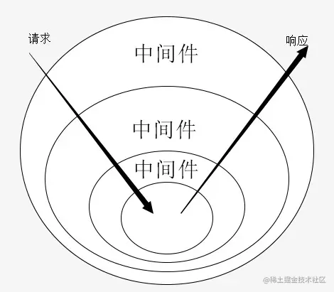

# 洋葱圈架构

## 什么是洋葱圈架构

将核心业务层与中间任务层剥离，中间任务支持无限扩展并且可对核心业务执行前后进行处理、中断后续任务。



使用洋葱圈架构的典型代表：koa2

```js
const Koa = require('koa')
const app = new Koa()

// logger
app.use(async (ctx, next) => {
  await next()
  const rt = ctx.response.get('X-Response-Time')
  console.log(`${ctx.method} ${ctx.url} - ${rt}`)
})

// x-response-time
app.use(async (ctx, next) => {
  const start = Date.now() // 记录处理响应前时间
  await next()
  const ms = Date.now() - start // 计算处理响应时长
  ctx.set('X-Response-Time', `${ms}ms`)
})

// response
app.use(async (ctx) => {
  ctx.body = 'Hello World'
})

app.listen(3000)
```

koa2 中，使用 `app.use(async (ctx, next) => {})` 注册中间件，每个中间件里`await next()` 的执行前后分别对应核心业务执行前后，ctx 为上下文，这样每个中间件都能对响应前、响应后做处理。

## 代码实现

koa 中间件代码实现

```js
class Application {
  constructor() {
    this.middlewares = []
    this.context = {}
  }
  use(middleware) {
    this.middlewares.push(middleware)
  }

  compose(middlewares) {
    return async function (ctx, lastNext) {
      function createNext(middleware, oldNext) {
        return async () => {
          await middleware(ctx, oldNext)
        }
      }

      let len = middlewares.length
      let next = lastNext
      if (!next)
        next = () => {
          return Promise.resolve()
        }
      for (let i = len - 1; i >= 0; i--) {
        let currentMiddleware = middlewares[i]
        next = createNext(currentMiddleware, next)
      }

      await next()
    }
  }

  callback() {
    const fn = this.compose(this.middlewares)
    fn(this.context)
  }
}
```

测试代码

```js
const app = new Application()

app.use(async (ctx, next) => {
  console.log('%c 1 start', 'color:#0f0;')
  await next()
  console.log('%c 1 end', 'color:#0f0;')
})

app.use(async (ctx, next) => {
  console.log('%c 2 start', 'color:#0f0;')
  await next()
  console.log('%c 2 end', 'color:#0f0;')
})

app.use(async (ctx, next) => {
  console.log('%c final', 'color:#0f0;')
})

app.callback()
//  1 start
//  2 start
//  final
//  2 end
//  1 end
```

### 使用 reduce 实现 compose

与前文不同的是，reduce实现的compose遵循后进先出，即被use的函数从后往前的顺序运行。

```js
export default function compose(...funcs) {
  if (funcs.length === 0) {
    return (arg) => arg
  }

  if (funcs.length === 1) {
    return funcs[0]
  }

  return funcs.reduce((a, b) => (...args) => a(b(...args)))
}
```

## 应用场景

对前端复杂的表单检验进行优化

```js
// 表单提交需做几下4个阶段的处理
const submit = () => {
  /**
   * 1. 表单校验
   * 此处省略若干行表单字段校验逻辑
   */
  if (!formValid) {
    return false;
  }

  /**
   * 2. 敏感词校验
   * 此处省略若干行敏感词校验逻辑
   */
  if (!sensitiveValid) {
    return false;
  }

  /**
   * 3. 表单字段格式化处理
   * 此处省略若干行字段格式化处理逻辑
   */
  formFields.format();

  /**
   * 4. 表单提交
   * 此处省略若干行表单提交逻辑
   */
  formFields.submit();
};
```

使用中间件形式，submit 函数完全解耦，符合开闭设计原则。

```js
let middleWares = new Middleware();
middleWares.use(formValidMd);
middleWares.use(sensitiveValidMd);
middleWares.use(formFormatMd);
middleWares.use(formSubmitMd);

let submit = middleWares.compose();
```